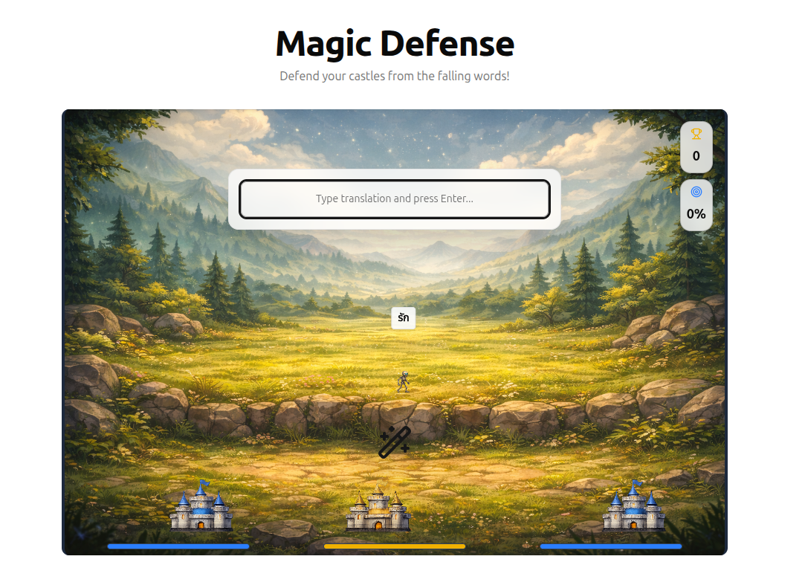
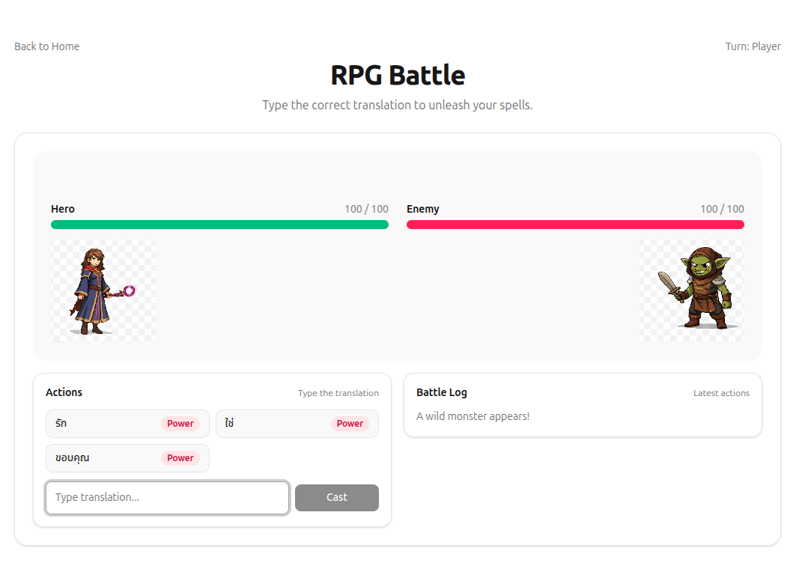
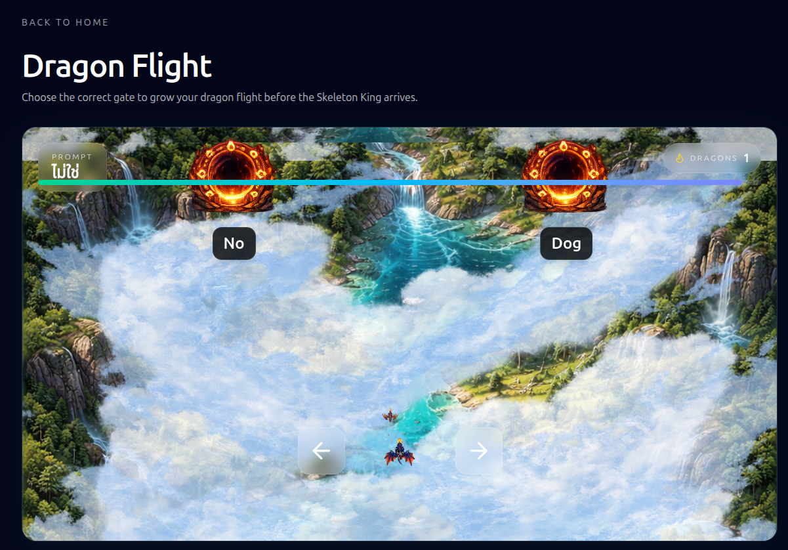
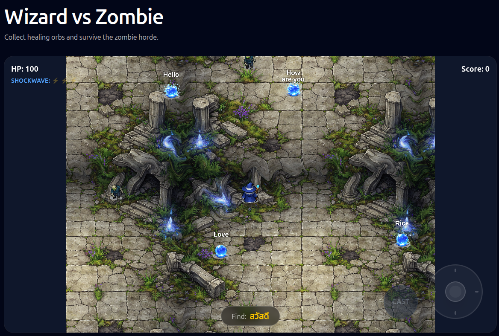
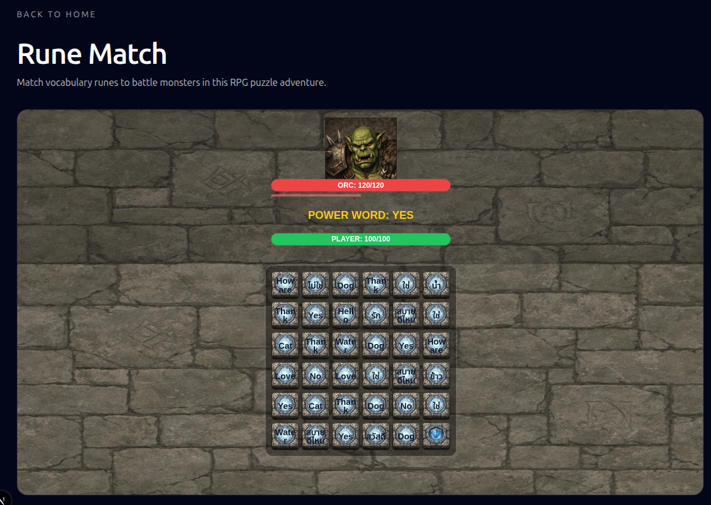

# Advantage Games

A collection of vocabulary learning games built with Next.js, designed to help users practice language terms through engaging gameplay.

## 🎮 Games

### Magic Defense
Defend your castles from falling words by typing their correct translations!


### RPG Battle
Fight monsters PvP


### Dragon Flight
Choose the correct gate to gather enough dragons to defeat the boss


### Wizard vs Zombie
Survive the zombie horde by running to collect magic orbs


### Rune Match
Match vocabulary runes to defeat monsters in this RPG puzzle battle.


### Castle Defense
Defend your towers against swarms of enemies by collecting word cards to create correct sentences.


## 🛠️ Developer Guide

### Game Interface Standard

All games in this repository adhere to a strict interface for data input and progression output. This ensures seamless integration with the main platform.

#### 1. Input: Vocabulary Data
All games must accept a vocabulary list in the following JSON format:

```typescript
type VocabularyItem = {
  term: string;       // The word/phrase to learn (e.g., "สวัสดี")
  translation: string; // The answer/meaning (e.g., "Hello")
}

// Example Input
const vocabulary: VocabularyItem[] = [
  { term: 'สวัสดี', translation: 'Hello' },
  { term: 'แมว', translation: 'Cat' },
  // ...
];
```

#### 2. Output: XP & Progression
All games must calculate and expose a final **XP (Experience Points)** value upon game completion. This value is used to track user progress in the main database.

**XP Calculation Formula:**
The standard formula for XP calculation is:
```typescript
XP = Math.floor(correctAnswers * accuracy)
```
*Where `accuracy` is `correctAnswers / totalAttempts`.*

**Implementation Requirement:**
Games should expose this final XP value (e.g., via a callback prop like `onComplete(xp)` or by updating a shared store) so it can be persisted.

### Vocabulary Management

Each game loads its vocabulary from a dedicated JSON file in the `public/vocab/` directory. This allows you to customize vocabulary for each game without rebuilding the application.

#### File Structure

```
public/vocab/
├── default.json           # Fallback vocabulary
├── enchanted-library.json # Word-based game
├── rune-match.json       # Word-based game
├── wizard-vs-zombie.json # Word-based game
├── dragon-flight.json    # Word-based game
├── rpg-battle.json       # Word-based game
├── magic-defense.json    # Word-based game
├── potion-rush.json      # Sentence-based game
└── castle-defense.json   # Sentence-based game
```

#### JSON File Format

All vocabulary files use the same simple JSON structure:

```json
[
  { "term": "สวัสดี", "translation": "Hello" },
  { "term": "ขอบคุณ", "translation": "Thank you" },
  { "term": "แมว", "translation": "Cat" }
]
```

**Word-based games** (6 games): Use Thai terms with English translations
**Sentence-based games** (2 games): Use English sentences with Thai translations

#### Editing Vocabulary

1. Navigate to `public/vocab/`
2. Open the JSON file for the game you want to edit
3. Modify the vocabulary items following the JSON format
4. Save the file
5. Refresh the game page in your browser (no rebuild needed!)

**Example:** To change Enchanted Library's first word:
```json
[
  { "term": "สวัสดีครับ", "translation": "Hello (polite)" },
  ...
]
```

#### Fallback Behavior

If a game's vocabulary file is missing or fails to load, the system automatically falls back to `default.json`. Check the browser console for warnings if vocabulary doesn't load as expected.

## 🚀 Getting Started

First, install dependencies:

```bash
npm install
# or
yarn
```

Run the development server:

```bash
npm run dev
```

Open [http://localhost:3000](http://localhost:3000) with your browser to see the result.

## 📁 Project Structure

- `src/app/games/`: Contains the individual game pages.
- `src/components/game/`: Shared game components and game-specific logic.
- `src/lib/`: Shared utilities and game-specific configuration (e.g., `castleDefenseConfig.ts`, `runeMatchConfig.ts`).
- `src/lib/xp.ts`: Standardized XP calculation logic.
- `public/`: Static assets (images, videos).


## casual game ideas

This is a fantastic direction. Turning vocabulary practice into a "Hybridcasual" experience is exactly how modern language apps (like Duolingo) keep retention high. Since you have an RPG theme, you can wrap these mechanics in a narrative: "The Hero's Journey."

### 1. The "Gate Runner" (Dragon Flight)
**Your Idea:** A speed version where a dragon rider flies through the correct vocabulary gate.
**My Expansion:** Make it about **"Army Building"** (like *Count Masters*).
*   **The Mechanic:** You start as a lone Dragon Rider. You approach two gates: one has the correct translation (e.g., for "Apple"), and one has a distractor (e.g., "Banana").
*   **The Twist:** The correct gate doesn't just let you pass; it **adds more dragons** to your flight.
*   **The Boss Fight:** At the end of the 30-second run, you face a Skeleton King. If you chose correctly enough times, you have a massive dragon army that overwhelms him. If you failed often, your small army fights and might lose.
*   **Why it works:** It turns a binary quiz into a satisfying visual of accumulating power.

### 2. The "Snake/Connect" Mechanic (Wall Defense)
**Your Idea:** Connect translations in order or the horde overwhelms you.
**My Expansion:** A **"Light Barrier" Defense**.
*   **The Visual:** A dark, spooky forest edge. Waves of monsters are approaching the player's castle.
*   **The Mechanic:** The player is given a target word (e.g., "Run"). They see a grid of bubbles in the sky/field containing translations (Thai/Chinese/Vietnamese) and wrong answers. They must drag their finger from the correct answer to the next correct answer that appears.
*   **The Visual Payoff:** As you connect the bubbles, you are drawing a magical glowing line (like a laser fence). Every time you hit a correct word, a beam of light shoots out from that bubble and fries the monsters.
*   **Fail State:** If you touch a wrong word, the line breaks, and the monsters advance closer to the screen.

### 3. The "Loot Box" Locks (The Safe Cracker)
**Your Idea:** Spinning combination locks where you stop on the correct translation.
**My Expansion:** **The Treasure Chest Rush**.
*   **The Visual:** A massive, golden 3D treasure chest with 3 spinning locks on it.
*   **The Mechanic:** A target English word appears (e.g., "Water"). The three rings spin rapidly.
    *   Ring 1 has: *Water, Fire, Earth*.
    *   Ring 2 has: *Water, Wind, Metal*.
    *   Ring 3 has: *Water, Wood, Ice*.
*   **The Action:** The player has to tap "STOP" on all three rings to land on "Water."
*   **The Reward:** The chest explodes with gold coins and an RPG item (a new sword or hat). The "Near Miss" effect (stopping right next to the word) creates great tension.

### 4. Vocabulary "Candy Crush" (Word Collapse)
**Your Idea:** Match-3 but with translations.
**My Expansion:** **"Collapse" vs. "Swap"**.
*   **Why:** Standard "swap adjacent" is hard to control if the user doesn't know the words well. Instead, use a **"Collapse/Tap"** mechanic (like *Toy Blast*).
*   **The Mechanic:** The screen is filled with blocks. Some blocks have English words, some have Thai/Chinese/Vietnamese words. The prompt says: "Match pairs for [Happy]".
*   **The Action:** The player taps a block that says "Happy" (English) and then taps the matching translation. Both blocks explode, causing the blocks above to fall down. If they can clear the screen in 30 seconds, they win a star.
*   **RPG Element:** Use the blocks to build a bridge for the hero to cross the level.

### 5. Camouflaged Words (The "Hidden" Mechanic)
**Your Struggle:** Visualizing how to hide words.
**The Solution:** **The "Magic Spell" Scroll**.
*   **The Concept:** In RPGs, you often have to decipher ancient scrolls. Use this.
*   **The Visual:** The player sees a "cluttered" scene—a wizard’s desk or a messy dungeon floor. The English words are written in a "Magic Font" (glowing runes).
*   **The Camouflage:** The words are overlaid on objects that share the same color.
    *   Example: The word "RED" is written in dark red ink on a red potion bottle.
    *   Example: The word "BOOK" is written in brown on a wooden table texture.
*   **The Gameplay:** A voice says: "Find the word Book." The player has to scan the messy background to find the word camouflaged against the textures. When found, they tap it, and the item materializes into their inventory.
*   **Why it works:** It trains reading speed and spelling recognition (finding the shape of the word) without being a boring quiz.

### Bonus Idea: The "Tower Stacking" (High skill)
This is a very popular casual mechanic (like *Tower Bloxx*).
*   **The Mechanic:** A block swings back and forth over a stack. You tap to drop it.
*   **The Vocabulary Twist:** The base block has the English word (e.g., "Castle"). The swinging block has the Thai/Chinese/Vietnamese translation.
*   **The Skill:** You have to time your drop perfectly to stack them.
*   **The Visual:** If you get it perfectly aligned, the block glows and the tower grows taller into the clouds. If you miss, the edges are shaved off, making the next block harder to stack.
*   **Goal:** Build a tower high enough to reach the "Dragon's Lair" at the top.

**Recommendation for your MVP (Minimum Viable Product):**
Start with **#1 (Gate Runner)** and **#3 (Loot Box Locks)**.
*   **Gate Runner** uses the "Choice" mechanic (easy to code, easy to play).
*   **Loot Box** uses the "Timing" mechanic (addictive, feels like gambling/rewarding).

Both fit perfectly into a "Dragon Rider / Wizard" theme

## technical hurdles

React is actually an excellent choice for this, but because it sits in the browser, there are specific "physics" and "performance" hurdles you have to clear to make these games feel "native" and smooth (like the hyper-casual games you see on the App Store).

Here are the limits of React for these specific ideas, and how to beat them.

### 1. The Rendering Bottleneck (DOM vs. Canvas)
**The Limit:** React works by manipulating the DOM (HTML elements). If you create a game with 50 moving zombies (Idea #6) or a massive pile of falling blocks (Idea #4), using standard `<div>` elements for every object will cause the game to **lag and stutter**.
*   **The DOM Limit:** Moving 50 `<div>`s at 60 frames per second requires the browser to recalculate the layout of the page constantly. It's heavy.

**The Solution:** You must use **HTML5 Canvas** or **WebGL** via React.
*   **The Tech:** Do not map every game object to a React component (e.g., `<Zombie key={1} />`). Instead, use a library like **React Three Fiber** (for 3D) or **Konva.js / React-Konva** (for 2D).
*   **Why:** These libraries render a single "canvas" element and draw the images inside it using the Graphics Card (GPU). You can have 1,000 skeletons on screen without lag.
*   **Impact on Ideas:**
    *   **Gate Runner (#1):** Use `<canvas>` for the spinning gates and character so it stays buttery smooth.
    *   **Snake/Connect (#2):** Definitely use Canvas. Drawing a line that follows a finger/touch is very jerky in the DOM but instant in Canvas.

### 2. The "Touch" Event Lag
**The Limit:** In standard React, you handle events like `onClick` or `onTouchStart`. However, browsers have a built-in 300ms delay to distinguish a tap from a zoom. Also, standard React events are "synthetic" (wrapped by React), which adds processing time.
*   **The Impact:** For the **Loot Box Locks (#3)** or **Stacking Game**, if the player taps "Stop" and there is a 100ms delay, the game feels "floaty" and unresponsive. They will miss the target.

**The Solution:** You must use **Pointer Events** (or specifically touch event listeners) directly on the canvas.
*   **The Tech:** When building your game loop, use `requestAnimationFrame` and track input state directly, rather than relying solely on React's `onClick`.
*   **Library:** Libraries like **React-use-gesture** are fantastic for getting high-performance, low-latency drag and tap inputs.

### 3. Text Rendering (The "Blurry Font" Problem)
**The Limit:** This is critical for a **Reading Platform**. When you move DOM elements (like text labels) around quickly in Chrome/Safari, the text often blurs or fails to sub-pixel render properly.
*   **The Impact:** In the **Camouflage Game (#5)**, the user needs to read text that is overlaid on textures. If the text is blurry or pixelated, the educational value is lost, and it looks cheap.

**The Solution:**
*   **If using Canvas (Konva/ThreeFiber):** You must use high-resolution assets (SDF fonts or high-res PNGs for words).
*   **If using DOM:** Ensure you use CSS `transform: translate3d(x, y, 0)` to move elements. This forces the browser to use the GPU to move the text, keeping it crisp. Avoid changing `top`/`left` CSS properties during animation.

### 4. Asset Loading & Memory
**The Limit:** A browser tab has a memory limit. If your **Gate Runner** has 50 different backgrounds, 20 different dragon types, and 100 sound effects, the browser might crash on a low-end phone (common in the casual gaming market).
*   **The Impact:** The game stops working halfway through a level.

**The Solution:** Implement an **Asset Loader / Preloader**.
*   **The Tech:** Do not start the game loop until all images are loaded. Show a simple progress bar ("Loading Resources... 80%").
*   **Optimization:** Use **Sprite Sheets**. Instead of loading 50 images of a dragon running, load 1 big image strip that contains all the frames. React libraries like Konva handle this very well.

### 5. Input Blocking (The "Pull to Refresh" Issue)
**The Limit:** If a user is playing the **Snake/Connect (#2)** game and they swipe their finger rapidly down, Chrome on Android might try to "Pull to Refresh" the page or navigate back, killing the game immersion.
*   **The Solution:** You must add CSS to the game container to disable default browser behaviors.
    ```css
    .game-container {
      touch-action: none; /* Critical! Disables scrolling/zooming */
      user-select: none; /* Disables text highlighting */
      -webkit-user-select: none;
    }
    ```

### Summary Recommendation for your Stack
Since you want to go "Bigger" and "Better," I strongly recommend you wrap your game components in a library that handles the performance for you.

**Best Option for 2D (Your Ideas #1, #2, #3, #5):**
*   **React-Konva:** It is a React wrapper for the HTML5 Canvas 2D API. It gives you the React component syntax (`<Rect />`, `<Text />`) but renders them to a high-performance canvas.
    *   *Good for:* The Gate Runner, Connect lines, Loot locks, Sorting games.

**Best Option for 3D (Idea #1 Dragon version):**
*   **React Three Fiber (R3F):** If you want the dragon to look like a 3D model. It has a steeper learning curve but looks amazing.

**What to avoid:**
*   Avoid using pure HTML/CSS (`<div>`s with absolute positioning) for moving objects if the count exceeds 10-20 items.
*   Avoid heavy physics engines like Matter.js unless necessary; they are heavy for React. Simple AABB collision (box checking) is usually enough for these casual games.

**Verdict:** React is capable of doing **all** these ideas, provided you use a **Canvas-based library** (like React-Konva) rather than standard DOM elements for the gameplay parts.
