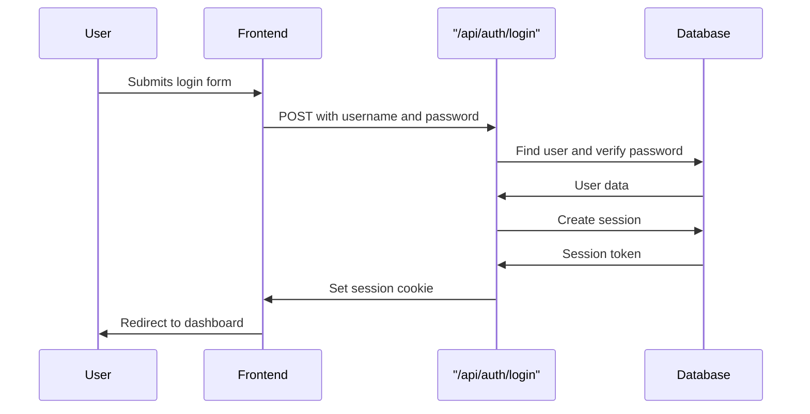

# Backend Architecture

## Service Architecture

Based on our serverless architecture choice on Vercel, we use Next.js 15 App Router API routes for our serverless functions:

### Function Organization

```
app/api/
├── auth/
│   ├── login/
│   │   └── route.ts
│   ├── logout/
│   │   └── route.ts
│   └── session/
│       └── route.ts
├── classes/
│   └── [classId]/
│       ├── lessons/
│       │   └── [slug]/
│       │       ├── completions/
│       │       │   └── route.ts        # GET/POST lesson completions
│       │       ├── experiment-submissions/
│       │       │   └── route.ts        # GET/POST experiment submissions
│       │       └── scores/
│       │           └── route.ts        # GET quiz scores
├── demo/
│   └── join/
│       └── route.ts          # POST to join demo class
├── dev/
│   └── auth/
│       └── impersonate/
│           └── route.ts      # Development auth override
└── lessons/
    └── [slug]/
        ├── completion/
        │   └── route.ts      # POST lesson completion
        ├── experiment-submissions/
        │   └── route.ts      # GET/POST experiment submissions
        └── quiz/
            └── route.ts      # GET/POST quiz questions and answers
```

### Function Template

```typescript
// app/api/classes/[classId]/lessons/[slug]/completions/route.ts
import { NextRequest, NextResponse } from 'next/server';
import { getCurrentSession } from '@/lib/auth/session';
import { prisma } from '@/lib/prisma';
import { ApiError } from '@/lib/errors/api-error';

export async function GET(
  request: NextRequest,
  { params }: { params: { classId: string; slug: string } }
) {
  try {
    const session = await getCurrentSession();

    if (!session) {
      return NextResponse.json(
        { error: 'Authentication required' },
        { status: 401 }
      );
    }

    const { classId, slug } = params;

    const completion = await prisma.lessonCompletion.findUnique({
      where: {
        lessonId_studentId_classId: {
          lessonId: slug,
          studentId: session.user.id,
          classId,
        },
      },
      include: {
        lesson: {
          select: {
            title: true,
            slug: true,
            type: true,
          },
        },
      },
    });

    return NextResponse.json({ completion });
  } catch (error) {
    console.error('Error fetching lesson completion:', error);
    return NextResponse.json(
      { error: 'Internal server error' },
      { status: 500 }
    );
  }
}

export async function POST(
  request: NextRequest,
  { params }: { params: { classId: string; slug: string } }
) {
  try {
    const session = await getCurrentSession();

    if (!session) {
      return NextResponse.json(
        { error: 'Authentication required' },
        { status: 401 }
      );
    }

    const { classId, slug } = params;

    // Verify user is enrolled in the class
    const enrollment = await prisma.classEnrollment.findUnique({
      where: {
        classId_studentId: {
          classId,
          studentId: session.user.id,
        },
      },
    });

    if (!enrollment) {
      return NextResponse.json(
        { error: 'Not enrolled in this class' },
        { status: 403 }
      );
    }

    // Create or update lesson completion
    const completion = await prisma.lessonCompletion.upsert({
      where: {
        lessonId_studentId_classId: {
          lessonId: slug,
          studentId: session.user.id,
          classId,
        },
      },
      update: {
        completedAt: new Date(),
      },
      create: {
        lessonId: slug,
        studentId: session.user.id,
        classId,
        completedAt: new Date(),
      },
      include: {
        lesson: {
          select: {
            title: true,
            slug: true,
            type: true,
          },
        },
      },
    });

    return NextResponse.json({ completion });
  } catch (error) {
    console.error('Error completing lesson:', error);
    return NextResponse.json(
      { error: 'Internal server error' },
      { status: 500 }
    );
  }
}
```

## Database Architecture

### Schema Design (Prisma)

Our database schema is defined using Prisma with PostgreSQL as the provider. The schema supports our educational platform's complex data relationships:

> **A Note on Naming Conventions**
> The application layers (TypeScript, Prisma Client, API) use `camelCase` for fields and `PascalCase` for models. The underlying PostgreSQL database, however, uses `snake_case` for tables and columns, as documented in `database-schema.md`. Prisma handles this mapping automatically, providing a consistent developer experience.

```prisma
// Key models from prisma/schema.prisma
model User {
  id            String            @id @default(cuid())
  email         String            @unique
  name          String?
  role          Role              @default(STUDENT)
  image         String?
  classes       Class[]           @relation("ClassTeacher")
  enrollments   ClassEnrollment[]
  attempts      Attempt[]
  lessonCompletions LessonCompletion[]
  experimentSubmissions ExperimentSubmission[]
  accounts      Account[]
  sessions      Session[]
  createdAt     DateTime          @default(now())
  updatedAt     DateTime          @updatedAt
}

model Class {
  id          String            @id @default(cuid())
  name        String
  description String?
  joinCode    String            @unique
  teacher     User              @relation("ClassTeacher", fields: [teacherId], references: [id])
  teacherId   String
  enrollments ClassEnrollment[]
  lessonCompletions LessonCompletion[]
  experimentSubmissions ExperimentSubmission[]
  createdAt   DateTime          @default(now())
  updatedAt   DateTime          @updatedAt
}

model Lesson {
  id            String         @id @default(cuid())
  unitSlug      String
  title         String
  slug          String         @unique
  summary       String?
  order         Int
  content       String
  type          LessonType     @default(LESSON)
  quizQuestions QuizQuestion[]
  attempts      Attempt[]
  completions   LessonCompletion[]
  experimentSubmissions ExperimentSubmission[]
  createdAt     DateTime       @default(now())
  updatedAt     DateTime       @updatedAt
}

model QuizQuestion {
  id        String   @id @default(cuid())
  lesson    Lesson   @relation(fields: [lessonId], references: [id])
  lessonId  String
  order     Int
  prompt    String
  options   String[]
  answer    String
  rationale String?
  createdAt DateTime @default(now())
  updatedAt DateTime @updatedAt
}

model Attempt {
  id          String    @id @default(cuid())
  student     User      @relation(fields: [studentId], references: [id])
  studentId   String
  lesson      Lesson    @relation(fields: [lessonId], references: [id])
  lessonId    String
  score       Int
  maxScore    Int
  responses   Json      // Stores student responses
  startedAt   DateTime  @default(now())
  completedAt DateTime?
  createdAt   DateTime  @default(now())
  updatedAt   DateTime  @updatedAt

  @@index([studentId])
  @@index([lessonId])
}

model ExperimentSubmission {
  id        String   @id @default(cuid())
  lesson    Lesson   @relation(fields: [lessonId], references: [id])
  lessonId  String
  student   User     @relation(fields: [studentId], references: [id])
  studentId String
  class     Class    @relation(fields: [classId], references: [id])
  classId   String
  data      Json     // Stores experiment data
  submittedAt DateTime @default(now())
  updatedAt DateTime   @updatedAt

  @@unique([lessonId, studentId, classId])
  @@index([classId])
  @@index([studentId])
}
```

### Data Access Layer

```typescript
// lib/prisma.ts
import { PrismaClient } from '@prisma/client';

const globalForPrisma = globalThis as unknown as {
  prisma: PrismaClient | undefined;
};

export const prisma = globalForPrisma.prisma ?? new PrismaClient();

if (process.env.NODE_ENV !== 'production') globalForPrisma.prisma = prisma;

// lib/services/class-service.ts
import { prisma } from '@/lib/prisma';
import { Class, ClassEnrollment, User, Role } from '@prisma/client';

export interface ClassWithEnrollments extends Class {
  enrollments: (ClassEnrollment & { student: User })[];
}

export class ClassService {
  async findById(id: string): Promise<Class | null> {
    return prisma.class.findUnique({
      where: { id },
      include: {
        teacher: true,
        enrollments: {
          include: {
            student: true,
          },
        },
      },
    });
  }

  async findByJoinCode(joinCode: string): Promise<Class | null> {
    return prisma.class.findUnique({
      where: { joinCode },
      include: {
        teacher: true,
      },
    });
  }

  async findByTeacherId(teacherId: string): Promise<Class[]> {
    return prisma.class.findMany({
      where: { teacherId },
      include: {
        enrollments: {
          include: {
            student: true,
          },
        },
        _count: {
          select: {
            enrollments: true,
          },
        },
      },
      orderBy: {
        createdAt: 'desc',
      },
    });
  }

  async findByStudentId(studentId: string): Promise<ClassWithEnrollments[]> {
    const enrollments = await prisma.classEnrollment.findMany({
      where: { studentId },
      include: {
        class: {
          include: {
            teacher: true,
            enrollments: {
              include: {
                student: true,
              },
            },
            _count: {
              select: {
                enrollments: true,
              },
            },
          },
        },
      },
    });

    return enrollments.map((e) => e.class as ClassWithEnrollments);
  }

  async create(data: {
    name: string;
    description?: string;
    teacherId: string;
  }): Promise<Class> {
    // Generate unique join code
    const joinCode = this.generateJoinCode();

    return prisma.class.create({
      data: {
        name: data.name,
        description: data.description,
        teacherId: data.teacherId,
        joinCode,
      },
      include: {
        teacher: true,
      },
    });
  }

  async enrollStudent(
    classId: string,
    studentId: string
  ): Promise<ClassEnrollment> {
    return prisma.classEnrollment.create({
      data: {
        classId,
        studentId,
      },
      include: {
        class: true,
        student: true,
      },
    });
  }

  private generateJoinCode(): string {
    const characters = 'ABCDEFGHIJKLMNOPQRSTUVWXYZ0123456789';
    let result = '';
    for (let i = 0; i < 6; i++) {
      result += characters.charAt(
        Math.floor(Math.random() * characters.length)
      );
    }
    return result;
  }
}

// lib/services/lesson-service.ts
import { prisma } from '@/lib/prisma';
import {
  Lesson,
  QuizQuestion,
  Attempt,
  LessonCompletion,
} from '@prisma/client';

export interface LessonWithQuestions extends Lesson {
  quizQuestions: QuizQuestion[];
}

export class LessonService {
  async findBySlug(slug: string): Promise<LessonWithQuestions | null> {
    return prisma.lesson.findUnique({
      where: { slug },
      include: {
        quizQuestions: {
          orderBy: {
            order: 'asc',
          },
        },
      },
    });
  }

  async findByUnitSlug(unitSlug: string): Promise<Lesson[]> {
    return prisma.lesson.findMany({
      where: { unitSlug },
      orderBy: {
        order: 'asc',
      },
    });
  }

  async getLessonProgress(
    lessonId: string,
    studentId: string,
    classId: string
  ): Promise<{
    completion: LessonCompletion | null;
    attempts: Attempt[];
    bestScore: number | null;
  }> {
    const [completion, attempts] = await Promise.all([
      prisma.lessonCompletion.findUnique({
        where: {
          lessonId_studentId_classId: {
            lessonId,
            studentId,
            classId,
          },
        },
      }),
      prisma.attempt.findMany({
        where: {
          lessonId,
          studentId,
        },
        orderBy: {
          createdAt: 'desc',
        },
      }),
    ]);

    const bestScore =
      attempts.length > 0 ? Math.max(...attempts.map((a) => a.score)) : null;

    return {
      completion,
      attempts,
      bestScore,
    };
  }

  async submitQuizAttempt(data: {
    lessonId: string;
    studentId: string;
    responses: any[];
    score: number;
    maxScore: number;
  }): Promise<Attempt> {
    return prisma.attempt.create({
      data: {
        lessonId: data.lessonId,
        studentId: data.studentId,
        responses: data.responses,
        score: data.score,
        maxScore: data.maxScore,
        completedAt: new Date(),
      },
    });
  }
}
```

## Authentication and Authorization

### Auth Flow



### Middleware/Guards

```typescript
// middleware.ts
import { NextRequest, NextResponse } from 'next/server';

export async function middleware(request: NextRequest) {
  const { pathname } = request.nextUrl;

  // Get the session token from cookies
  const sessionToken = request.cookies.get('session_token')?.value;
  const hasSession = !!sessionToken;

  // Protected routes that require authentication
  const protectedRoutes = ['/student', '/teacher', '/admin', '/system'];
  const isProtectedRoute = protectedRoutes.some(route => pathname.startsWith(route));

  // If accessing protected route without session, redirect to login
  if (isProtectedRoute && !hasSession) {
    return NextResponse.redirect(new URL('/login', request.url));
  }

  // If accessing login with session, redirect to dashboard
  // The dashboard page will handle role-based redirect
  if (hasSession && pathname === '/login') {
    return NextResponse.redirect(new URL('/dashboard', request.url));
  }

  return NextResponse.next();
}
```

## Error Handling and Middleware

### Error Handling Pattern

```typescript
// lib/errors/api-error.ts
export class ApiError extends Error {
  constructor(
    public code: string,
    message: string,
    public statusCode: number = 500
  ) {
    super(message);
    this.name = 'ApiError';
  }
}

export const errorCodes = {
  UNAUTHORIZED: 'UNAUTHORIZED',
  FORBIDDEN: 'FORBIDDEN',
  NOT_FOUND: 'NOT_FOUND',
  VALIDATION_ERROR: 'VALIDATION_ERROR',
  INTERNAL_ERROR: 'INTERNAL_ERROR',
  METHOD_NOT_ALLOWED: 'METHOD_NOT_ALLOWED',
} as const;

// lib/middleware/error-handler.ts
import { NextRequest, NextResponse } from 'next/server';
import { ApiError } from '@/lib/errors/api-error';

export function withErrorHandler(handler: Function) {
  return async (request: NextRequest, ...args: any[]) => {
    try {
      return await handler(request, ...args);
    } catch (error) {
      console.error('API Error:', error);

      if (error instanceof ApiError) {
        return NextResponse.json(
          {
            error: error.message,
            code: error.code,
          },
          { status: error.statusCode }
        );
      }

      // Handle Prisma errors
      if (error.code === 'P2002') {
        return NextResponse.json(
          { error: 'Resource already exists', code: 'DUPLICATE_RESOURCE' },
          { status: 409 }
        );
      }

      if (error.code === 'P2025') {
        return NextResponse.json(
          { error: 'Resource not found', code: 'NOT_FOUND' },
          { status: 404 }
        );
      }

      // Generic error
      return NextResponse.json(
        { error: 'Internal server error', code: 'INTERNAL_ERROR' },
        { status: 500 }
      );
    }
  };
}

// lib/middleware/validation.ts
import { NextRequest } from 'next/server';
import { ApiError } from '@/lib/errors/api-error';

export function validateRequired(fields: string[], data: any) {
  const missing = fields.filter((field) => !data[field]);
  if (missing.length > 0) {
    throw new ApiError(
      'VALIDATION_ERROR',
      `Missing required fields: ${missing.join(', ')}`
    );
  }
}

export function validateEmail(email: string) {
  const emailRegex = /^[^\s@]+@[^\s@]+\.[^\s@]+$/;
  if (!emailRegex.test(email)) {
    throw new ApiError('VALIDATION_ERROR', 'Invalid email format');
  }
}

export function validateJoinCode(joinCode: string) {
  if (joinCode.length !== 6 || !/^[A-Z0-9]+$/.test(joinCode)) {
    throw new ApiError('VALIDATION_ERROR', 'Invalid join code format');
  }
}
```

## Security Implementation

### Security Middleware

```typescript
// lib/middleware/security.ts
import { NextRequest } from 'next/server';
import { ApiError } from '@/lib/errors/api-error';

// Rate limiting (simplified for serverless)
const rateLimitStore = new Map<string, { count: number; resetTime: number }>();

export function rateLimit(
  request: NextRequest,
  limit: number = 100,
  windowMs: number = 15 * 60 * 1000 // 15 minutes
) {
  const ip = request.ip || 'unknown';
  const now = Date.now();
  const key = `${ip}:${Math.floor(now / windowMs)}`;

  const current = rateLimitStore.get(key) || {
    count: 0,
    resetTime: now + windowMs,
  };

  if (current.count >= limit) {
    throw new ApiError('TOO_MANY_REQUESTS', 'Rate limit exceeded', 429);
  }

  current.count++;
  rateLimitStore.set(key, current);

  // Clean up old entries
  if (now > current.resetTime) {
    rateLimitStore.delete(key);
  }
}

// CORS handling
export function handleCors(request: NextRequest) {
  const origin = request.headers.get('origin');
  const allowedOrigins = [
    process.env.NEXT_PUBLIC_APP_URL,
    'http://localhost:3000',
  ];

  if (origin && allowedOrigins.includes(origin)) {
    return {
      'Access-Control-Allow-Origin': origin,
      'Access-Control-Allow-Methods': 'GET, POST, PUT, DELETE, OPTIONS',
      'Access-Control-Allow-Headers': 'Content-Type, Authorization',
      'Access-Control-Allow-Credentials': 'true',
    };
  }

  return {};
}

// Input sanitization
export function sanitizeInput(data: any): any {
  if (typeof data === 'string') {
    return data.trim().replace(/[<>]/g, '');
  }

  if (Array.isArray(data)) {
    return data.map(sanitizeInput);
  }

  if (typeof data === 'object' && data !== null) {
    const sanitized: any = {};
    for (const [key, value] of Object.entries(data)) {
      sanitized[key] = sanitizeInput(value);
    }
    return sanitized;
  }

  return data;
}
```

## Real-time Features

### WebSocket Integration (for future implementation)

```typescript
// lib/realtime/websocket-manager.ts
import { Server } from 'socket.io';
import { NextApiRequest, NextApiResponse } from 'next';

export class WebSocketManager {
  private io: Server | null = null;

  initialize(server: any) {
    this.io = new Server(server, {
      cors: {
        origin: process.env.NEXT_PUBLIC_APP_URL,
        methods: ['GET', 'POST'],
      },
    });

    this.io.on('connection', (socket) => {
      console.log('User connected:', socket.id);

      // Join class room
      socket.on('join-class', (classId: string) => {
        socket.join(`class-${classId}`);
      });

      // Leave class room
      socket.on('leave-class', (classId: string) => {
        socket.leave(`class-${classId}`);
      });

      // Handle lesson completion notifications
      socket.on(
        'lesson-completed',
        (data: { classId: string; studentId: string }) => {
          socket.to(`class-${data.classId}`).emit('student-progress', {
            studentId: data.studentId,
            type: 'lesson-completed',
          });
        }
      );

      socket.on('disconnect', () => {
        console.log('User disconnected:', socket.id);
      });
    });
  }

  // Notify class of new enrollment
  notifyClassEnrollment(classId: string, studentData: any) {
    if (this.io) {
      this.io.to(`class-${classId}`).emit('new-enrollment', studentData);
    }
  }

  // Notify class of quiz submission
  notifyQuizSubmission(classId: string, submissionData: any) {
    if (this.io) {
      this.io.to(`class-${classId}`).emit('quiz-submission', submissionData);
    }
  }
}

export const wsManager = new WebSocketManager();
```

## AI Integration

### AI Service Integration

```typescript
// lib/services/ai-service.ts
export class AIService {
  private apiKey: string;
  private baseUrl: string;

  constructor() {
    this.apiKey = process.env.OPENAI_API_KEY!;
    this.baseUrl = 'https://api.openai.com/v1';
  }

  async generateExperimentFeedback(
    experimentData: any,
    lessonContext: string
  ): Promise<string> {
    const prompt = `
      As a science teacher, review this experiment submission and provide constructive feedback.
      
      Lesson Context: ${lessonContext}
      Experiment Data: ${JSON.stringify(experimentData, null, 2)}
      
      Provide feedback on:
      1. Scientific accuracy
      2. Methodology
      3. Results interpretation
      4. Suggestions for improvement
      
      Keep the feedback encouraging and educational.
    `;

    try {
      const response = await fetch(`${this.baseUrl}/chat/completions`, {
        method: 'POST',
        headers: {
          Authorization: `Bearer ${this.apiKey}`,
          'Content-Type': 'application/json',
        },
        body: JSON.stringify({
          model: 'gpt-3.5-turbo',
          messages: [
            {
              role: 'system',
              content:
                'You are a helpful science teacher providing feedback to students.',
            },
            {
              role: 'user',
              content: prompt,
            },
          ],
          max_tokens: 500,
          temperature: 0.7,
        }),
      });

      const data = await response.json();
      return data.choices[0].message.content;
    } catch (error) {
      console.error('AI Service Error:', error);
      throw new ApiError('AI_SERVICE_ERROR', 'Failed to generate feedback');
    }
  }

  async generateQuizQuestions(
    lessonContent: string,
    questionCount: number = 5
  ): Promise<any[]> {
    const prompt = `
      Based on the following lesson content, generate ${questionCount} multiple-choice quiz questions.
      
      Lesson Content: ${lessonContent}
      
      For each question, provide:
      1. The question text
      2. 4 possible answers (A, B, C, D)
      3. The correct answer
      4. A brief explanation of why the answer is correct
      
      Format as JSON array.
    `;

    try {
      const response = await fetch(`${this.baseUrl}/chat/completions`, {
        method: 'POST',
        headers: {
          Authorization: `Bearer ${this.apiKey}`,
          'Content-Type': 'application/json',
        },
        body: JSON.stringify({
          model: 'gpt-3.5-turbo',
          messages: [
            {
              role: 'system',
              content:
                'You are an educational content creator. Generate quiz questions in JSON format.',
            },
            {
              role: 'user',
              content: prompt,
            },
          ],
          max_tokens: 1000,
          temperature: 0.5,
        }),
      });

      const data = await response.json();
      const content = data.choices[0].message.content;

      // Parse JSON response
      return JSON.parse(content);
    } catch (error) {
      console.error('AI Service Error:', error);
      throw new ApiError(
        'AI_SERVICE_ERROR',
        'Failed to generate quiz questions'
      );
    }
  }
}
```

## Performance Optimization

### Caching Strategy

```typescript
// lib/cache/redis-cache.ts
import Redis from 'ioredis';

export class CacheService {
  private redis: Redis;

  constructor() {
    this.redis = new Redis(process.env.REDIS_URL!);
  }

  async get<T>(key: string): Promise<T | null> {
    try {
      const value = await this.redis.get(key);
      return value ? JSON.parse(value) : null;
    } catch (error) {
      console.error('Cache get error:', error);
      return null;
    }
  }

  async set(key: string, value: any, ttl: number = 3600): Promise<void> {
    try {
      await this.redis.setex(key, ttl, JSON.stringify(value));
    } catch (error) {
      console.error('Cache set error:', error);
    }
  }

  async del(key: string): Promise<void> {
    try {
      await this.redis.del(key);
    } catch (error) {
      console.error('Cache delete error:', error);
    }
  }

  // Cache keys
  static keys = {
    class: (id: string) => `class:${id}`,
    userClasses: (userId: string) => `user:${userId}:classes`,
    lesson: (slug: string) => `lesson:${slug}`,
    quizQuestions: (lessonId: string) => `lesson:${lessonId}:quiz`,
  };
}

// lib/middleware/cache.ts
import { CacheService } from '@/lib/cache/redis-cache';

export function withCache<T>(
  key: string,
  fetcher: () => Promise<T>,
  ttl: number = 3600
): Promise<T> {
  const cache = new CacheService();

  return cache.get<T>(key).then((cached) => {
    if (cached) {
      return cached;
    }

    return fetcher().then((data) => {
      cache.set(key, data, ttl);
      return data;
    });
  });
}
```

## Monitoring and Logging

### Application Monitoring

```typescript
// lib/monitoring/logger.ts
export class Logger {
  static info(message: string, meta?: any) {
    console.log(
      JSON.stringify({
        level: 'info',
        message,
        meta,
        timestamp: new Date().toISOString(),
      })
    );
  }

  static error(message: string, error?: Error, meta?: any) {
    console.error(
      JSON.stringify({
        level: 'error',
        message,
        error: error?.stack,
        meta,
        timestamp: new Date().toISOString(),
      })
    );
  }

  static warn(message: string, meta?: any) {
    console.warn(
      JSON.stringify({
        level: 'warn',
        message,
        meta,
        timestamp: new Date().toISOString(),
      })
    );
  }
}

// lib/monitoring/metrics.ts
export class Metrics {
  private static counters = new Map<string, number>();
  private static timers = new Map<string, number>();

  static increment(name: string, value: number = 1) {
    const current = this.counters.get(name) || 0;
    this.counters.set(name, current + value);
  }

  static timer(name: string, duration: number) {
    const current = this.timers.get(name) || 0;
    this.timers.set(name, current + duration);
  }

  static getMetrics() {
    return {
      counters: Object.fromEntries(this.counters),
      timers: Object.fromEntries(this.timers),
    };
  }
}

// Usage in API routes
export function withMetrics(handler: Function) {
  return async (request: NextRequest, ...args: any[]) => {
    const startTime = Date.now();
    const url = request.url;

    try {
      Metrics.increment('api.requests');
      const result = await handler(request, ...args);

      const duration = Date.now() - startTime;
      Metrics.timer(`api.response_time`, duration);

      Logger.info('API request completed', {
        url,
        duration,
        status: 200,
      });

      return result;
    } catch (error) {
      const duration = Date.now() - startTime;
      Metrics.increment('api.errors');
      Metrics.timer(`api.response_time`, duration);

      Logger.error('API request failed', error as Error, {
        url,
        duration,
      });

      throw error;
    }
  };
}