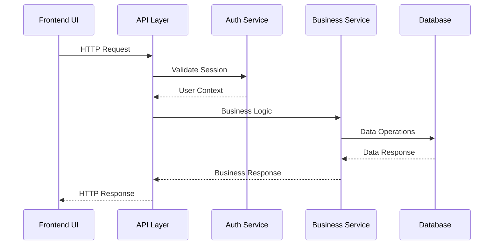
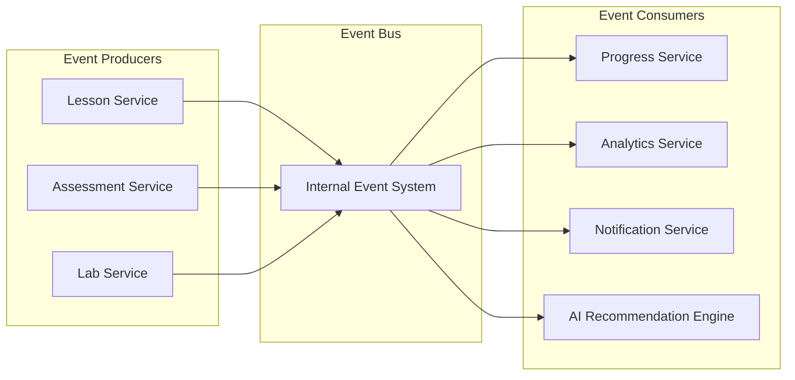

# Components

## Overview

The Science Advantage platform is composed of interconnected components that work together to deliver a comprehensive science education experience. This section outlines the major logical components, their responsibilities, interfaces, and interdependencies.

## Component Architecture

```mermaid
graph TB
    subgraph "Frontend Layer"
        UI[UI Components]
        AuthUI[Authentication UI]
        DashboardUI[Dashboard UI]
        LessonUI[Lesson Delivery UI]
        LabUI[Virtual Lab UI]
        AssessmentUI[Assessment UI]
    end

    subgraph "API Layer"
        AuthAPI[Authentication API]
        UserAPI[User Management API]
        ClassAPI[Classroom API]
        LessonAPI[Lesson API]
        LabAPI[Virtual Lab API]
        AssessmentAPI[Assessment API]
        ProgressAPI[Progress API]
        AI_API[AI Recommendation API]
        NotificationAPI[Notification API]
        AnalyticsAPI[Analytics API]
    end

    subgraph "Service Layer"
        AuthService[Authentication Service]
        UserService[User Management Service]
        ClassService[Classroom Management Service]
        LessonService[Lesson Delivery Service]
        LabService[Virtual Laboratory Service]
        AssessmentService[Assessment Engine Service]
        ProgressService[Progress Tracking Service]
        AI_Service[AI Recommendation Engine]
        NotificationService[Notification Service]
        AnalyticsService[Analytics Service]
        FileService[File Storage Service]
    end

    subgraph "Data Layer"
        PostgreSQL[(PostgreSQL on GCP)]
        GCS[(Google Cloud Storage)]
        OpenAI[OpenAI API]
    end

    UI --> AuthAPI
    UI --> UserAPI
    UI --> ClassAPI
    UI --> LessonAPI
    UI --> LabAPI
    UI --> AssessmentAPI
    UI --> ProgressAPI
    UI --> AI_API
    UI --> NotificationAPI
    UI --> AnalyticsAPI

    AuthAPI --> AuthService
    UserAPI --> UserService
    ClassAPI --> ClassService
    LessonAPI --> LessonService
    LabAPI --> LabService
    AssessmentAPI --> AssessmentService
    ProgressAPI --> ProgressService
    AI_API --> AI_Service
    NotificationAPI --> NotificationService
    AnalyticsAPI --> AnalyticsService

    AuthService --> PostgreSQL
    UserService --> PostgreSQL
    ClassService --> PostgreSQL
    LessonService --> PostgreSQL
    LabService --> PostgreSQL
    AssessmentService --> PostgreSQL
    ProgressService --> PostgreSQL
    AI_Service --> PostgreSQL
    AI_Service --> OpenAI
    NotificationService --> PostgreSQL
    AnalyticsService --> PostgreSQL
    FileService --> GCS
```

## Core Components

### Authentication Service

**Primary Responsibility:**

- User authentication and authorization
- Session management
- Role-based access control
- OAuth integration (Google)

**Key Interfaces/APIs:**

- `POST /api/auth/signin` - User authentication
- `POST /api/auth/signout` - User logout
- `GET /api/auth/session` - Session validation
- `POST /api/auth/register` - User registration
- `GET /api/auth/callback/google` - OAuth callback

**Dependencies:**

- NextAuth.js (authentication framework)
- PostgreSQL (for user profile data)

**Technology Specifics:**

- NextAuth.js for session management
- JWT tokens for session persistence
- Google OAuth 2.0 integration

### User Management Service

**Primary Responsibility:**

- User profile management
- Role assignment and permissions
- User preferences and settings
- Account lifecycle management

**Key Interfaces/APIs:**

- `GET /api/users/profile` - Get user profile
- `PUT /api/users/profile` - Update user profile
- `GET /api/users/roles` - Get user roles
- `POST /api/users/preferences` - Update preferences
- `DELETE /api/users/account` - Delete account

**Dependencies:**

- Authentication Service (user identity)
- PostgreSQL (user data storage)
- File Storage Service (profile images)

**Technology Specifics:**

- Prisma ORM for database operations
- Zod for data validation
- TypeScript for type safety

### Classroom Management Service

**Primary Responsibility:**

- Class creation and configuration
- Student enrollment and management
- Teacher permissions and controls
- Class scheduling and settings

**Key Interfaces/APIs:**

- `POST /api/classes` - Create new class
- `GET /api/classes` - List user's classes
- `PUT /api/classes/[id]` - Update class details
- `POST /api/classes/[id]/enroll` - Enroll students
- `DELETE /api/classes/[id]/students/[studentId]` - Remove student

**Dependencies:**

- User Management Service (user data)
- Authentication Service (authorization)
- PostgreSQL (class data)
- Notification Service (enrollment notifications)

**Technology Specifics:**

- Next.js API routes
- Prisma for database operations
- Role-based access control (RBAC)

## Learning Components

### Lesson Delivery Service

**Primary Responsibility:**

- Lesson content management and delivery
- Progress tracking within lessons
- Interactive content rendering
- Lesson sequencing and navigation

**Key Interfaces/APIs:**

- `GET /api/lessons/[slug]` - Get lesson content
- `POST /api/lessons/[slug]/progress` - Update lesson progress
- `GET /api/lessons/[slug]/next` - Get next lesson
- `POST /api/lessons/[slug]/complete` - Mark lesson complete

**Dependencies:**

- Classroom Management Service (class context)
- Progress Tracking Service (progress data)
- File Storage Service (media content)
- PostgreSQL (lesson data)

**Technology Specifics:**

- MDX for lesson content rendering
- React components for interactive elements
- Server-side rendering with Next.js

### Virtual Laboratory Service

**Primary Responsibility:**

- Virtual experiment simulation
- Lab data collection and analysis
- Experiment configuration and setup
- Scientific visualization

**Key Interfaces/APIs:**

- `GET /api/experiments/[id]` - Get experiment configuration
- `POST /api/experiments/[id]/submit` - Submit experiment data
- `GET /api/experiments/[id]/results` - Get experiment results
- `POST /api/experiments/[id]/reset` - Reset experiment state

**Dependencies:**

- Lesson Delivery Service (experiment context)
- Progress Tracking Service (completion tracking)
- File Storage Service (experiment data)
- PostgreSQL (experiment configurations)

**Technology Specifics:**

- Canvas API for scientific visualizations
- Web Workers for computation-intensive simulations
- React state management for experiment state

### Assessment Engine Service

**Primary Responsibility:**

- Quiz and test creation
- Question delivery and validation
- Score calculation and feedback
- Assessment analytics

**Key Interfaces/APIs:**

- `GET /api/assessments/[id]` - Get assessment questions
- `POST /api/assessments/[id]/submit` - Submit answers
- `GET /api/assessments/[id]/results` - Get assessment results
- `POST /api/assessments/[id]/feedback` - Generate feedback

**Dependencies:**

- Lesson Delivery Service (assessment context)
- Progress Tracking Service (score tracking)
- AI Recommendation Engine (adaptive testing)
- PostgreSQL (assessment data)

**Technology Specifics:**

- Question bank with multiple question types
- Real-time validation and scoring
- Adaptive difficulty algorithms

## Intelligence Components

### AI Recommendation Engine

**Primary Responsibility:**

- Personalized learning path recommendations
- Content difficulty adaptation
- Cross-subject connection suggestions
- Performance prediction and intervention

**Key Interfaces/APIs:**

- `GET /api/recommendations/lessons` - Get lesson recommendations
- `GET /api/recommendations/paths` - Get learning path suggestions
- `POST /api/recommendations/feedback` - Provide recommendation feedback
- `GET /api/recommendations/cross-subject` - Get cross-subject connections

**Dependencies:**

- Progress Tracking Service (performance data)
- Lesson Delivery Service (content metadata)
- Assessment Engine Service (assessment results)
- OpenAI API (AI processing)
- PostgreSQL (recommendation data)

**Technology Specifics:**

- OpenAI GPT-4 for content analysis
- Machine learning algorithms for personalization
- Real-time recommendation processing

### Progress Tracking Service

**Primary Responsibility:**

- Learning progress monitoring
- Performance analytics
- Completion tracking
- Achievement system

**Key Interfaces/APIs:**

- `GET /api/progress/overview` - Get overall progress
- `GET /api/progress/lessons/[id]` - Get lesson progress
- `POST /api/progress/update` - Update progress
- `GET /api/progress/achievements` - Get achievements

**Dependencies:**

- User Management Service (user context)
- Lesson Delivery Service (lesson completion)
- Assessment Engine Service (assessment scores)
- PostgreSQL (progress data)

**Technology Specifics:**

- Event-driven progress updates
- Real-time progress synchronization
- Gamification elements

## Supporting Components

### Notification Service

**Primary Responsibility:**

- User notifications management
- Email and in-app notifications
- Notification preferences
- Alert scheduling

**Key Interfaces/APIs:**

- `GET /api/notifications` - Get user notifications
- `POST /api/notifications/mark-read` - Mark notifications as read
- `PUT /api/notifications/preferences` - Update notification preferences
- `POST /api/notifications/send` - Send notification (admin)

**Dependencies:**

- User Management Service (user data)
- Classroom Management Service (class notifications)
- PostgreSQL (notification data)
- External email service (delivery)

**Technology Specifics:**

- Real-time notifications with WebSocket
- Email integration for external notifications
- Push notification support

### File Storage Service

**Primary Responsibility:**

- File upload and management
- Content delivery optimization
- File access control
- Storage quota management

**Key Interfaces/APIs:**

- `POST /api/files/upload` - Upload file
- `GET /api/files/[id]` - Retrieve file
- `DELETE /api/files/[id]` - Delete file
- `GET /api/files/usage` - Get storage usage

**Dependencies:**

- User Management Service (ownership)
- Authentication Service (access control)
- Cloud storage provider (file storage)

**Technology Specifics:**

- Google Cloud Storage for file management
- CDN integration for content delivery
- Image optimization and resizing

### Analytics Service

**Primary Responsibility:**

- Learning analytics collection
- Performance metrics calculation
- Usage pattern analysis
- Reporting and insights

**Key Interfaces/APIs:**

- `GET /api/analytics/dashboard` - Get dashboard analytics
- `GET /api/analytics/performance` - Get performance metrics
- `POST /api/analytics/events` - Track analytics events
- `GET /api/analytics/reports` - Generate reports

**Dependencies:**

- All services (event data collection)
- PostgreSQL (analytics data)
- Progress Tracking Service (learning data)

**Technology Specifics:**

- Event-driven data collection
- Real-time analytics processing
- Custom dashboard components

## Component Interaction Patterns

### Request Flow Pattern

### Event-Driven Pattern

## Technology Stack Integration

### Frontend Components

- **Framework:** Next.js 14 with App Router
- **UI Library:** Shadcn/ui components
- **Styling:** Tailwind CSS
- **State Management:** React Context + Zustand
- **Form Handling:** React Hook Form + Zod

### Backend Components

- **Runtime:** Node.js
- **API:** Next.js API Routes
- **Database:** PostgreSQL via Supabase
- **ORM:** Prisma
- **Authentication:** NextAuth.js + Supabase Auth

### External Integrations

- **AI Services:** OpenAI GPT-4
- **File Storage:** Supabase Storage
- **Email:** External email service
- **Analytics:** Custom analytics pipeline

## Scalability Considerations

### Component Scaling

- **Stateless Services:** All API services designed for horizontal scaling
- **Database Optimization:** Connection pooling and query optimization
- **Caching Strategy:** Redis for session and data caching
- **CDN Integration:** Static content delivery optimization

### Performance Optimization

- **Lazy Loading:** Components loaded on demand
- **Code Splitting:** Optimized bundle sizes
- **Database Indexing:** Optimized query performance
- **API Rate Limiting:** Prevent abuse and ensure stability

## Security Architecture

### Component Security

- **Authentication:** JWT-based session management
- **Authorization:** Role-based access control (RBAC)
- **Data Validation:** Input sanitization and validation
- **API Security:** Rate limiting and CORS configuration

### Data Protection

- **Encryption:** Data at rest and in transit
- **Privacy:** GDPR compliance considerations
- **Audit Logging:** Action tracking and monitoring
- **Access Controls:** Principle of least privilege
