# Core Workflows

This section illustrates key system workflows using sequence diagrams to show component interactions, data flow, and system behavior across the Science Advantage platform. Each workflow includes frontend and backend flows, error handling paths, and async operations.

## User Authentication Flow (Google OAuth)

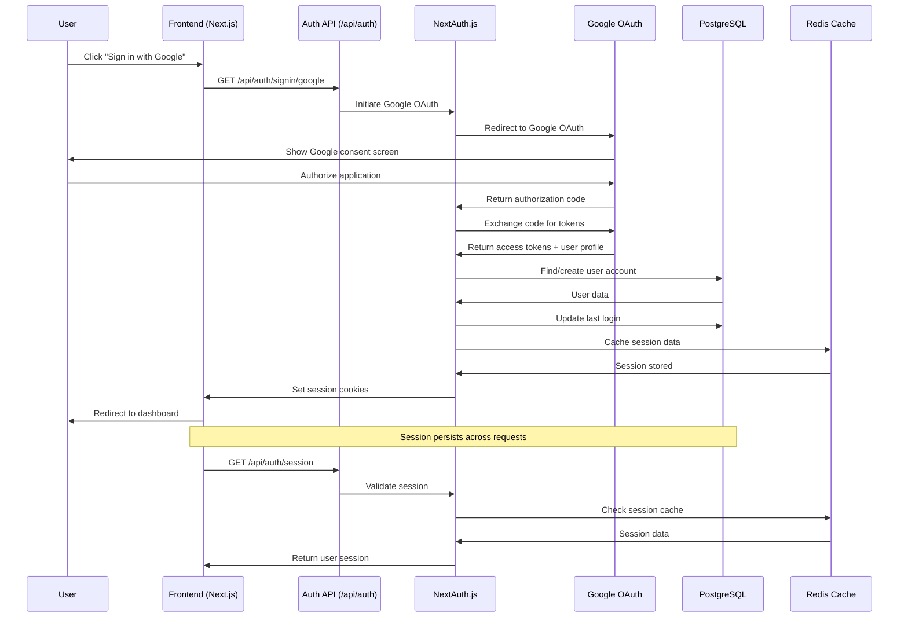
```mermaid
sequenceDiagram
    participant User
    participant Frontend as Frontend (Next.js)
    participant AuthAPI as Auth API (/api/auth)
    participant NextAuth as NextAuth.js
    participant Google as Google OAuth
    participant Database as PostgreSQL
    participant Redis as Redis Cache

    User->>Frontend: Click "Sign in with Google"
    Frontend->>AuthAPI: GET /api/auth/signin/google
    AuthAPI->>NextAuth: Initiate Google OAuth
    NextAuth->>Google: Redirect to Google OAuth
    Google->>User: Show Google consent screen
    User->>Google: Authorize application
    Google->>NextAuth: Return authorization code
    NextAuth->>Google: Exchange code for tokens
    Google->>NextAuth: Return access tokens + user profile

    NextAuth->>Database: Find/create user account
    Database->>NextAuth: User data
    NextAuth->>Database: Update last login
    NextAuth->>Redis: Cache session data
    Redis->>NextAuth: Session stored

    NextAuth->>Frontend: Set session cookies
    Frontend->>User: Redirect to dashboard

    Note over Frontend,Database: Session persists across requests
    Frontend->>AuthAPI: GET /api/auth/session
    AuthAPI->>NextAuth: Validate session
    NextAuth->>Redis: Check session cache
    Redis->>NextAuth: Session data
    NextAuth->>Frontend: Return user session
```

### Authentication Error Handling

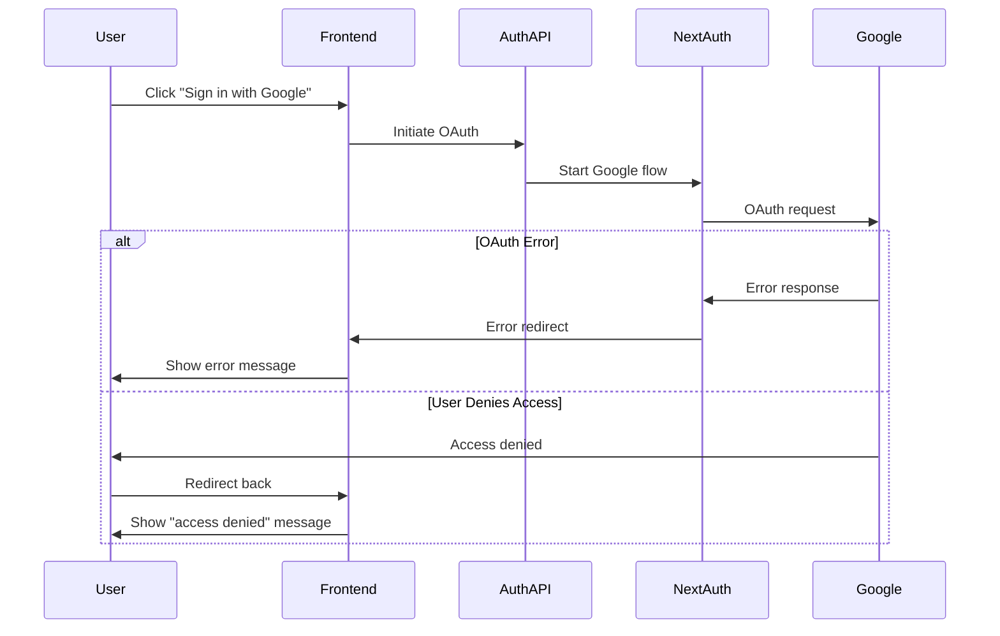
```mermaid
sequenceDiagram
    participant User
    participant Frontend
    participant AuthAPI
    participant NextAuth
    participant Google

    User->>Frontend: Click "Sign in with Google"
    Frontend->>AuthAPI: Initiate OAuth
    AuthAPI->>NextAuth: Start Google flow
    NextAuth->>Google: OAuth request

    alt OAuth Error
        Google->>NextAuth: Error response
        NextAuth->>Frontend: Error redirect
        Frontend->>User: Show error message
    else User Denies Access
        Google->>User: Access denied
        User->>Frontend: Redirect back
        Frontend->>User: Show "access denied" message
    end
```

## Student Lesson Completion Workflow

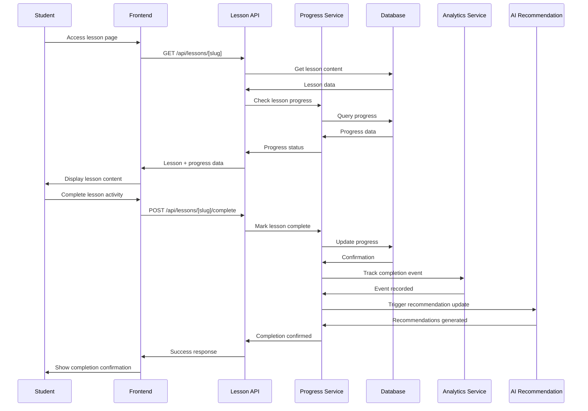
```mermaid
sequenceDiagram
    participant Student
    participant Frontend
    participant LessonAPI as Lesson API
    participant ProgressService as Progress Service
    participant Database
    participant Analytics as Analytics Service
    participant AIRecommendation as AI Recommendation

    Student->>Frontend: Access lesson page
    Frontend->>LessonAPI: GET /api/lessons/[slug]
    LessonAPI->>Database: Get lesson content
    Database->>LessonAPI: Lesson data
    LessonAPI->>ProgressService: Check lesson progress
    ProgressService->>Database: Query progress
    Database->>ProgressService: Progress data
    ProgressService->>LessonAPI: Progress status
    LessonAPI->>Frontend: Lesson + progress data
    Frontend->>Student: Display lesson content

    Student->>Frontend: Complete lesson activity
    Frontend->>LessonAPI: POST /api/lessons/[slug]/complete
    LessonAPI->>ProgressService: Mark lesson complete
    ProgressService->>Database: Update progress
    Database->>ProgressService: Confirmation
    ProgressService->>Analytics: Track completion event
    Analytics->>ProgressService: Event recorded
    ProgressService->>AIRecommendation: Trigger recommendation update
    AIRecommendation->>ProgressService: Recommendations generated
    ProgressService->>LessonAPI: Completion confirmed
    LessonAPI->>Frontend: Success response
    Frontend->>Student: Show completion confirmation
```

### Lesson Completion with Experiment

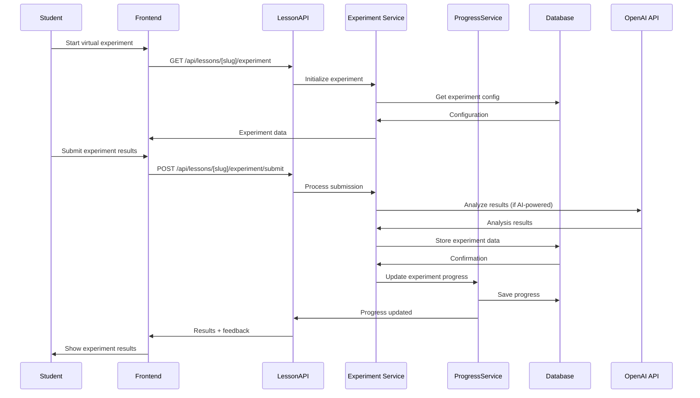
```mermaid
sequenceDiagram
    participant Student
    participant Frontend
    participant LessonAPI
    participant ExperimentService as Experiment Service
    participant ProgressService
    participant Database
    participant OpenAI as OpenAI API

    Student->>Frontend: Start virtual experiment
    Frontend->>LessonAPI: GET /api/lessons/[slug]/experiment
    LessonAPI->>ExperimentService: Initialize experiment
    ExperimentService->>Database: Get experiment config
    Database->>ExperimentService: Configuration
    ExperimentService->>Frontend: Experiment data

    Student->>Frontend: Submit experiment results
    Frontend->>LessonAPI: POST /api/lessons/[slug]/experiment/submit
    LessonAPI->>ExperimentService: Process submission
    ExperimentService->>OpenAI: Analyze results (if AI-powered)
    OpenAI->>ExperimentService: Analysis results
    ExperimentService->>Database: Store experiment data
    Database->>ExperimentService: Confirmation
    ExperimentService->>ProgressService: Update experiment progress
    ProgressService->>Database: Save progress
    ProgressService->>LessonAPI: Progress updated
    LessonAPI->>Frontend: Results + feedback
    Frontend->>Student: Show experiment results
```

## Virtual Laboratory Session Workflow

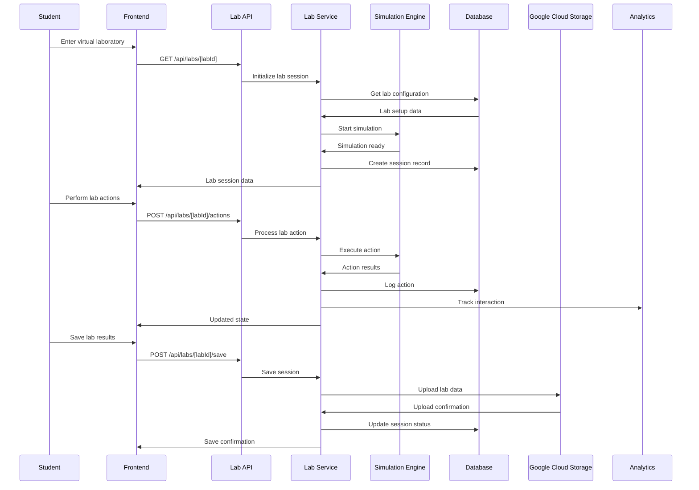
```mermaid
sequenceDiagram
    participant Student
    participant Frontend
    participant LabAPI as Lab API
    participant LabService as Lab Service
    participant SimulationEngine as Simulation Engine
    participant Database
    participant Storage as Google Cloud Storage
    participant Analytics

    Student->>Frontend: Enter virtual laboratory
    Frontend->>LabAPI: GET /api/labs/[labId]
    LabAPI->>LabService: Initialize lab session
    LabService->>Database: Get lab configuration
    Database->>LabService: Lab setup data
    LabService->>SimulationEngine: Start simulation
    SimulationEngine->>LabService: Simulation ready
    LabService->>Database: Create session record
    LabService->>Frontend: Lab session data

    Student->>Frontend: Perform lab actions
    Frontend->>LabAPI: POST /api/labs/[labId]/actions
    LabAPI->>LabService: Process lab action
    LabService->>SimulationEngine: Execute action
    SimulationEngine->>LabService: Action results
    LabService->>Database: Log action
    LabService->>Analytics: Track interaction
    LabService->>Frontend: Updated state

    Student->>Frontend: Save lab results
    Frontend->>LabAPI: POST /api/labs/[labId]/save
    LabAPI->>LabService: Save session
    LabService->>Storage: Upload lab data
    Storage->>LabService: Upload confirmation
    LabService->>Database: Update session status
    LabService->>Frontend: Save confirmation
```

## Error Handling and Recovery Patterns

### Database Connection Failure

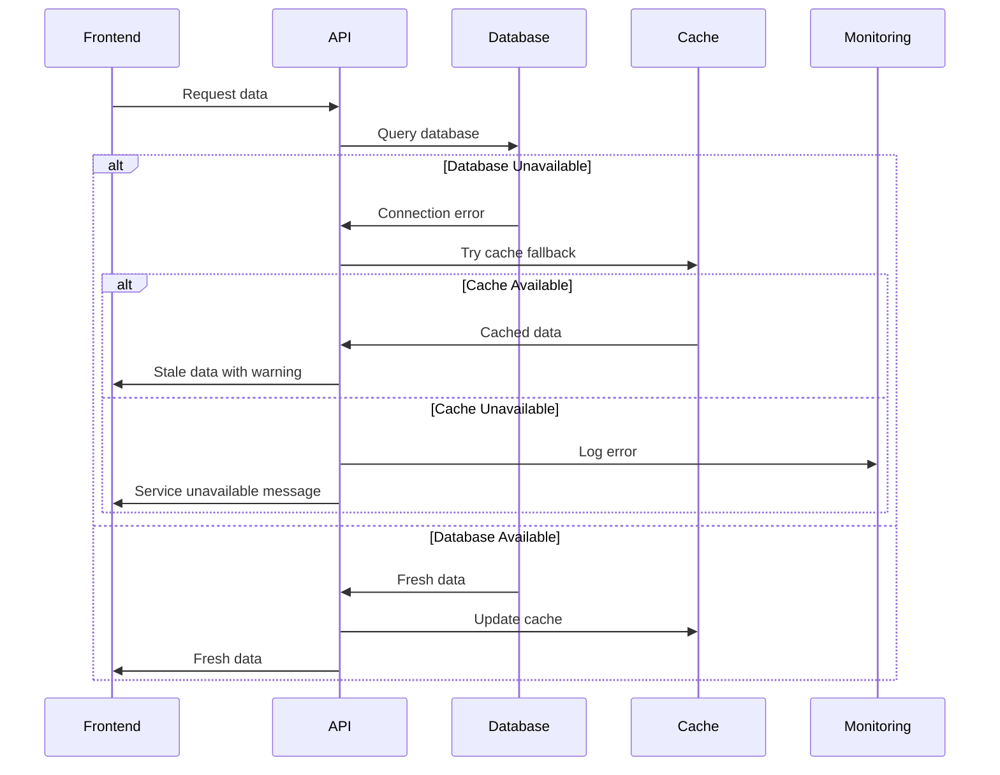
```mermaid
sequenceDiagram
    participant Frontend
    participant API
    participant Database
    participant Cache
    participant Monitoring

    Frontend->>API: Request data
    API->>Database: Query database

    alt Database Unavailable
        Database->>API: Connection error
        API->>Cache: Try cache fallback
        alt Cache Available
            Cache->>API: Cached data
            API->>Frontend: Stale data with warning
        else Cache Unavailable
            API->>Monitoring: Log error
            API->>Frontend: Service unavailable message
        end
    else Database Available
        Database->>API: Fresh data
        API->>Cache: Update cache
        API->>Frontend: Fresh data
    end
```

### External API Rate Limiting

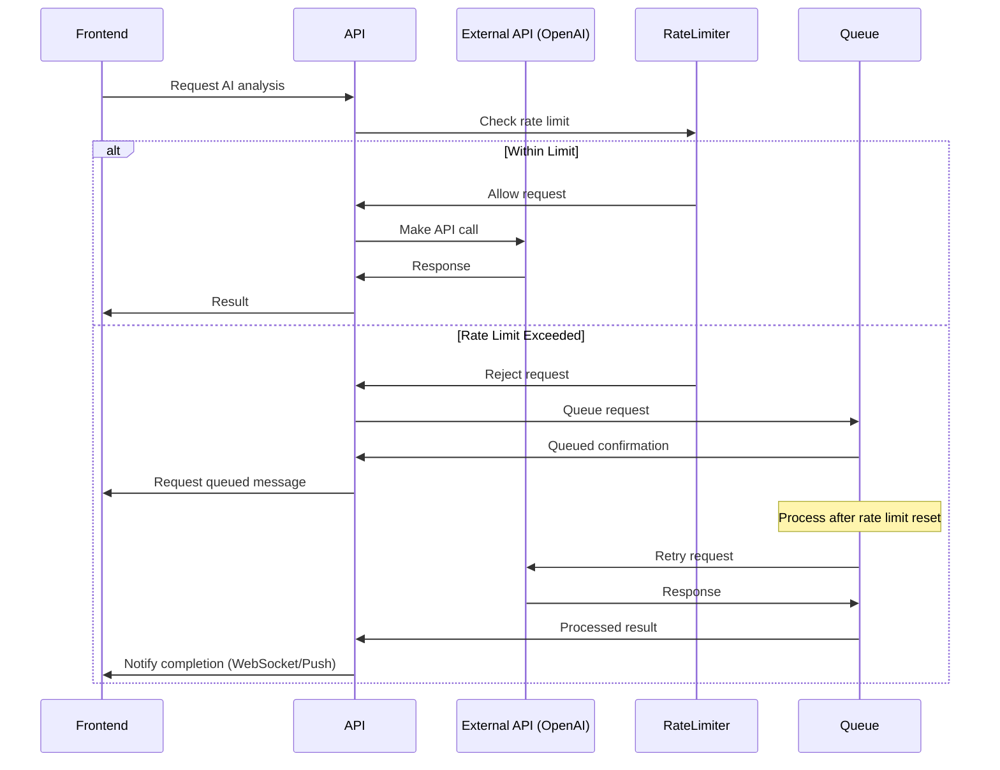
```mermaid
sequenceDiagram
    participant Frontend
    participant API
    participant ExternalAPI as External API (OpenAI)
    participant RateLimiter
    participant Queue

    Frontend->>API: Request AI analysis
    API->>RateLimiter: Check rate limit
    alt Within Limit
        RateLimiter->>API: Allow request
        API->>ExternalAPI: Make API call
        ExternalAPI->>API: Response
        API->>Frontend: Result
    else Rate Limit Exceeded
        RateLimiter->>API: Reject request
        API->>Queue: Queue request
        Queue->>API: Queued confirmation
        API->>Frontend: Request queued message

        Note over Queue: Process after rate limit reset
        Queue->>ExternalAPI: Retry request
        ExternalAPI->>Queue: Response
        Queue->>API: Processed result
        API->>Frontend: Notify completion (WebSocket/Push)
    end
```

### API Error Handling with Fallback

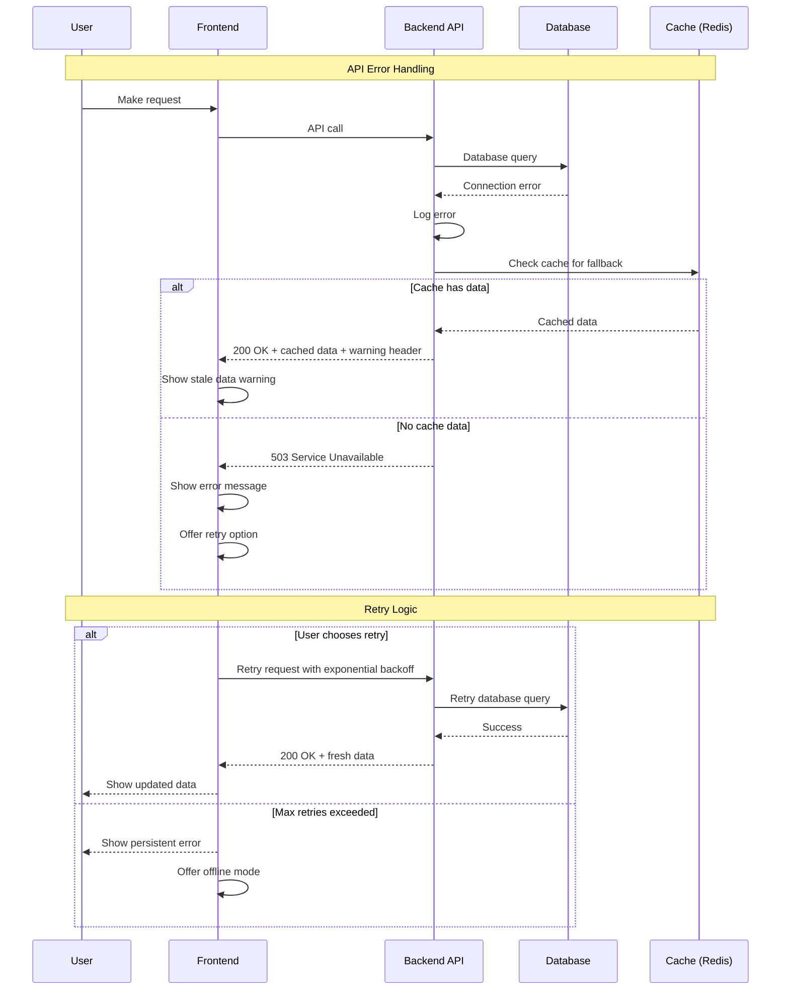
```mermaid
sequenceDiagram
    participant U as User
    participant F as Frontend
    participant B as Backend API
    participant D as Database
    participant C as Cache (Redis)

    Note over U,C: API Error Handling
    U->>F: Make request
    F->>B: API call
    B->>D: Database query
    D-->>B: Connection error
    B->>B: Log error
    B->>C: Check cache for fallback
    alt Cache has data
        C-->>B: Cached data
        B-->>F: 200 OK + cached data + warning header
        F->>F: Show stale data warning
    else No cache data
        B-->>F: 503 Service Unavailable
        F->>F: Show error message
        F->>F: Offer retry option
    end

    Note over U,C: Retry Logic
    alt User chooses retry
        F->>B: Retry request with exponential backoff
        B->>D: Retry database query
        D-->>B: Success
        B-->>F: 200 OK + fresh data
        F-->>U: Show updated data
    else Max retries exceeded
        F-->>U: Show persistent error
        F->>F: Offer offline mode
    end
```

## Async Operations and Background Jobs

### Lesson Content Preprocessing

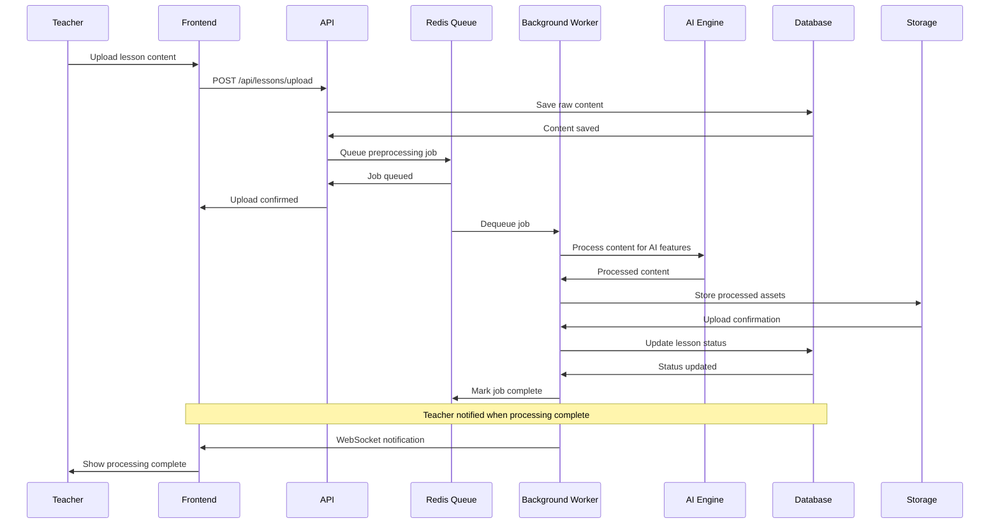
```mermaid
sequenceDiagram
    participant Teacher
    participant Frontend
    participant API
    participant JobQueue as Redis Queue
    participant Worker as Background Worker
    participant AIEngine as AI Engine
    participant Database
    participant Storage

    Teacher->>Frontend: Upload lesson content
    Frontend->>API: POST /api/lessons/upload
    API->>Database: Save raw content
    Database->>API: Content saved
    API->>JobQueue: Queue preprocessing job
    JobQueue->>API: Job queued
    API->>Frontend: Upload confirmed

    JobQueue->>Worker: Dequeue job
    Worker->>AIEngine: Process content for AI features
    AIEngine->>Worker: Processed content
    Worker->>Storage: Store processed assets
    Storage->>Worker: Upload confirmation
    Worker->>Database: Update lesson status
    Database->>Worker: Status updated
    Worker->>JobQueue: Mark job complete

    Note over Frontend,Database: Teacher notified when processing complete
    Worker->>Frontend: WebSocket notification
    Frontend->>Teacher: Show processing complete
```

### Async Report Generation

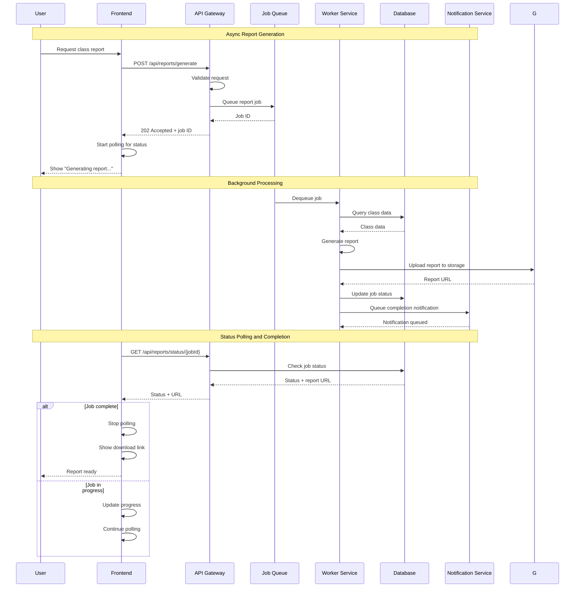
```mermaid
sequenceDiagram
    participant U as User
    participant F as Frontend
    participant A as API Gateway
    participant J as Job Queue
    participant W as Worker Service
    participant D as Database
    participant N as Notification Service

    Note over U,N: Async Report Generation
    U->>F: Request class report
    F->>A: POST /api/reports/generate
    A->>A: Validate request
    A->>J: Queue report job
    J-->>A: Job ID
    A-->>F: 202 Accepted + job ID
    F->>F: Start polling for status
    F-->>U: Show "Generating report..."

    Note over U,N: Background Processing
    J->>W: Dequeue job
    W->>D: Query class data
    D-->>W: Class data
    W->>W: Generate report
    W->>G: Upload report to storage
    G-->>W: Report URL
    W->>D: Update job status
    W->>N: Queue completion notification
    N-->>W: Notification queued

    Note over U,N: Status Polling and Completion
    F->>A: GET /api/reports/status/{jobId}
    A->>D: Check job status
    D-->>A: Status + report URL
    A-->>F: Status + URL
    alt Job complete
        F->>F: Stop polling
        F->>F: Show download link
        F-->>U: Report ready
    else Job in progress
        F->>F: Update progress
        F->>F: Continue polling
    end
```

## Assessment Submission and Grading

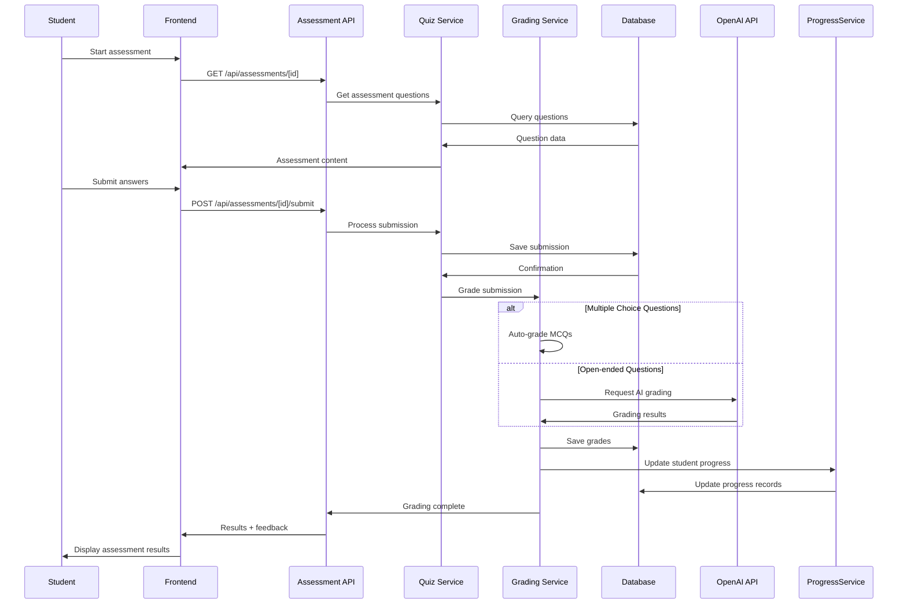
```mermaid
sequenceDiagram
    participant Student
    participant Frontend
    participant AssessmentAPI as Assessment API
    participant QuizService as Quiz Service
    participant GradingService as Grading Service
    participant Database
    participant OpenAI as OpenAI API
    participant ProgressService

    Student->>Frontend: Start assessment
    Frontend->>AssessmentAPI: GET /api/assessments/[id]
    AssessmentAPI->>QuizService: Get assessment questions
    QuizService->>Database: Query questions
    Database->>QuizService: Question data
    QuizService->>Frontend: Assessment content

    Student->>Frontend: Submit answers
    Frontend->>AssessmentAPI: POST /api/assessments/[id]/submit
    AssessmentAPI->>QuizService: Process submission
    QuizService->>Database: Save submission
    Database->>QuizService: Confirmation
    QuizService->>GradingService: Grade submission

    alt Multiple Choice Questions
        GradingService->>GradingService: Auto-grade MCQs
    else Open-ended Questions
        GradingService->>OpenAI: Request AI grading
        OpenAI->>GradingService: Grading results
    end

    GradingService->>Database: Save grades
    GradingService->>ProgressService: Update student progress
    ProgressService->>Database: Update progress records
    GradingService->>AssessmentAPI: Grading complete
    AssessmentAPI->>Frontend: Results + feedback
    Frontend->>Student: Display assessment results
```

## AI-Powered Recommendation Flow

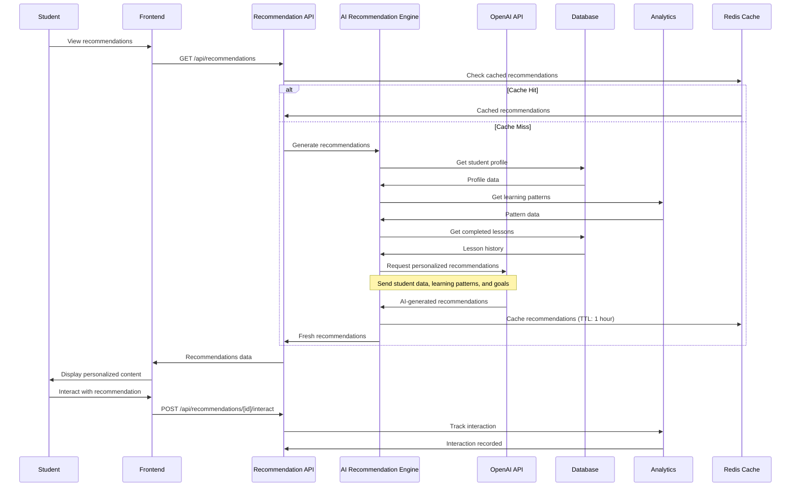
```mermaid
sequenceDiagram
    participant Student
    participant Frontend
    participant RecommendationAPI as Recommendation API
    participant AIEngine as AI Recommendation Engine
    participant OpenAI as OpenAI API
    participant Database
    participant Analytics
    participant Cache as Redis Cache

    Student->>Frontend: View recommendations
    Frontend->>RecommendationAPI: GET /api/recommendations
    RecommendationAPI->>Cache: Check cached recommendations
    alt Cache Hit
        Cache->>RecommendationAPI: Cached recommendations
    else Cache Miss
        RecommendationAPI->>AIEngine: Generate recommendations
        AIEngine->>Database: Get student profile
        Database->>AIEngine: Profile data
        AIEngine->>Analytics: Get learning patterns
        Analytics->>AIEngine: Pattern data
        AIEngine->>Database: Get completed lessons
        Database->>AIEngine: Lesson history

        AIEngine->>OpenAI: Request personalized recommendations
        Note over AIEngine,OpenAI: Send student data, learning patterns, and goals
        OpenAI->>AIEngine: AI-generated recommendations
        AIEngine->>Cache: Cache recommendations (TTL: 1 hour)
        AIEngine->>RecommendationAPI: Fresh recommendations
    end
    RecommendationAPI->>Frontend: Recommendations data
    Frontend->>Student: Display personalized content

    Student->>Frontend: Interact with recommendation
    Frontend->>RecommendationAPI: POST /api/recommendations/[id]/interact
    RecommendationAPI->>Analytics: Track interaction
    Analytics->>RecommendationAPI: Interaction recorded
```

## Cross-Subject Learning Integration

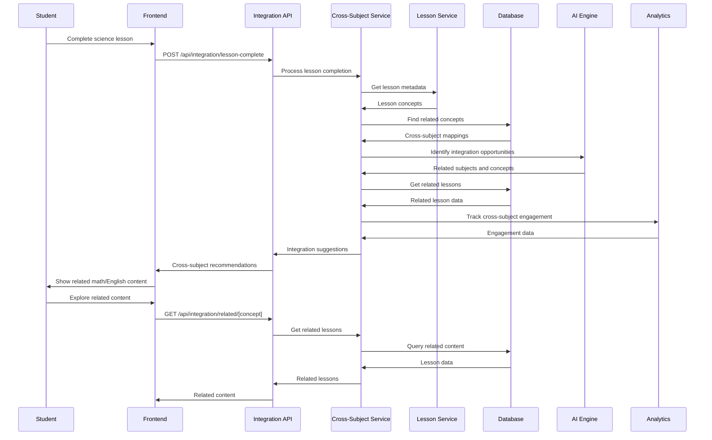
```mermaid
sequenceDiagram
    participant Student
    participant Frontend
    participant IntegrationAPI as Integration API
    participant CrossSubjectService as Cross-Subject Service
    participant LessonService as Lesson Service
    participant Database
    participant AIEngine as AI Engine
    participant Analytics

    Student->>Frontend: Complete science lesson
    Frontend->>IntegrationAPI: POST /api/integration/lesson-complete
    IntegrationAPI->>CrossSubjectService: Process lesson completion
    CrossSubjectService->>LessonService: Get lesson metadata
    LessonService->>CrossSubjectService: Lesson concepts
    CrossSubjectService->>Database: Find related concepts
    Database->>CrossSubjectService: Cross-subject mappings

    CrossSubjectService->>AIEngine: Identify integration opportunities
    AIEngine->>CrossSubjectService: Related subjects and concepts
    CrossSubjectService->>Database: Get related lessons
    Database->>CrossSubjectService: Related lesson data
    CrossSubjectService->>Analytics: Track cross-subject engagement
    Analytics->>CrossSubjectService: Engagement data

    CrossSubjectService->>IntegrationAPI: Integration suggestions
    IntegrationAPI->>Frontend: Cross-subject recommendations
    Frontend->>Student: Show related math/English content

    Student->>Frontend: Explore related content
    Frontend->>IntegrationAPI: GET /api/integration/related/[concept]
    IntegrationAPI->>CrossSubjectService: Get related lessons
    CrossSubjectService->>Database: Query related content
    Database->>CrossSubjectService: Lesson data
    CrossSubjectService->>IntegrationAPI: Related lessons
    IntegrationAPI->>Frontend: Related content
```

## Teacher Classroom Management Workflow

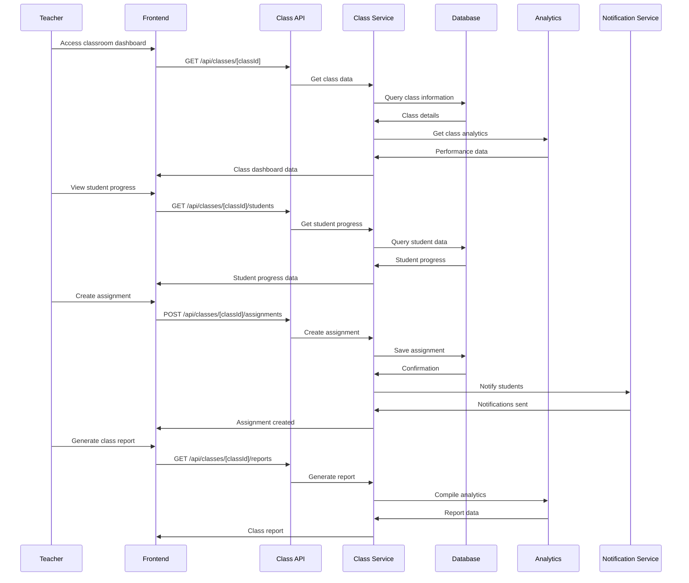
```mermaid
sequenceDiagram
    participant Teacher
    participant Frontend
    participant ClassAPI as Class API
    participant ClassService as Class Service
    participant Database
    participant Analytics
    participant NotificationService as Notification Service

    Teacher->>Frontend: Access classroom dashboard
    Frontend->>ClassAPI: GET /api/classes/[classId]
    ClassAPI->>ClassService: Get class data
    ClassService->>Database: Query class information
    Database->>ClassService: Class details
    ClassService->>Analytics: Get class analytics
    Analytics->>ClassService: Performance data
    ClassService->>Frontend: Class dashboard data

    Teacher->>Frontend: View student progress
    Frontend->>ClassAPI: GET /api/classes/[classId]/students
    ClassAPI->>ClassService: Get student progress
    ClassService->>Database: Query student data
    Database->>ClassService: Student progress
    ClassService->>Frontend: Student progress data

    Teacher->>Frontend: Create assignment
    Frontend->>ClassAPI: POST /api/classes/[classId]/assignments
    ClassAPI->>ClassService: Create assignment
    ClassService->>Database: Save assignment
    Database->>ClassService: Confirmation
    ClassService->>NotificationService: Notify students
    NotificationService->>ClassService: Notifications sent
    ClassService->>Frontend: Assignment created

    Teacher->>Frontend: Generate class report
    Frontend->>ClassAPI: GET /api/classes/[classId]/reports
    ClassAPI->>ClassService: Generate report
    ClassService->>Analytics: Compile analytics
    Analytics->>ClassService: Report data
    ClassService->>Frontend: Class report
```

## Progress Tracking and Analytics

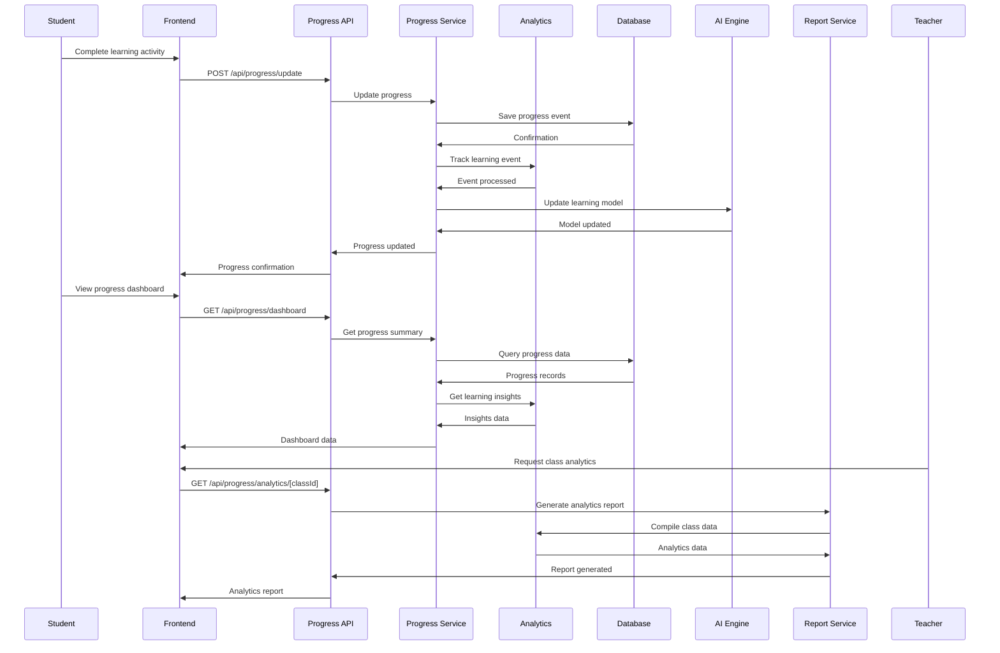
```mermaid
sequenceDiagram
    participant Student
    participant Frontend
    participant ProgressAPI as Progress API
    participant ProgressService as Progress Service
    participant Analytics
    participant Database
    participant AIEngine as AI Engine
    participant ReportService as Report Service

    Student->>Frontend: Complete learning activity
    Frontend->>ProgressAPI: POST /api/progress/update
    ProgressAPI->>ProgressService: Update progress
    ProgressService->>Database: Save progress event
    Database->>ProgressService: Confirmation
    ProgressService->>Analytics: Track learning event
    Analytics->>ProgressService: Event processed

    ProgressService->>AIEngine: Update learning model
    AIEngine->>ProgressService: Model updated
    ProgressService->>ProgressAPI: Progress updated
    ProgressAPI->>Frontend: Progress confirmation

    Student->>Frontend: View progress dashboard
    Frontend->>ProgressAPI: GET /api/progress/dashboard
    ProgressAPI->>ProgressService: Get progress summary
    ProgressService->>Database: Query progress data
    Database->>ProgressService: Progress records
    ProgressService->>Analytics: Get learning insights
    Analytics->>ProgressService: Insights data
    ProgressService->>Frontend: Dashboard data

    Teacher->>Frontend: Request class analytics
    Frontend->>ProgressAPI: GET /api/progress/analytics/[classId]
    ProgressAPI->>ReportService: Generate analytics report
    ReportService->>Analytics: Compile class data
    Analytics->>ReportService: Analytics data
    ReportService->>ProgressAPI: Report generated
    ProgressAPI->>Frontend: Analytics report
```

## Data Synchronization Flow

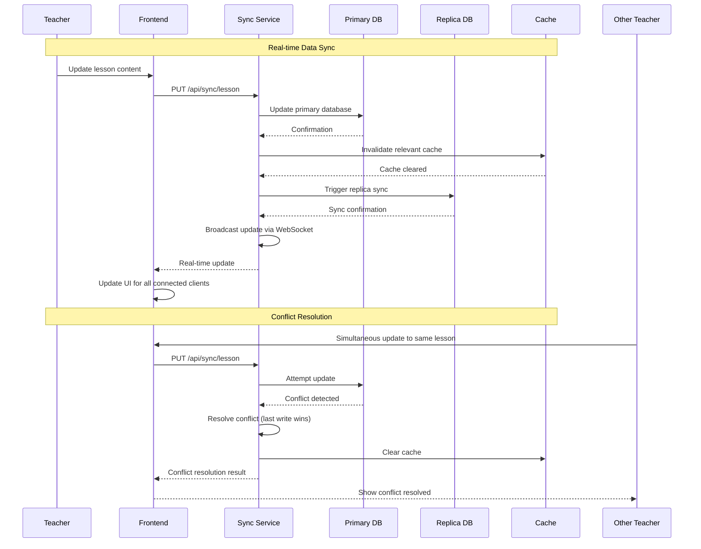
```mermaid
sequenceDiagram
    participant T as Teacher
    participant F as Frontend
    participant S as Sync Service
    participant D1 as Primary DB
    participant D2 as Replica DB
    participant C as Cache

    Note over T,C: Real-time Data Sync
    T->>F: Update lesson content
    F->>S: PUT /api/sync/lesson
    S->>D1: Update primary database
    D1-->>S: Confirmation
    S->>C: Invalidate relevant cache
    C-->>S: Cache cleared
    S->>D2: Trigger replica sync
    D2-->>S: Sync confirmation
    S->>S: Broadcast update via WebSocket
    S-->>F: Real-time update
    F->>F: Update UI for all connected clients

    Note over T,C: Conflict Resolution
    participant O as Other Teacher
    O->>F: Simultaneous update to same lesson
    F->>S: PUT /api/sync/lesson
    S->>D1: Attempt update
    D1-->>S: Conflict detected
    S->>S: Resolve conflict (last write wins)
    S->>C: Clear cache
    S-->>F: Conflict resolution result
    F-->>O: Show conflict resolved
```

## Workflow Design Principles

### 1. Separation of Concerns

- **Frontend**: Handles UI interactions, client-side validation, and user experience
- **Backend**: Manages business logic, data persistence, and external integrations
- **Services**: Specialized components for specific domains (auth, lessons, experiments)
- **Infrastructure**: Cross-cutting concerns like caching, messaging, and storage

### 2. Error Handling Strategy

- **Graceful Degradation**: System continues functioning with reduced capabilities
- **User Feedback**: Clear error messages with actionable next steps
- **Retry Logic**: Exponential backoff for transient failures
- **Circuit Breakers**: Prevent cascade failures in distributed systems

### 3. Performance Optimization

- **Caching Layers**: Multiple cache levels for different data types
- **Async Processing**: Background jobs for long-running operations
- **Data Pagination**: Large datasets delivered in chunks
- **Lazy Loading**: Content loaded on demand

### 4. Security Considerations

- **Authentication**: JWT tokens with refresh mechanism
- **Authorization**: Role-based access control (RBAC)
- **Data Validation**: Input validation at multiple layers
- **Secure Storage**: Encrypted sensitive data

### 5. Scalability Patterns

- **Horizontal Scaling**: Stateless services for easy scaling
- **Database Sharding**: Data partitioning for large datasets
- **CDN Integration**: Static content delivery optimization
- **Load Balancing**: Request distribution across instances

## Integration Points

### External Services

- **Google OAuth**: Authentication and user identity
- **Google Cloud Storage**: File storage for experiments and media
- **Email Service**: Notifications and communications
- **Payment Gateway**: Subscription management (future)

### Internal Services

- **Authentication Service**: User management and session handling
- **Lesson Service**: Curriculum content and delivery
- **Progress Service**: Student progress tracking
- **Experiment Service**: Virtual laboratory management
- **Notification Service**: Real-time updates and alerts

### Data Flow Patterns

- **Request-Response**: Synchronous API calls
- **Event-Driven**: Async message passing
- **Streaming**: Real-time data updates
- **Batch Processing**: Scheduled data operations
