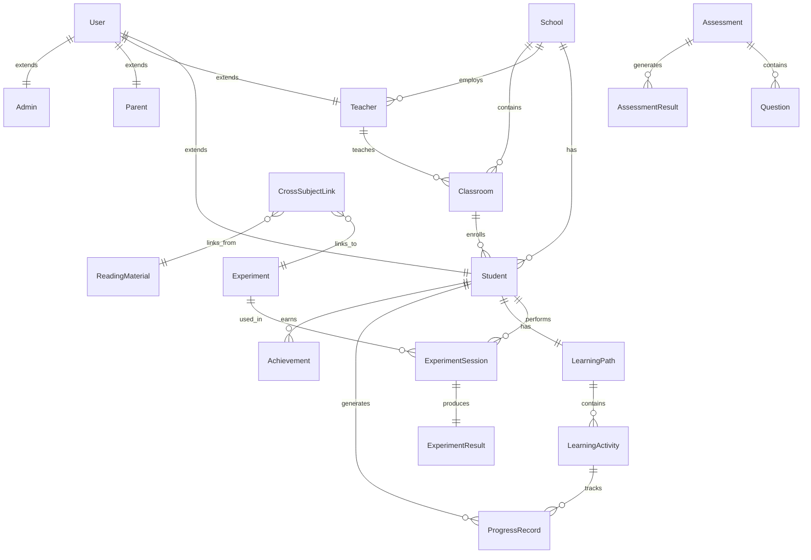

# Data Models

## Overview

The data models for Science Advantage represent the core entities that will be shared between frontend and backend systems. These models are designed to support the complex educational ecosystem, including curriculum management, student progress tracking, virtual laboratories, and cross-subject learning integration.

## Core Data Models

### User

**Purpose:** Represents all users in the system including students, teachers, parents, and administrators with role-based access control.

**Key Attributes:**

- id: UUID - Primary identifier
- email: string - Unique email address
- username: string - Unique username
- passwordHash: string - Encrypted password
- role: enum - STUDENT | TEACHER | PARENT | ADMIN
- profile: UserProfile - Extended profile information
- preferences: UserPreferences - User-specific settings
- ecosystemAccounts: EcosystemAccount[] - Links to other Advantage products
- createdAt: DateTime - Account creation timestamp
- updatedAt: DateTime - Last update timestamp
- isActive: boolean - Account status
- lastLoginAt: DateTime - Last login timestamp

#### TypeScript Interface

```typescript
interface User {
  id: string;
  email: string;
  username: string;
  role: 'STUDENT' | 'TEACHER' | 'PARENT' | 'ADMIN';
  profile: UserProfile;
  preferences: UserPreferences;
  ecosystemAccounts: EcosystemAccount[];
  createdAt: Date;
  updatedAt: Date;
  isActive: boolean;
  lastLoginAt?: Date;
}

interface UserProfile {
  firstName: string;
  lastName: string;
  displayName: string;
  avatar?: string;
  dateOfBirth?: Date;
  gender?: 'MALE' | 'FEMALE' | 'OTHER';
  nationality: string;
  primaryLanguage: 'TH' | 'EN';
  timezone: string;
}

interface UserPreferences {
  language: 'TH' | 'EN' | 'BOTH';
  theme: 'LIGHT' | 'DARK' | 'AUTO';
  notifications: NotificationPreferences;
  accessibility: AccessibilityPreferences;
  learningStyle?: 'VISUAL' | 'AUDITORY' | 'KINESTHETIC' | 'READING';
}

interface EcosystemAccount {
  product: 'READING_ADVANTAGE' | 'PRIMARY_ADVANTAGE' | 'SCIENCE_ADVANTAGE';
  externalId: string;
  linkedAt: Date;
  isActive: boolean;
}
```

#### Relationships

- One-to-many with StudentProfile (if role is STUDENT)
- One-to-many with TeacherProfile (if role is TEACHER)
- One-to-many with ParentProfile (if role is PARENT)
- One-to-many with Enrollment (as student)
- One-to-many with Classroom (as teacher)

### Student

**Purpose:** Extends User with student-specific information including academic details and learning preferences.

**Key Attributes:**

- userId: UUID - Foreign key to User
- studentId: string - School-provided student identifier
- gradeLevel: integer - Current grade level (1-12)
- schoolId: UUID - Associated school
- classroomIds: UUID[] - Enrolled classrooms
- parentIds: UUID[] - Linked parent accounts
- learningProfile: LearningProfile - AI-powered learning profile
- progressRecords: ProgressRecord[] - Historical progress data
- achievements: Achievement[] - Earned achievements
- currentLearningPath: LearningPath - Active personalized path

#### TypeScript Interface

```typescript
interface Student {
  userId: string;
  studentId: string;
  gradeLevel: number;
  schoolId: string;
  classroomIds: string[];
  parentIds: string[];
  learningProfile: LearningProfile;
  currentLearningPath?: LearningPath;
}

interface LearningProfile {
  scienceAptitude: number; // 0-100 scale
  readingLevel: number; // Grade level equivalent
  learningPace: 'SLOW' | 'NORMAL' | 'FAST';
  preferredTopics: string[];
  weakAreas: string[];
  lastAssessmentDate: Date;
  adaptationHistory: AdaptationRecord[];
}

interface AdaptationRecord {
  date: Date;
  type: 'DIFFICULTY_ADJUSTMENT' | 'TOPIC_RECOMMENDATION' | 'PACE_CHANGE';
  oldValue: any;
  newValue: any;
  reason: string;
  effectiveness?: number; // 0-100 scale
}
```

#### Relationships

- Belongs-to User (one-to-one)
- Belongs-to School (many-to-one)
- Has-many Enrollment
- Has-many ProgressRecord
- Has-many Achievement
- Has-many ExperimentSession

### Teacher

**Purpose:** Extends User with teacher-specific information including classroom management and credentials.

**Key Attributes:**

- userId: UUID - Foreign key to User
- teacherId: string - School-provided teacher identifier
- schoolId: UUID - Associated school
- classroomIds: UUID[] - Managed classrooms
- subjects: Subject[] - Subjects taught
- credentials: TeacherCredential[] - Teaching qualifications
- teachingStyle: TeachingStyle - Preferred teaching methods
- classroomSettings: ClassroomSettings - Default classroom preferences

#### TypeScript Interface

```typescript
interface Teacher {
  userId: string;
  teacherId: string;
  schoolId: string;
  classroomIds: string[];
  subjects: Subject[];
  credentials: TeacherCredential[];
  teachingStyle: TeachingStyle;
  classroomSettings: ClassroomSettings;
}

interface TeacherCredential {
  type: 'BACHELOR' | 'MASTER' | 'PHD' | 'CERTIFICATE';
  field: string;
  institution: string;
  yearObtained: number;
  certificateUrl?: string;
}

interface TeachingStyle {
  approach: 'TRADITIONAL' | 'PROJECT_BASED' | 'INQUIRY_BASED' | 'BLENDED';
  technologyIntegration: 'MINIMAL' | 'MODERATE' | 'EXTENSIVE';
  assessmentPreference: 'FORMAL' | 'INFORMAL' | 'BLENDED';
  classroomManagement: 'AUTHORITATIVE' | 'COLLABORATIVE' | 'PERMISSIVE';
}
```

#### Relationships

- Belongs-to User (one-to-one)
- Belongs-to School (many-to-one)
- Has-many Classroom
- Has-many Assignment
- Has-many Assessment

### School

**Purpose:** Represents educational institutions using the platform.

**Key Attributes:**

- id: UUID - Primary identifier
- name: string - School name
- type: enum - PUBLIC | PRIVATE | INTERNATIONAL
- address: Address - Physical address
- contactInfo: ContactInfo - Contact details
- subscription: Subscription - Current subscription details
- settings: SchoolSettings - School-wide configuration
- lmsIntegration: LMSIntegration - Learning management system integration
- statistics: SchoolStatistics - Usage and performance statistics

#### TypeScript Interface

```typescript
interface School {
  id: string;
  name: string;
  type: 'PUBLIC' | 'PRIVATE' | 'INTERNATIONAL';
  address: Address;
  contactInfo: ContactInfo;
  subscription: Subscription;
  settings: SchoolSettings;
  lmsIntegration?: LMSIntegration;
  statistics: SchoolStatistics;
}

interface SchoolSettings {
  academicCalendar: AcademicCalendar;
  gradingScale: GradingScale;
  languagePolicy: 'TH_ONLY' | 'EN_ONLY' | 'BILINGUAL';
  accessibilityRequirements: AccessibilityRequirement[];
  dataRetentionPolicy: DataRetentionPolicy;
}

interface LMSIntegration {
  platform: 'MOODLE' | 'GOOGLE_CLASSROOM' | 'CANVAS' | 'CUSTOM';
  apiKey: string;
  endpointUrl: string;
  syncSettings: SyncSettings;
  lastSyncAt: Date;
}
```

#### Relationships

- Has-many Student
- Has-many Teacher
- Has-many Classroom
- Has-many Enrollment

### Classroom

**Purpose:** Represents individual classes where students learn science concepts.

**Key Attributes:**

- id: UUID - Primary identifier
- name: string - Classroom name/identifier
- description: string - Classroom description
- teacherId: UUID - Primary teacher
- schoolId: UUID - Associated school
- gradeLevel: integer - Grade level
- subject: Subject - Subject focus
- studentIds: UUID[] - Enrolled students
- curriculum: Curriculum - Assigned curriculum
- schedule: ClassSchedule - Class meeting times
- settings: ClassroomSettings - Classroom-specific settings
- activeSemester: Semester - Current academic period

#### TypeScript Interface

```typescript
interface Classroom {
  id: string;
  name: string;
  description: string;
  teacherId: string;
  schoolId: string;
  gradeLevel: number;
  subject: Subject;
  studentIds: string[];
  curriculum: Curriculum;
  schedule: ClassSchedule;
  settings: ClassroomSettings;
  activeSemester: Semester;
}

interface Curriculum {
  id: string;
  name: string;
  gradeLevel: number;
  subject: Subject;
  units: CurriculumUnit[];
  standards: EducationStandard[];
  customizationOptions: CurriculumCustomization[];
}

interface CurriculumUnit {
  id: string;
  title: string;
  description: string;
  order: number;
  lessons: Lesson[];
  experiments: Experiment[];
  assessments: Assessment[];
  estimatedDuration: number; // in hours
}
```

#### Relationships

- Belongs-to Teacher (many-to-one)
- Belongs-to School (many-to-one)
- Has-many Enrollment
- Has-many Assignment
- Has-many ExperimentSession

### Experiment

**Purpose:** Represents virtual laboratory experiments and simulations.

**Key Attributes:**

- id: UUID - Primary identifier
- title: string - Experiment title
- description: string - Detailed description
- category: ExperimentCategory - Science category
- difficulty: integer - Difficulty level (1-5)
- estimatedDuration: integer - Time in minutes
- prerequisites: string[] - Required knowledge
- learningObjectives: string[] - Learning goals
- safetyGuidelines: SafetyGuideline[] - Safety instructions
- simulation: SimulationConfig - Simulation configuration
- assessmentCriteria: AssessmentCriterion[] - Evaluation criteria
- thaiCulturalContext: ThaiContext - Cultural adaptation

#### TypeScript Interface

```typescript
interface Experiment {
  id: string;
  title: string;
  description: string;
  category: ExperimentCategory;
  difficulty: number;
  estimatedDuration: number;
  prerequisites: string[];
  learningObjectives: string[];
  safetyGuidelines: SafetyGuideline[];
  simulation: SimulationConfig;
  assessmentCriteria: AssessmentCriterion[];
  thaiCulturalContext: ThaiContext;
}

type ExperimentCategory =
  | 'PHYSICS_MECHANICS'
  | 'PHYSICS_ELECTRICITY'
  | 'PHYSICS_OPTICS'
  | 'CHEMISTRY_REACTIONS'
  | 'CHEMISTRY_SOLUTIONS'
  | 'BIOLOGY_CELLS'
  | 'BIOLOGY_ECOSYSTEMS'
  | 'EARTH_SCIENCE_GEOLOGY'
  | 'EARTH_SCIENCE_METEOROLOGY';

interface SimulationConfig {
  type: '2D' | '3D' | 'INTERACTIVE' | 'VIDEO';
  engine: string; // e.g., 'PhET', 'Custom WebGL'
  parameters: SimulationParameter[];
  interactions: Interaction[];
  resources: SimulationResource[];
}

interface ThaiContext {
  localExamples: string[];
  culturalReferences: string[];
  languageAdaptations: LanguageAdaptation[];
  regionalVariations?: RegionalVariation[];
}
```

#### Relationships

- Belongs-to many CurriculumUnit
- Has-many ExperimentSession
- Has-many ExperimentResult

### ExperimentSession

**Purpose:** Tracks individual student sessions with virtual experiments.

**Key Attributes:**

- id: UUID - Primary identifier
- experimentId: UUID - Associated experiment
- studentId: UUID - Student performing experiment
- classroomId: UUID - Classroom context
- startTime: DateTime - Session start
- endTime?: DateTime - Session completion
- status: SessionStatus - Current state
- progress: SessionProgress - Completion progress
- interactions: InteractionLog[] - User interactions
- results: ExperimentResult - Session outcomes
- feedback: SessionFeedback - Student feedback
- aiInsights: AIInsight[] - AI-generated insights

#### TypeScript Interface

```typescript
interface ExperimentSession {
  id: string;
  experimentId: string;
  studentId: string;
  classroomId: string;
  startTime: Date;
  endTime?: Date;
  status: SessionStatus;
  progress: SessionProgress;
  interactions: InteractionLog[];
  results?: ExperimentResult;
  feedback?: SessionFeedback;
  aiInsights: AIInsight[];
}

type SessionStatus =
  | 'NOT_STARTED'
  | 'IN_PROGRESS'
  | 'PAUSED'
  | 'COMPLETED'
  | 'ABANDONED'
  | 'FAILED';

interface SessionProgress {
  stepsCompleted: number;
  totalSteps: number;
  currentStep: string;
  timeSpent: number; // in seconds
  hintsUsed: number;
  mistakesMade: number;
  conceptsMastered: string[];
}

interface InteractionLog {
  timestamp: Date;
  action: string;
  parameters: Record<string, any>;
  duration: number; // in milliseconds
  result: 'SUCCESS' | 'ERROR' | 'HINT' | 'RESET';
}
```

#### Relationships

- Belongs-to Experiment (many-to-one)
- Belongs-to Student (many-to-one)
- Belongs-to Classroom (many-to-one)
- Has-one ExperimentResult

### LearningPath

**Purpose:** AI-generated personalized learning paths for individual students.

**Key Attributes:**

- id: UUID - Primary identifier
- studentId: UUID - Target student
- title: string - Path title
- description: string - Path description
- goals: LearningGoal[] - Learning objectives
- activities: LearningActivity[] - Ordered activities
- adaptations: PathAdaptation[] - AI adaptation history
- progress: PathProgress - Overall progress
- estimatedCompletion: DateTime - Predicted completion
- difficulty: DifficultyLevel - Adaptive difficulty
- recommendations: Recommendation[] - AI recommendations

#### TypeScript Interface

```typescript
interface LearningPath {
  id: string;
  studentId: string;
  title: string;
  description: string;
  goals: LearningGoal[];
  activities: LearningActivity[];
  adaptations: PathAdaptation[];
  progress: PathProgress;
  estimatedCompletion: Date;
  difficulty: DifficultyLevel;
  recommendations: Recommendation[];
}

interface LearningActivity {
  id: string;
  type: 'LESSON' | 'EXPERIMENT' | 'ASSESSMENT' | 'READING' | 'VIDEO';
  title: string;
  description: string;
  order: number;
  estimatedDuration: number;
  prerequisites: string[];
  resources: ActivityResource[];
  assessmentCriteria?: AssessmentCriterion[];
}

interface PathAdaptation {
  id: string;
  timestamp: Date;
  trigger: AdaptationTrigger;
  change: AdaptationChange;
  reason: string;
  effectiveness?: number;
}

interface Recommendation {
  id: string;
  type: 'CONTENT' | 'PACE' | 'DIFFICULTY' | 'TOPIC';
  priority: 'LOW' | 'MEDIUM' | 'HIGH' | 'URGENT';
  title: string;
  description: string;
  actionItems: string[];
  evidence: RecommendationEvidence[];
}
```

#### Relationships

- Belongs-to Student (many-to-one)
- Has-many LearningActivity
- Has-many Recommendation

### Assessment

**Purpose:** Represents various types of assessments including quizzes, tests, and experiment evaluations.

**Key Attributes:**

- id: UUID - Primary identifier
- title: string - Assessment title
- description: string - Assessment description
- type: AssessmentType - Type of assessment
- category: AssessmentCategory - Subject category
- difficulty: integer - Difficulty level (1-5)
- timeLimit?: integer - Time limit in minutes
- questions: Question[] - Assessment questions
- gradingRubric: GradingRubric - Grading criteria
- randomization: RandomizationSettings - Question randomization
- accessibility: AccessibilitySettings - Accessibility accommodations

#### TypeScript Interface

```typescript
interface Assessment {
  id: string;
  title: string;
  description: string;
  type: AssessmentType;
  category: AssessmentCategory;
  difficulty: number;
  timeLimit?: number;
  questions: Question[];
  gradingRubric: GradingRubric;
  randomization: RandomizationSettings;
  accessibility: AccessibilitySettings;
}

type AssessmentType =
  | 'FORMATIVE_QUIZ'
  | 'SUMMATIVE_TEST'
  | 'EXPERIMENT_EVALUATION'
  | 'PROJECT_ASSESSMENT'
  | 'READING_COMPREHENSION'
  | 'CROSS_SUBJECT';

interface Question {
  id: string;
  type: QuestionType;
  stem: string;
  options?: QuestionOption[];
  correctAnswer: any;
  explanation?: string;
  points: number;
  difficulty: number;
  tags: string[];
  thaiTranslation?: QuestionTranslation;
}

type QuestionType =
  | 'MULTIPLE_CHOICE'
  | 'TRUE_FALSE'
  | 'SHORT_ANSWER'
  | 'ESSAY'
  | 'DRAG_AND_DROP'
  | 'INTERACTIVE_SIMULATION';
```

#### Relationships

- Belongs-to many CurriculumUnit
- Has-many Question
- Has-many AssessmentResult

### ProgressRecord

**Purpose:** Tracks student progress across various learning activities and outcomes.

**Key Attributes:**

- id: UUID - Primary identifier
- studentId: UUID - Student identifier
- activityType: ActivityType - Type of activity
- activityId: UUID - Specific activity
- timestamp: DateTime - Record timestamp
- score?: number - Achievement score
- completion: number - Completion percentage
- timeSpent: number - Time in seconds
- masteryLevel: MasteryLevel - Concept mastery
- concepts: string[] - Concepts addressed
- feedback?: string - Automated or teacher feedback
- nextSteps?: string[] - Recommended next activities

#### TypeScript Interface

```typescript
interface ProgressRecord {
  id: string;
  studentId: string;
  activityType: ActivityType;
  activityId: string;
  timestamp: Date;
  score?: number;
  completion: number;
  timeSpent: number;
  masteryLevel: MasteryLevel;
  concepts: string[];
  feedback?: string;
  nextSteps?: string[];
}

type ActivityType =
  | 'LESSON'
  | 'EXPERIMENT'
  | 'ASSESSMENT'
  | 'READING'
  | 'VIDEO'
  | 'PROJECT'
  | 'DISCUSSION';

type MasteryLevel =
  | 'NOT_INTRODUCED'
  | 'INTRODUCED'
  | 'DEVELOPING'
  | 'APPROACHING'
  | 'MASTERED'
  | 'EXTENDED';
```

#### Relationships

- Belongs-to Student (many-to-one)
- References various activity types

### Achievement

**Purpose:** Represents gamified achievements and badges students can earn.

**Key Attributes:**

- id: UUID - Primary identifier
- title: string - Achievement title
- description: string - Achievement description
- category: AchievementCategory - Type of achievement
- icon: string - Achievement icon
- rarity: AchievementRarity - Achievement rarity
- criteria: AchievementCriteria - Earning requirements
- rewards: AchievementReward[] - Earned rewards
- thaiLocalization: ThaiLocalization - Cultural adaptation

#### TypeScript Interface

```typescript
interface Achievement {
  id: string;
  title: string;
  description: string;
  category: AchievementCategory;
  icon: string;
  rarity: AchievementRarity;
  criteria: AchievementCriteria;
  rewards: AchievementReward[];
  thaiLocalization: ThaiLocalization;
}

type AchievementCategory =
  | 'SCIENCE_MASTERY'
  | 'EXPERIMENT_EXPERT'
  | 'READING_COMPREHENSION'
  | 'CONSISTENCY'
  | 'COLLABORATION'
  | 'CROSS_SUBJECT'
  | 'SPEED'
  | 'ACCURACY';

type AchievementRarity = 'COMMON' | 'UNCOMMON' | 'RARE' | 'EPIC' | 'LEGENDARY';

interface AchievementCriteria {
  type: 'COMPLETION' | 'SCORE' | 'STREAK' | 'TIME' | 'COMBINATION';
  target: number;
  conditions: Record<string, any>;
  timeframe?: string; // e.g., 'WEEKLY', 'MONTHLY'
}
```

#### Relationships

- Has-many StudentAchievement (join table)

## Cross-Subject Integration Models

### CrossSubjectLink

**Purpose:** Links science content with reading comprehension materials.

**Key Attributes:**

- id: UUID - Primary identifier
- scienceContentId: UUID - Science lesson/experiment
- readingContentId: UUID - Reading material
- linkType: LinkType - Type of connection
- strength: number - Connection strength (0-1)
- description: string - Link explanation
- thaiContext: string - Cultural relevance

#### TypeScript Interface

```typescript
interface CrossSubjectLink {
  id: string;
  scienceContentId: string;
  readingContentId: string;
  linkType: LinkType;
  strength: number;
  description: string;
  thaiContext: string;
}

type LinkType =
  | 'VOCABULARY_BUILDING'
  | 'CONCEPT_REINFORCEMENT'
  | 'SKILL_APPLICATION'
  | 'CONTEXTUAL_LEARNING'
  | 'ASSESSMENT_PREPARATION';
```

## Data Model Relationships Summary



## Design Considerations

### 1. Scalability

- UUIDs for all primary keys to support distributed systems
- Indexed fields for common query patterns
- Optimized for read-heavy educational workloads

### 2. Multilingual Support

- All user-facing content includes Thai localization
- Language preferences stored at user level
- Cultural context integrated throughout models

### 3. AI Integration

- Learning profiles support adaptive algorithms
- Progress tracking enables personalization
- Recommendation engine integration points

### 4. Privacy and Security

- Student data protection compliance
- Role-based access control
- Audit trails for all data access

### 5. Ecosystem Integration

- External account linking for Advantage products
- Cross-subject learning correlation
- Unified analytics across products

## Next Steps

1. Validate data models with curriculum experts
2. Review with Thai education authorities for compliance
3. Technical review for database schema optimization
4. Integration testing with existing Advantage systems
5. User testing with Thai students and teachers
