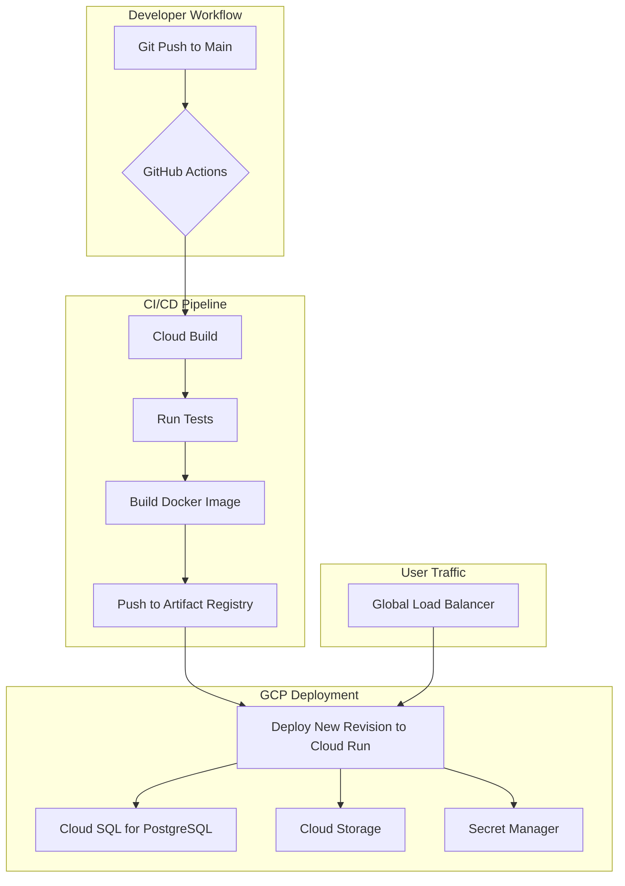

# Deployment Architecture

## Overview

The Science Advantage platform is deployed entirely on the **Google Cloud Platform (GCP)**, leveraging its scalable, secure, and managed services. This architecture ensures high availability and performance while providing a robust environment for a modern Next.js application.

The core components of the GCP architecture are:

- **Google Cloud Run**: For hosting the containerized Next.js application, providing a serverless and scalable runtime environment.
- **Google Cloud SQL for PostgreSQL**: A fully managed relational database service for the application's data.
- **Google Cloud Storage**: For storing and serving static assets, user uploads, and experiment data.
- **Google Cloud Build**: As the CI/CD pipeline for automated testing, container building, and deployment.
- **Google Secret Manager**: For securely storing and managing environment variables and other secrets.

## Deployment Strategy



### Containerization

The Next.js application is containerized using Docker for portability and consistent deployments.

**`Dockerfile`**

```dockerfile
# 1. Base Image
FROM node:20-alpine AS base

# 2. Install dependencies
FROM base AS deps
WORKDIR /app
COPY package.json package-lock.json ./
RUN npm ci

# 3. Build the application
FROM base AS builder
WORKDIR /app
COPY --from=deps /app/node_modules ./node_modules
COPY . .
# Copy secrets for build time if necessary (use build arguments)
# ARG NEXTAUTH_SECRET
# ENV NEXTAUTH_SECRET=$NEXTAUTH_SECRET
RUN npm run build

# 4. Production Image
FROM base AS runner
WORKDIR /app

ENV NODE_ENV=production

# Copy production-ready node_modules and build output
COPY --from=builder /app/public ./public
COPY --from=builder --chown=nextjs:nodejs ./.next/standalone ./
COPY --from=builder --chown=nextjs:nodejs ./.next/static ./.next/static

USER nextjs

EXPOSE 3000

ENV PORT=3000

CMD ["node", "server.js"]
```

_Note: This Dockerfile uses the `standalone` output mode in `next.config.ts` for optimized, smaller production images._

### Hosting on Google Cloud Run

Cloud Run serves the containerized application, automatically scaling based on incoming traffic.

- **Service Configuration**: The service is configured to use the container image from Google Artifact Registry.
- **Scalability**: Autoscaling is configured from 0 to N instances. Setting a minimum number of instances can reduce cold starts for higher-traffic environments.
- **Continuous Deployment**: Cloud Build triggers new deployments to Cloud Run on every push to the main branch.

### Database on Google Cloud SQL

A managed PostgreSQL instance on Cloud SQL serves as the primary database.

- **Connectivity**: The Cloud Run service connects to the Cloud SQL instance via a secure VPC connector (Cloud SQL Auth Proxy). This ensures a private, encrypted connection.
- **High Availability**: The database is configured with high availability (HA) and automated backups for reliability and disaster recovery.
- **Connection Pooling**: Prisma is configured with appropriate connection pool settings to efficiently manage connections to the managed database.

### CI/CD with GitHub Actions

The entire CI/CD process is automated using GitHub Actions, triggered by pushes and pull requests to the main branches. The workflow ensures that every change is automatically tested and deployed, providing rapid and reliable delivery.

**Workflow Trigger:**

- **On push to `main`**: A full build, test, and production deployment is triggered.
- **On pull_request to `main`**: The test suite is run to validate changes before merging.

**`.github/workflows/deploy.yml`**

```yaml
name: Build and Deploy to Cloud Run

on:
  push:
    branches:
      - main

env:
  GCP_PROJECT_ID: your-gcp-project-id
  GCP_ARTIFACT_REGISTRY: us-central1-docker.pkg.dev
  GCP_SERVICE_NAME: science-advantage-prod
  GCP_REGION: us-central1

jobs:
  build-and-deploy:
    name: Build and Deploy
    runs-on: ubuntu-latest

    steps:
      - name: Checkout
        uses: actions/checkout@v3

      # Authenticate to Google Cloud
      - id: 'auth'
        uses: 'google-github-actions/auth@v1'
        with:
          credentials_json: '${{ secrets.GCP_SA_KEY }}'

      # Set up Cloud SDK
      - name: 'Set up Cloud SDK'
        uses: 'google-github-actions/setup-gcloud@v1'

      # Configure Docker to use the gcloud command-line tool as a credential helper
      - name: Configure Docker
        run: gcloud auth configure-docker ${{ env.GCP_ARTIFACT_REGISTRY }}

      # Build and push Docker image to Google Artifact Registry
      - name: Build and Push Image
        run: |
          docker build -t "${{ env.GCP_ARTIFACT_REGISTRY }}/${{ env.GCP_PROJECT_ID }}/${{ env.GCP_SERVICE_NAME }}:${{ github.sha }}" .
          docker push "${{ env.GCP_ARTIFACT_REGISTRY }}/${{ env.GCP_PROJECT_ID }}/${{ env.GCP_SERVICE_NAME }}:${{ github.sha }}"

      # Deploy image to Cloud Run
      - name: Deploy to Cloud Run
        run: |
          gcloud run deploy ${{ env.GCP_SERVICE_NAME }} \
            --image "${{ env.GCP_ARTIFACT_REGISTRY }}/${{ env.GCP_PROJECT_ID }}/${{ env.GCP_SERVICE_NAME }}:${{ github.sha }}" \
            --region ${{ env.GCP_REGION }} \
            --platform managed \
            --allow-unauthenticated
```

### Environment and Secret Management

All sensitive information, including database URLs and API keys, is stored in **Google Secret Manager**.

- **GitHub Actions Secrets**: A GCP Service Account key (`GCP_SA_KEY`) is stored as a GitHub secret to grant the workflow permission to deploy resources.
- **Runtime Secrets**: The Cloud Run service is granted IAM permissions to access application secrets (like `DATABASE_URL`) from Secret Manager at runtime.

This GCP-native architecture provides a secure, scalable, and maintainable foundation for the Science Advantage platform.
