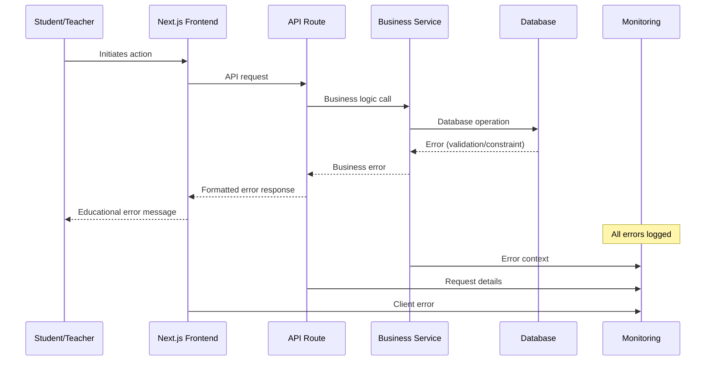

# Error Handling Strategy

## Purpose

Unified error handling across the Science Advantage platform that provides clear, educational feedback while maintaining security and system reliability. This strategy ensures students and teachers receive helpful error messages without exposing sensitive information.

## Error Flow



## Error Response Format

### Standard API Error Response

All API errors follow this consistent format:

```typescript
// lib/types.ts
export interface ApiError {
  error: {
    code: string;
    message: string;
    details?: Record<string, any>;
    field?: string; // For validation errors
    timestamp: string;
    requestId: string;
  };
}

export interface ValidationError extends ApiError {
  error: ApiError['error'] & {
    field: string;
    validationRule: string;
  };
}

export interface EducationalError extends ApiError {
  error: ApiError['error'] & {
    educational?: {
      explanation: string;
      suggestion?: string;
      learnMore?: string;
    };
  };
}
```

### Error Code Categories

```typescript
export enum ErrorCategory {
  // Client errors (4xx)
  VALIDATION = 'VALIDATION',
  AUTHENTICATION = 'AUTHENTICATION',
  AUTHORIZATION = 'AUTHORIZATION',
  NOT_FOUND = 'NOT_FOUND',
  RATE_LIMIT = 'RATE_LIMIT',

  // Server errors (5xx)
  INTERNAL = 'INTERNAL',
  DATABASE = 'DATABASE',
  EXTERNAL_SERVICE = 'EXTERNAL_SERVICE',

  // Educational specific
  LESSON_ACCESS = 'LESSON_ACCESS',
  QUIZ_SUBMISSION = 'QUIZ_SUBMISSION',
  EXPERIMENT_ERROR = 'EXPERIMENT_ERROR',
}
```

## Frontend Error Handling

### Global Error Boundary

```typescript
// components/ErrorBoundary.tsx
import React from 'react';
import { ApiError } from '@/lib/types';

interface Props {
  children: React.ReactNode;
  fallback?: React.ComponentType<{ error: Error; reset: () => void }>;
}

export class ErrorBoundary extends React.Component<Props, { hasError: boolean; error: Error | null }> {
  constructor(props: Props) {
    super(props);
    this.state = { hasError: false, error: null };
  }

  static getDerivedStateFromError(error: Error) {
    return { hasError: true, error };
  }

  componentDidCatch(error: Error, errorInfo: React.ErrorInfo) {
    // Log to monitoring service
    console.error('Frontend error:', { error, errorInfo });

    // Send to monitoring
    if (typeof window !== 'undefined') {
      window.gtag?.('event', 'exception', {
        description: error.message,
        fatal: false,
      });
    }
  }

  render() {
    if (this.state.hasError) {
      const FallbackComponent = this.props.fallback || DefaultErrorFallback;
      return <FallbackComponent error={this.state.error!} reset={() => this.setState({ hasError: false, error: null })} />;
    }

    return this.props.children;
  }
}

function DefaultErrorFallback({ error, reset }: { error: Error; reset: () => void }) {
  return (
    <div className="min-h-screen flex items-center justify-center bg-gray-50">
      <div className="max-w-md w-full bg-white rounded-lg shadow-md p-6">
        <div className="flex items-center justify-center w-12 h-12 mx-auto bg-red-100 rounded-full mb-4">
          <svg className="w-6 h-6 text-red-600" fill="none" stroke="currentColor" viewBox="0 0 24 24">
            <path strokeLinecap="round" strokeLinejoin="round" strokeWidth={2} d="M12 9v2m0 4h.01m-6.938 4h13.856c1.54 0 2.502-1.667 1.732-2.5L13.732 4c-.77-.833-1.964-.833-2.732 0L4.082 16.5c-.77.833.192 2.5 1.732 2.5z" />
          </svg>
        </div>
        <h2 className="text-xl font-semibold text-center text-gray-900 mb-2">
          Something went wrong
        </h2>
        <p className="text-gray-600 text-center mb-4">
          We encountered an unexpected error. Please try again.
        </p>
        <button
          onClick={reset}
          className="w-full bg-blue-600 text-white py-2 px-4 rounded-md hover:bg-blue-700 transition-colors"
        >
          Try Again
        </button>
      </div>
    </div>
  );
}
```

### API Client Error Handling

```typescript
// lib/api.ts
import { ApiError, EducationalError } from '@/lib/types';

class ApiClient {
  private baseURL: string;

  constructor() {
    this.baseURL = process.env.NEXT_PUBLIC_API_URL || '';
  }

  private async handleResponse<T>(response: Response): Promise<T> {
    if (!response.ok) {
      const errorData = await response.json().catch(() => ({}));
      const apiError = this.createApiError(response, errorData);

      // Log error for monitoring
      this.logError(apiError, response);

      // Show user-friendly message
      this.showUserMessage(apiError);

      throw apiError;
    }

    return response.json();
  }

  private createApiError(response: Response, errorData: any): ApiError {
    const defaultError: ApiError = {
      error: {
        code: 'UNKNOWN_ERROR',
        message: 'An unexpected error occurred',
        timestamp: new Date().toISOString(),
        requestId: this.generateRequestId(),
      },
    };

    // Merge with server error if available
    if (errorData.error) {
      return {
        error: {
          ...defaultError.error,
          ...errorData.error,
        },
      };
    }

    // Create client-side error based on HTTP status
    return {
      error: {
        ...defaultError.error,
        code: this.getErrorCodeFromStatus(response.status),
        message: this.getErrorMessageFromStatus(response.status),
      },
    };
  }

  private getErrorCodeFromStatus(status: number): string {
    switch (status) {
      case 400:
        return 'BAD_REQUEST';
      case 401:
        return 'AUTHENTICATION';
      case 403:
        return 'AUTHORIZATION';
      case 404:
        return 'NOT_FOUND';
      case 429:
        return 'RATE_LIMIT';
      case 500:
        return 'INTERNAL';
      case 502:
        return 'EXTERNAL_SERVICE';
      case 503:
        return 'SERVICE_UNAVAILABLE';
      default:
        return 'UNKNOWN_ERROR';
    }
  }

  private getErrorMessageFromStatus(status: number): string {
    switch (status) {
      case 400:
        return 'Invalid request. Please check your input.';
      case 401:
        return 'Please sign in to continue.';
      case 403:
        return "You don't have permission to perform this action.";
      case 404:
        return 'The requested resource was not found.';
      case 429:
        return 'Too many requests. Please try again later.';
      case 500:
        return 'Server error. Please try again in a few moments.';
      case 502:
        return 'Service temporarily unavailable. Please try again.';
      case 503:
        return 'Service maintenance in progress. Please try again later.';
      default:
        return 'An unexpected error occurred. Please try again.';
    }
  }

  private showUserMessage(error: ApiError) {
    // Use toast or notification system
    if (typeof window !== 'undefined') {
      // Integration with toast library
      console.error('API Error:', error);

      // For educational errors, show enhanced message
      if ('educational' in error.error) {
        const eduError = error.error as EducationalError['error'];
        this.showEducationalMessage(eduError);
      }
    }
  }

  private showEducationalMessage(error: EducationalError['error']) {
    if (error.educational) {
      // Show enhanced educational message
      const message = `${error.message}\n\n${error.educational.explanation}`;

      // Could integrate with a modal or enhanced toast
      console.info('Educational Message:', message);
    }
  }

  private logError(error: ApiError, response: Response) {
    // Send to monitoring service
    if (typeof window !== 'undefined') {
      window.gtag?.('event', 'api_error', {
        error_code: error.error.code,
        error_message: error.error.message,
        status: response.status,
        endpoint: response.url,
      });
    }
  }

  private generateRequestId(): string {
    return `req_${Date.now()}_${Math.random().toString(36).substr(2, 9)}`;
  }

  async get<T>(endpoint: string): Promise<T> {
    const response = await fetch(`${this.baseURL}${endpoint}`, {
      method: 'GET',
      headers: {
        'Content-Type': 'application/json',
      },
    });
    return this.handleResponse<T>(response);
  }

  async post<T>(endpoint: string, data?: any): Promise<T> {
    const response = await fetch(`${this.baseURL}${endpoint}`, {
      method: 'POST',
      headers: {
        'Content-Type': 'application/json',
      },
      body: data ? JSON.stringify(data) : undefined,
    });
    return this.handleResponse<T>(response);
  }
}

export const apiClient = new ApiClient();
```

## Backend Error Handling

### API Route Error Handling (Standard Pattern)

For clarity and simplicity, the standard error handling pattern within Next.js API Routes follows a direct `try...catch` block. This approach is easy to understand and implement, handling most use cases effectively directly within the route handler.

**Example from `backend-architecture.md`:**

```typescript
// app/api/some-route/route.ts
import { NextRequest, NextResponse } from 'next/server';

export async function GET(request: NextRequest) {
  try {
    // Business logic that might throw an error
    const data = await someService.fetchData();
    if (!data) {
      return NextResponse.json({ error: 'Not Found' }, { status: 404 });
    }
    return NextResponse.json({ data });
  } catch (error) {
    console.error('API Error in some-route:', error);
    // Return a generic error response
    return NextResponse.json(
      { error: 'Internal server error' },
      { status: 500 }
    );
  }
}
```

This pattern ensures that any unexpected errors are caught and a standardized, simple error message is returned to the client, preventing crashes and exposure of sensitive stack traces.

### Advanced Service-Layer Error Handling

For more complex business logic, especially within shared services in the `lib/` directory, a more sophisticated error handling strategy is available. This pattern uses custom error classes and a centralized handler to provide more detailed and consistent error responses across the application.

#### Error Handler Middleware

```typescript
// lib/error-handler.ts
import { NextRequest, NextResponse } from 'next/server';
import { ApiError, EducationalError, ErrorCategory } from '@/lib/types';

export class AppError extends Error {
  public readonly statusCode: number;
  public readonly code: string;
  public readonly isOperational: boolean;
  public readonly details?: Record<string, any>;
  public readonly field?: string;
  public readonly educational?: EducationalError['error']['educational'];

  constructor(
    message: string,
    statusCode: number = 500,
    code: string = 'INTERNAL',
    isOperational: boolean = true,
    details?: Record<string, any>,
    field?: string,
    educational?: EducationalError['error']['educational']
  ) {
    super(message);
    this.statusCode = statusCode;
    this.code = code;
    this.isOperational = isOperational;
    this.details = details;
    this.field = field;
    this.educational = educational;

    Error.captureStackTrace(this, this.constructor);
  }
}

// Educational error creators
export class LessonAccessError extends AppError {
  constructor(message: string, explanation?: string, suggestion?: string) {
    super(
      message,
      403,
      ErrorCategory.LESSON_ACCESS,
      true,
      undefined,
      undefined,
      {
        explanation:
          explanation ||
          'This lesson requires specific prerequisites or permissions.',
        suggestion:
          suggestion ||
          'Please complete previous lessons or contact your teacher.',
        learnMore: '/help/lesson-access',
      }
    );
  }
}

export class QuizSubmissionError extends AppError {
  constructor(message: string, explanation?: string, suggestion?: string) {
    super(
      message,
      400,
      ErrorCategory.QUIZ_SUBMISSION,
      true,
      undefined,
      undefined,
      {
        explanation:
          explanation || 'Your quiz submission could not be processed.',
        suggestion: suggestion || 'Please review your answers and try again.',
        learnMore: '/help/quiz-submission',
      }
    );
  }
}

export class ValidationError extends AppError {
  constructor(message: string, field: string, validationRule: string) {
    super(
      message,
      400,
      ErrorCategory.VALIDATION,
      true,
      { validationRule },
      field
    );
  }
}

// Error handler middleware
export function errorHandler(error: Error, request: NextRequest) {
  let statusCode = 500;
  let errorCode = 'INTERNAL';
  let message = 'Internal server error';
  let details: Record<string, any> | undefined;
  let field: string | undefined;
  let educational: EducationalError['error']['educational'] | undefined;

  // Handle known application errors
  if (error instanceof AppError) {
    statusCode = error.statusCode;
    errorCode = error.code;
    message = error.message;
    details = error.details;
    field = error.field;
    educational = error.educational;
  }
  // Handle Prisma errors
  else if (error.name === 'PrismaClientKnownRequestError') {
    const prismaError = error as any;

    switch (prismaError.code) {
      case 'P2002':
        statusCode = 400;
        errorCode = 'DUPLICATE_ENTRY';
        message = 'This record already exists.';
        field = prismaError.meta?.target?.[0];
        break;
      case 'P2025':
        statusCode = 404;
        errorCode = 'NOT_FOUND';
        message = 'Record not found.';
        break;
      default:
        statusCode = 400;
        errorCode = 'DATABASE_ERROR';
        message = 'Database operation failed.';
    }
  }
  // Handle validation errors
  else if (error.name === 'ValidationError') {
    statusCode = 400;
    errorCode = 'VALIDATION';
    message = error.message;
  }

  // Create error response
  const errorResponse: ApiError = {
    error: {
      code: errorCode,
      message,
      timestamp: new Date().toISOString(),
      requestId: generateRequestId(),
      ...(details && { details }),
      ...(field && { field }),
      ...(educational && { educational }),
    },
  };

  // Log error for monitoring
  logError(error, request, errorResponse);

  return NextResponse.json(errorResponse, { status: statusCode });
}

function generateRequestId(): string {
  return `req_${Date.now()}_${Math.random().toString(36).substr(2, 9)}`;
}

function logError(error: Error, request: NextRequest, errorResponse: ApiError) {
  const logData = {
    error: {
      name: error.name,
      message: error.message,
      stack: error.stack,
    },
    request: {
      url: request.url,
      method: request.method,
      headers: Object.fromEntries(request.headers.entries()),
    },
    response: errorResponse,
    timestamp: new Date().toISOString(),
  };

  // Log to console (in production, use proper logging service)
  console.error('API Error:', JSON.stringify(logData, null, 2));

  // Send to monitoring service
  if (process.env.NODE_ENV === 'production') {
    // Integration with monitoring service (e.g., Sentry, DataDog)
    // Sentry.captureException(error, { extra: logData });
  }
}
```

### API Route Error Handling

```typescript
// app/api/lessons/route.ts
import { NextRequest, NextResponse } from 'next/server';
import { errorHandler, LessonAccessError } from '@/lib/error-handler';
import { getServerSession } from 'next-auth';

export async function GET(request: NextRequest) {
  try {
    const session = await getServerSession();

    if (!session) {
      throw new AppError('Authentication required', 401, 'AUTHENTICATION');
    }

    // Business logic
    const lessons = await getLessonsForUser(session.user.id);

    return NextResponse.json({ lessons });
  } catch (error) {
    return errorHandler(error as Error, request);
  }
}

export async function POST(request: NextRequest) {
  try {
    const session = await getServerSession();
    const body = await request.json();

    if (!session) {
      throw new AppError('Authentication required', 401, 'AUTHENTICATION');
    }

    // Validate lesson access
    const hasAccess = await checkLessonAccess(session.user.id, body.lessonId);
    if (!hasAccess) {
      throw new LessonAccessError(
        'You cannot access this lesson',
        'This lesson requires completing prerequisite lessons first.',
        'Please complete the introductory lessons in this module.'
      );
    }

    // Process lesson completion
    const result = await completeLesson(session.user.id, body.lessonId);

    return NextResponse.json(result);
  } catch (error) {
    return errorHandler(error as Error, request);
  }
}
```

## Educational Error Messages

### Lesson Access Errors

```typescript
// Example: Student tries to access advanced lesson without prerequisites
const lessonAccessError = {
  error: {
    code: 'LESSON_ACCESS',
    message: 'You need to complete "Introduction to Chemistry" first',
    educational: {
      explanation:
        'Advanced chemistry lessons build on foundational concepts. Mastering the basics ensures you have the knowledge needed for more complex topics.',
      suggestion:
        'Complete the introductory lessons in order, then return to this lesson.',
      learnMore: '/help/learning-path',
    },
    timestamp: '2024-01-15T10:30:00Z',
    requestId: 'req_1642248600_abc123',
  },
};
```

### Quiz Submission Errors

```typescript
// Example: Invalid quiz answer format
const quizError = {
  error: {
    code: 'QUIZ_SUBMISSION',
    message: 'Question 3 requires a numerical answer',
    field: 'answers.2',
    educational: {
      explanation:
        'This question tests your ability to calculate chemical concentrations. Please enter a number with appropriate units.',
      suggestion:
        'Review the concentration formula and try again. Remember to include units like "mol/L".',
      learnMore: '/help/quiz-answers',
    },
    timestamp: '2024-01-15T10:30:00Z',
    requestId: 'req_1642248600_def456',
  },
};
```

### Experiment Errors

```typescript
// Example: Virtual experiment configuration error
const experimentError = {
  error: {
    code: 'EXPERIMENT_ERROR',
    message: 'Invalid experiment parameters',
    details: {
      temperature: 'Temperature must be between 0°C and 100°C',
      concentration: 'Concentration cannot be negative',
    },
    educational: {
      explanation:
        'Virtual experiments follow real-world physical and chemical laws. Temperature and concentration values must be within realistic ranges.',
      suggestion:
        'Check the experiment guidelines for valid parameter ranges and try again.',
      learnMore: '/help/experiment-setup',
    },
    timestamp: '2024-01-15T10:30:00Z',
    requestId: 'req_1642248600_ghi789',
  },
};
```

## Monitoring and Alerting

### Error Monitoring Integration

```typescript
// lib/monitoring.ts
export class ErrorMonitor {
  static logError(error: ApiError, context: Record<string, any>) {
    // Google Analytics integration
    if (typeof window !== 'undefined') {
      window.gtag?.('event', 'error', {
        error_code: error.error.code,
        error_message: error.error.message,
        ...context,
      });
    }

    // Send to monitoring service
    this.sendToMonitoringService(error, context);
  }

  static logEducationalError(
    error: EducationalError,
    context: Record<string, any>
  ) {
    // Track educational errors separately for learning analytics
    if (typeof window !== 'undefined') {
      window.gtag?.('event', 'educational_error', {
        error_code: error.error.code,
        has_explanation: !!error.error.educational?.explanation,
        has_suggestion: !!error.error.educational?.suggestion,
        ...context,
      });
    }

    this.logError(error, context);
  }

  private static sendToMonitoringService(
    error: ApiError,
    context: Record<string, any>
  ) {
    // Integration with monitoring service (Sentry, DataDog, etc.)
    if (process.env.NODE_ENV === 'production') {
      // Example Sentry integration
      // Sentry.captureException(new Error(error.error.message), {
      //   extra: { error, context },
      //   tags: { errorCode: error.error.code },
      // });
    }
  }
}
```

### Error Rate Alerting

```typescript
// lib/error-alerts.ts
export class ErrorAlerts {
  private static errorCounts = new Map<string, number>();
  private static alertThresholds = {
    [ErrorCategory.AUTHENTICATION]: 10, // 10 auth errors per minute
    [ErrorCategory.LESSON_ACCESS]: 5, // 5 lesson access errors per minute
    [ErrorCategory.QUIZ_SUBMISSION]: 8, // 8 quiz errors per minute
  };

  static trackError(errorCode: string) {
    const currentCount = this.errorCounts.get(errorCode) || 0;
    const newCount = currentCount + 1;
    this.errorCounts.set(errorCode, newCount);

    // Check threshold
    const threshold = this.alertThresholds[errorCode as ErrorCategory];
    if (threshold && newCount >= threshold) {
      this.triggerAlert(errorCode, newCount);
    }
  }

  private static triggerAlert(errorCode: string, count: number) {
    // Send alert to monitoring system
    console.warn(`High error rate detected: ${errorCode} (${count} errors)`);

    // Could integrate with PagerDuty, Slack, etc.
    // fetch('/api/alerts', {
    //   method: 'POST',
    //   body: JSON.stringify({ errorCode, count, timestamp: new Date() }),
    // });
  }

  // Reset counts every minute
  static resetCounts() {
    this.errorCounts.clear();
  }
}

// Reset counts every minute
setInterval(() => ErrorAlerts.resetCounts(), 60000);
```

## Integration with Existing Systems

### Next.js App Router Integration

```typescript
// app/layout.tsx
import { ErrorBoundary } from '@/components/ErrorBoundary';

export default function RootLayout({
  children,
}: {
  children: React.ReactNode;
}) {
  return (
    <html lang="en">
      <body>
        <ErrorBoundary>
          {children}
        </ErrorBoundary>
      </body>
    </html>
  );
}
```

### API Route Wrapper

```typescript
// lib/api-wrapper.ts
import { NextRequest, NextResponse } from 'next/server';
import { errorHandler } from '@/lib/error-handler';

export function withErrorHandler(
  handler: (req: NextRequest) => Promise<NextResponse>
) {
  return async (request: NextRequest) => {
    try {
      return await handler(request);
    } catch (error) {
      return errorHandler(error as Error, request);
    }
  };
}

// Usage in API routes
export const GET = withErrorHandler(async (request: NextRequest) => {
  // API logic here
  return NextResponse.json({ data: 'success' });
});
```

## Best Practices

### Frontend Error Handling

1. **Always show user-friendly messages** - Never expose technical details to users
2. **Provide educational context** - Help students understand what went wrong
3. **Offer clear next steps** - Guide users on how to resolve the issue
4. **Log everything** - Capture errors for debugging and improvement
5. **Graceful degradation** - Ensure the app remains functional when possible

### Backend Error Handling

1. **Use specific error codes** - Avoid generic error messages
2. **Include educational context** - Help students learn from errors
3. **Sanitize error messages** - Never expose sensitive system information
4. **Log with context** - Include request details for debugging
5. **Monitor error rates** - Alert on unusual error patterns

### Educational Considerations

1. **Learning opportunities** - Frame errors as learning moments
2. **Progressive disclosure** - Provide basic info first, details on demand
3. **Age-appropriate language** - Match complexity to student level
4. **Constructive feedback** - Focus on improvement, not failure
5. **Resource linking** - Connect errors to relevant learning materials

This error handling strategy ensures that the Science Advantage platform provides a supportive learning environment where errors become educational opportunities rather than frustrating obstacles.
