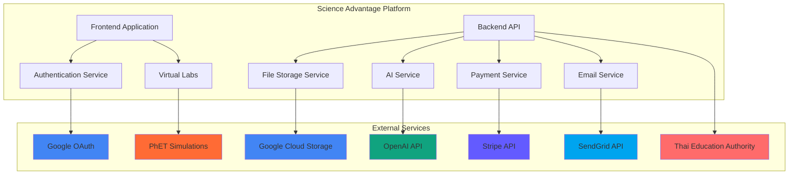

# External APIs

## Overview

Science Advantage integrates with several external services to provide authentication, file storage, and AI-powered features. These integrations are carefully chosen to enhance the educational experience while maintaining security and performance standards.

## Google OAuth API

- **Purpose:** User authentication via Google accounts
- **Documentation:** https://developers.google.com/identity/protocols/oauth2
- **Base URL(s):** https://accounts.google.com/o/oauth2/v2/auth
- **Authentication:** OAuth 2.0 with client credentials
- **Rate Limits:** Standard Google OAuth limits (100 requests per second per client)

### Key Endpoints Used

- `GET /oauth2/v2/auth` - Initiate OAuth flow
- `POST /oauth2/v4/token` - Exchange authorization code for tokens
- `GET /oauth2/v2/userinfo` - Get user profile information

### Integration Notes

Used through NextAuth.js Google provider. Requires client ID and secret from Google Cloud Console. The integration provides:

- Single sign-on capability for students and teachers
- Profile information synchronization (name, email, avatar)
- Secure token management with automatic refresh
- Compliance with Thai educational data protection requirements

### Security Considerations

- All OAuth tokens are stored securely with HTTP-only cookies
- Token refresh is handled automatically by NextAuth.js
- User consent is properly obtained and managed
- No sensitive user data is stored beyond what's necessary for educational purposes

## Google Cloud Storage API

- **Purpose:** Store experiment data files, user uploads, and static assets
- **Documentation:** https://cloud.google.com/storage/docs
- **Base URL(s):** https://storage.googleapis.com
- **Authentication:** Service account with JSON key file
- **Rate Limits:** Standard GCS limits (high for typical usage)

### Key Endpoints Used

- `POST /upload/storage/v1/b/{bucket}/o` - Upload files
- `GET /storage/v1/b/{bucket}/o/{object}` - Download files
- `DELETE /storage/v1/b/{bucket}/o/{object}` - Delete files

### Integration Notes

Used for storing experiment results, user avatars, and lesson assets. Integrated via @google-cloud/storage SDK with the following features:

- Automatic file compression for images and documents
- CDN integration for fast content delivery in Thailand
- Backup and disaster recovery capabilities
- Access control based on user roles and permissions

### Storage Structure

```
science-advantage-storage/
├── experiments/
│   ├── {experimentId}/
│   │   ├── {studentId}/
│   │   │   ├── results/
│   │   │   └── photos/
├── user-assets/
│   ├── avatars/
│   └── uploads/
├── lesson-content/
│   ├── images/
│   ├── videos/
│   └── documents/
└── system/
    ├── backups/
    └── logs/
```

### Security Considerations

- All uploads are scanned for malware and inappropriate content
- File size limits enforced based on user role
- Automatic encryption of sensitive data at rest
- Access logs maintained for audit compliance

## OpenAI API

- **Purpose:** Generate AI-powered hints, explanations, and adaptive content
- **Documentation:** https://platform.openai.com/docs/api-reference
- **Base URL(s):** https://api.openai.com/v1
- **Authentication:** Bearer token (API key)
- **Rate Limits:** Tier-based (starts at 3,000 RPM for pay-as-you-go)

### Key Endpoints Used

- `POST /chat/completions` - Generate chat responses for hints
- `POST /completions` - Generate text completions

### Integration Notes

Used selectively for premium features with careful cost management:

- AI-powered hints for difficult science concepts
- Personalized learning path recommendations
- Thai language support for localized content
- Adaptive difficulty adjustment based on student performance

### Usage Patterns

```typescript
// Example: Generating science concept hints
const generateHint = async (concept: string, difficulty: number) => {
  const response = await openai.chat.completions.create({
    model: 'gpt-3.5-turbo',
    messages: [
      {
        role: 'system',
        content:
          'You are a helpful science tutor for Thai students. Provide hints in both Thai and English.',
      },
      {
        role: 'user',
        content: `Provide a hint for understanding ${concept} at difficulty level ${difficulty}/5`,
      },
    ],
    max_tokens: 150,
    temperature: 0.7,
  });

  return response.choices[0].message.content;
};
```

### Cost Management

- Daily usage limits enforced per user
- Caching implemented for common requests
- Fallback to static content when API limits are reached
- Detailed usage tracking for budget optimization

### Security Considerations

- API keys stored securely in environment variables
- Content filtering enabled to prevent inappropriate responses
- User data never sent to external APIs without explicit consent
- Regular security audits of AI-generated content

## Payment Processing - Stripe API

- **Purpose:** Subscription management and payment processing for premium features
- **Documentation:** https://stripe.com/docs/api
- **Base URL(s):** https://api.stripe.com/v1
- **Authentication:** Bearer token (secret key)
- **Rate Limits:** 100 requests per second per account

### Key Endpoints Used

- `POST /customers` - Create customer accounts
- `POST /subscriptions` - Create and manage subscriptions
- `POST /payment_intents` - Process one-time payments
- `POST /checkout/sessions` - Create checkout sessions
- `POST /webhooks` - Handle webhook events

### Integration Notes

Used for premium subscription management and institutional licensing:

- Monthly/annual subscription plans for individual teachers
- Institutional licensing for schools
- Free trial management with automatic conversion
- Thai Baht (THB) currency support
- Multiple payment methods (credit cards, digital wallets)

### Security Considerations

- PCI DSS compliance for payment processing
- Webhook signature verification for secure event handling
- Customer data encryption and secure storage
- Fraud detection and prevention measures

## Email Service - SendGrid API

- **Purpose:** Transactional emails for notifications and user communications
- **Documentation:** https://docs.sendgrid.com/api-reference
- **Base URL(s):** https://api.sendgrid.com/v3
- **Authentication:** Bearer token (API key)
- **Rate Limits:** 100 emails per second (paid plans)

### Key Endpoints Used

- `POST /mail/send` - Send transactional emails
- `GET /templates` - Manage email templates
- `POST /validations/email` - Validate email addresses
- `GET /messages` - Retrieve email delivery status

### Integration Notes

Used for all platform communications:

- Welcome emails and account verification
- Class invitations and student enrollments
- Lesson reminders and deadline notifications
- Password reset and account recovery
- Progress reports for parents and teachers

### Template Strategy

- Dynamic templates with Thai language support
- Personalized content based on user role and progress
- Responsive design for mobile and desktop
- A/B testing for optimal engagement

## Virtual Laboratory - PhET Simulations

- **Purpose:** Interactive science simulations for physics, chemistry, and biology
- **Documentation:** https://phet.colorado.edu/en/simulations/filter?sort=date&view=grid
- **Base URL(s):** https://phet.colorado.edu/sims/html/
- **Authentication:** None required (embeddable content)
- **Rate Limits:** No limits for educational embedding

### Key Simulations Used

- **Physics:** Circuit Construction, Forces and Motion, Wave Interference
- **Chemistry:** Reactants, Products and Leftovers, Balancing Chemical Equations
- **Biology:** Natural Selection, Gene Expression Essentials
- **Math:** Function Builder, Graphing Lines

### Integration Notes

Embedded directly into lesson content:

- HTML5-based simulations for cross-platform compatibility
- Thai language localization where available
- Progress tracking and interaction analytics
- Customizable parameters for different difficulty levels
- Offline capability for downloaded simulations

### Performance Considerations

- Lazy loading of simulation content
- Progressive loading for large simulation files
- Fallback to simplified versions for low-bandwidth connections
- Mobile optimization for touch interactions

## Thai Educational Authority API (Future Integration)

- **Purpose:** Compliance with Thai educational standards and reporting
- **Documentation:** [To be provided by Ministry of Education]
- **Base URL(s):** [To be provided]
- **Authentication:** API key with institutional certificates
- **Rate Limits:** As specified by educational authority

### Planned Integration Features

- Student progress reporting for compliance
- Curriculum alignment verification
- Assessment standardization
- Educational outcome analytics

### Integration Considerations

- Compliance with Thai Personal Data Protection Act (PDPA)
- Alignment with national curriculum standards
- Support for Thai language and cultural context
- Integration with existing school management systems

## Integration Architecture



## Error Handling and Resilience

### Retry Strategies

- Exponential backoff for all external API calls
- Circuit breaker pattern for unreliable services
- Graceful degradation when external services are unavailable
- Local caching to reduce dependency on external services

### Monitoring and Alerting

- Real-time monitoring of API response times and error rates
- Automated alerts for service degradation or outages
- Cost tracking and budget alerts for paid services
- Performance metrics for integration endpoints

### Fallback Mechanisms

- Local authentication when Google OAuth is unavailable
- Static content delivery when AI services are down
- Alternative storage providers for critical file operations
- Offline mode for essential functionality

## Security and Compliance

### Data Protection

- All external API communications encrypted with TLS 1.3
- Sensitive data anonymized before sending to third-party services
- Regular security audits of all external integrations
- Compliance with GDPR, PDPA, and educational data protection regulations

### Access Control

- Role-based access to external service features
- API key rotation and management policies
- Audit trails for all external service interactions
- Least privilege principle applied to all integrations

## Performance Optimization

### Caching Strategy

- Redis caching for frequently accessed external data
- CDN integration for static content delivery
- Local caching of AI responses to reduce API calls
- Browser caching for user-specific content

### Load Balancing

- Multiple API endpoints for high-availability services
- Geographic routing for optimal performance in Thailand
- Connection pooling for database and external service connections
- Auto-scaling based on demand patterns

## Future Considerations

### Potential New Integrations

- **Microsoft Azure Education API** - For expanded cloud capabilities
- **AWS Educate API** - For additional educational resources
- **Local Thai EdTech APIs** - For regional content and services
- **Google Classroom API** - For LMS integration
- **Khan Academy API** - For supplementary educational content
- **Wolfram Alpha API** - For advanced mathematical computations
- **Zoom API** - For virtual classroom integration
- **Discord API** - For student community features

### Scalability Planning

- Microservices architecture for independent scaling
- Event-driven architecture for asynchronous processing
- Multi-region deployment for global expansion
- API gateway for centralized external service management

### Technology Evolution

- GraphQL adoption for more efficient data fetching
- Serverless functions for cost optimization
- Edge computing for improved performance
- Blockchain for educational credential verification
