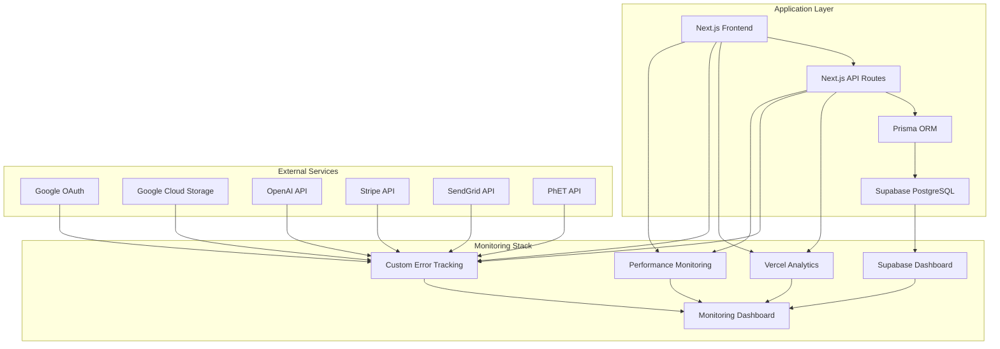

# Monitoring and Observability

## Overview

Science Advantage requires comprehensive monitoring and observability to ensure system reliability, performance optimization, and proactive issue detection. This section defines the monitoring stack, key metrics, alerting strategies, and observability practices for the full-stack application.

## Monitoring Stack Architecture

### Core Monitoring Components



### Monitoring Tools and Services

| Component                       | Tool/Service          | Purpose                             | Metrics Collected                        |
| ------------------------------- | --------------------- | ----------------------------------- | ---------------------------------------- |
| **Application Performance**     | Vercel Analytics      | Frontend performance, user behavior | Page views, load times, user flows       |
| **Database Performance**        | Supabase Dashboard    | Query performance, connections      | Query time, connection count, storage    |
| **Error Tracking**              | Custom implementation | Error aggregation and alerting      | Error rates, types, stack traces         |
| **API Monitoring**              | Custom middleware     | API response times and health       | Response times, status codes, throughput |
| **External Service Monitoring** | Custom tracking       | Third-party service availability    | API response times, error rates          |
| **User Analytics**              | Vercel Analytics      | Educational engagement              | Lesson completion, experiment usage      |

## Key Performance Indicators (KPIs)

### System Performance KPIs

#### Frontend Performance

- **Page Load Time**: < 2 seconds for lesson pages
- **Time to Interactive**: < 3 seconds for dashboard
- **Core Web Vitals**:
  - LCP (Largest Contentful Paint): < 2.5s
  - FID (First Input Delay): < 100ms
  - CLS (Cumulative Layout Shift): < 0.1

#### Backend Performance

- **API Response Time**: < 500ms for 95th percentile
- **Database Query Time**: < 200ms average
- **Concurrent Users**: Support 1000+ simultaneous users
- **Uptime**: 99.9% availability target

#### Educational Metrics

- **Lesson Completion Rate**: Track per-lesson completion
- **Experiment Submission Rate**: Monitor experiment engagement
- **User Session Duration**: Average time spent on platform
- **Error Rate**: < 1% for critical user actions

### Business Metrics

| Metric                      | Target          | Measurement Frequency |
| --------------------------- | --------------- | --------------------- |
| **Daily Active Users**      | Growth tracking | Daily                 |
| **Lesson Completion Rate**  | > 80%           | Weekly                |
| **Experiment Success Rate** | > 95%           | Daily                 |
| **Teacher Adoption**        | 50+ teachers    | Monthly               |
| **Student Engagement**      | > 2 hours/week  | Weekly                |

## Monitoring Implementation

### Frontend Monitoring

#### Performance Monitoring

```typescript
// lib/monitoring.ts
export class PerformanceMonitor {
  static trackPageLoad(pageName: string) {
    if (typeof window !== 'undefined' && 'performance' in window) {
      const navigation = performance.getEntriesByType(
        'navigation'
      )[0] as PerformanceNavigationTiming;
      const loadTime = navigation.loadEventEnd - navigation.fetchStart;

      // Track to analytics
      this.trackMetric('page_load_time', loadTime, {
        page: pageName,
        browser: navigator.userAgent,
      });
    }
  }

  static trackUserInteraction(action: string, context: Record<string, any>) {
    this.trackMetric('user_interaction', 1, {
      action,
      ...context,
    });
  }

  private static trackMetric(
    name: string,
    value: number,
    tags: Record<string, string>
  ) {
    // Send to monitoring service
    console.log(`[METRIC] ${name}: ${value}`, tags);
  }
}
```

#### Error Tracking

```typescript
// lib/error-tracking.ts
export class ErrorTracker {
  static trackError(error: Error, context?: Record<string, any>) {
    const errorData = {
      message: error.message,
      stack: error.stack,
      timestamp: new Date().toISOString(),
      url: typeof window !== 'undefined' ? window.location.href : 'server',
      userAgent: typeof window !== 'undefined' ? navigator.userAgent : 'server',
      context,
    };

    // Send to error tracking service
    this.reportError(errorData);
  }

  private static reportError(errorData: any) {
    // Implementation depends on error tracking service
    console.error('[ERROR]', errorData);
  }
}
```

### Backend Monitoring

#### API Middleware

```typescript
// middleware/api-monitoring.ts
export function apiMonitoringMiddleware(req: NextRequest, res: NextResponse) {
  const startTime = Date.now();

  // Log request
  console.log(`[API] ${req.method} ${req.url} - ${new Date().toISOString()}`);

  // Continue with request
  const response = NextResponse.next();

  // Log response
  const duration = Date.now() - startTime;
  console.log(
    `[API] ${req.method} ${req.url} - ${response.status} - ${duration}ms`
  );

  // Track metrics
  if (duration > 1000) {
    console.warn(`[SLOW API] ${req.method} ${req.url} took ${duration}ms`);
  }

  return response;
}
```

#### Database Monitoring

```typescript
// lib/db-monitoring.ts
export class DatabaseMonitor {
  static trackQuery(query: string, duration: number, success: boolean) {
    const metric = {
      query: query.substring(0, 100), // First 100 chars
      duration,
      success,
      timestamp: new Date().toISOString(),
    };

    if (duration > 1000) {
      console.warn(`[SLOW QUERY] ${duration}ms: ${query.substring(0, 100)}`);
    }

    if (!success) {
      console.error(`[QUERY ERROR] ${query.substring(0, 100)}`);
    }
  }
}
```

## Alerting Strategy

### Alert Levels and Escalation

| Alert Level  | Threshold                            | Escalation                  | Response Time |
| ------------ | ------------------------------------ | --------------------------- | ------------- |
| **Critical** | System down, data loss               | Immediate team notification | 15 minutes    |
| **High**     | Performance degradation, errors > 5% | Team notification           | 1 hour        |
| **Medium**   | Elevated error rates, slow queries   | Daily digest                | 24 hours      |
| **Low**      | Minor issues, warnings               | Weekly report               | 1 week        |

### Alert Rules

#### System Health Alerts

```yaml
alerts:
  - name: 'High Error Rate'
    condition: 'error_rate > 5%'
    duration: '5m'
    severity: 'high'
    action: 'notify_team'

  - name: 'Slow API Response'
    condition: 'api_response_time_p95 > 2s'
    duration: '10m'
    severity: 'medium'
    action: 'daily_digest'

  - name: 'Database Connection Issues'
    condition: 'db_connection_errors > 10'
    duration: '1m'
    severity: 'critical'
    action: 'immediate_notification'

  - name: 'External Service Down'
    condition: 'external_service_availability < 95%'
    duration: '5m'
    severity: 'high'
    action: 'notify_team'
```

#### Educational Metrics Alerts

```yaml
educational_alerts:
  - name: 'Low Lesson Completion'
    condition: 'lesson_completion_rate < 70%'
    duration: '24h'
    severity: 'medium'
    action: 'weekly_report'

  - name: 'Experiment Submission Drop'
    condition: 'experiment_submissions < 50% of baseline'
    duration: '6h'
    severity: 'high'
    action: 'notify_team'
```

## Logging Strategy

### Log Levels and Categories

| Level     | Purpose                   | Examples                              |
| --------- | ------------------------- | ------------------------------------- |
| **ERROR** | System errors, exceptions | Database failures, API errors         |
| **WARN**  | Warning conditions        | Slow queries, deprecated usage        |
| **INFO**  | Important events          | User actions, system state changes    |
| **DEBUG** | Detailed debugging        | Request/response details, query plans |

### Structured Logging Format

```typescript
interface LogEntry {
  timestamp: string;
  level: 'ERROR' | 'WARN' | 'INFO' | 'DEBUG';
  service: string;
  message: string;
  context?: Record<string, any>;
  userId?: string;
  sessionId?: string;
  requestId?: string;
}
```

### Log Examples

```typescript
// User action logging
logger.info('User completed lesson', {
  userId: 'user_123',
  lessonId: 'lesson_456',
  completionTime: 1800, // seconds
  context: { device: 'mobile', browser: 'chrome' },
});

// System error logging
logger.error('Database connection failed', {
  service: 'api',
  error: 'Connection timeout',
  context: { query: 'SELECT * FROM users', timeout: 30000 },
});
```

## Observability Practices

### Distributed Tracing

#### Request Correlation

```typescript
// lib/tracing.ts
export class RequestTracer {
  static generateTraceId(): string {
    return `trace_${Date.now()}_${Math.random().toString(36).substr(2, 9)}`;
  }

  static traceRequest(req: NextRequest, traceId?: string) {
    const id = traceId || this.generateTraceId();
    req.headers.set('x-trace-id', id);
    return id;
  }

  static logTrace(traceId: string, message: string, data?: any) {
    console.log(`[TRACE:${traceId}] ${message}`, data);
  }
}
```

### Health Checks

#### Application Health Endpoint

```typescript
// app/api/health/route.ts
export async function GET() {
  const health = {
    status: 'healthy',
    timestamp: new Date().toISOString(),
    version: process.env.npm_package_version,
    checks: {
      database: await checkDatabaseHealth(),
      external_services: await checkExternalServices(),
      memory: checkMemoryUsage(),
    },
  };

  const isHealthy = Object.values(health.checks).every(
    (check) => check.status === 'healthy'
  );

  return NextResponse.json(health, {
    status: isHealthy ? 200 : 503,
  });
}
```

## Monitoring Dashboard

### Key Dashboard Components

1. **System Overview**
   - Overall system health
   - Active users
   - Response times
   - Error rates

2. **Performance Metrics**
   - API response times
   - Database query performance
   - Frontend Core Web Vitals
   - External service latency

3. **Educational Analytics**
   - Lesson completion rates
   - Experiment submission trends
   - User engagement metrics
   - Teacher activity

4. **Error Analysis**
   - Error rate trends
   - Top error types
   - Error distribution by feature
   - Recent error details

### Dashboard Implementation Notes

- Use Vercel Analytics for frontend metrics
- Leverage Supabase Dashboard for database metrics
- Implement custom dashboard for educational metrics
- Create alerts for critical thresholds

## Monitoring Configuration

### Environment-Specific Monitoring

| Environment     | Monitoring Level | Data Retention | Alert Sensitivity  |
| --------------- | ---------------- | -------------- | ------------------ |
| **Production**  | Full monitoring  | 90 days        | High sensitivity   |
| **Staging**     | Full monitoring  | 30 days        | Medium sensitivity |
| **Development** | Basic monitoring | 7 days         | Low sensitivity    |

### Monitoring Data Storage

- **Metrics**: Time-series data in monitoring service
- **Logs**: Structured logs with 90-day retention
- **Traces**: Request traces for performance analysis
- **Events**: User interaction events for analytics

## Performance Optimization Monitoring

### Continuous Performance Monitoring

1. **Real User Monitoring (RUM)**
   - Core Web Vitals tracking
   - User journey performance
   - Device-specific performance

2. **Synthetic Monitoring**
   - Automated performance tests
   - API endpoint monitoring
   - Critical user path testing

3. **Resource Usage Monitoring**
   - Memory usage trends
   - CPU utilization
   - Database connection pool usage
   - External service rate limits

## Security Monitoring

### Security Event Tracking

| Event Type                   | Monitoring Approach                | Alert Threshold         |
| ---------------------------- | ---------------------------------- | ----------------------- |
| **Authentication Failures**  | Track failed login attempts        | > 10 failures/user/hour |
| **Authorization Violations** | Monitor access denied errors       | Any occurrence          |
| **Data Access**              | Log sensitive data access          | All access logged       |
| **API Abuse**                | Rate limiting and unusual patterns | > 1000 requests/minute  |

### Security Metrics

- Authentication success/failure rates
- Authorization violation counts
- Data access patterns
- API usage anomalies
- Security incident response times

## Monitoring Best Practices

### Implementation Guidelines

1. **Instrument Early**: Add monitoring from the beginning of development
2. **Meaningful Metrics**: Track metrics that drive actionable insights
3. **Contextual Logging**: Include relevant context in all log entries
4. **Performance Budgets**: Set and monitor performance budgets
5. **Regular Reviews**: Weekly monitoring reviews and monthly deep dives

### Data Privacy Considerations

- Anonymize user data in logs
- Comply with educational data privacy regulations
- Secure monitoring data access
- Regular audit of monitoring data retention

## Monitoring Evolution

### Phase 1: Basic Monitoring (MVP)

- Error tracking and logging
- Basic performance metrics
- System health checks
- Critical alerting

### Phase 2: Enhanced Observability (Post-MVP)

- Distributed tracing
- Advanced performance monitoring
- Educational metrics dashboard
- Predictive alerting

### Phase 3: Full Observability (Scale)

- Machine learning for anomaly detection
- Advanced user behavior analytics
- Automated performance optimization
- Real-time monitoring for all components

This comprehensive monitoring and observability strategy ensures Science Advantage maintains high reliability, performance, and educational effectiveness while providing the insights needed for continuous improvement.
