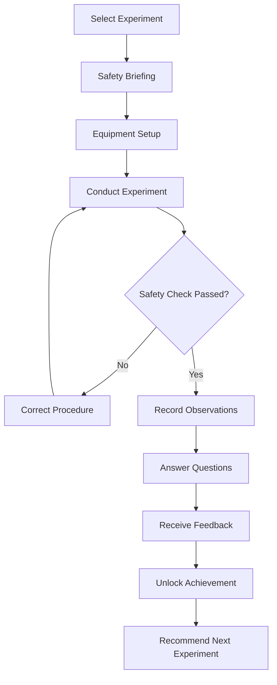
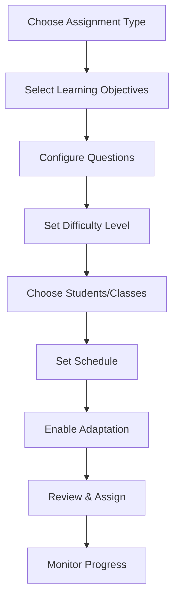
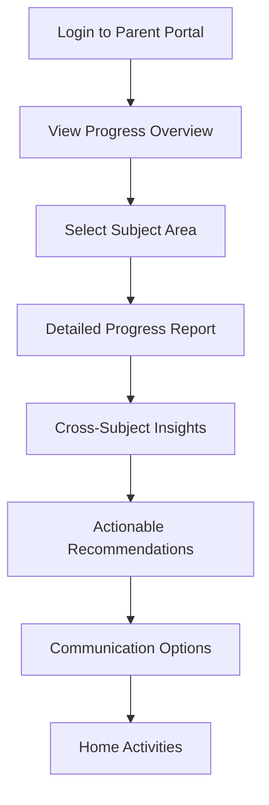

# Science Advantage UI/UX Specification

## Introduction

This document defines the user experience goals, information architecture, user flows, and visual design specifications for Science Advantage's user interface. It serves as the foundation for visual design and frontend development, ensuring a cohesive and user-centered experience.

### Overall UX Goals & Principles

#### Target User Personas

**Primary Student Persona: "Nong" - Age 12-16**

- Thai secondary school student studying science in Matthayom level
- Tech-savvy, uses smartphone for learning and social media
- Motivated by gamification and visual learning
- Needs bilingual support (Thai primary, English secondary)
- Learns best through interactive experiments and visual demonstrations

**Secondary Student Persona: "Ploy" - Age 7-12**

- Primary school student in Prathom level
- Requires more guidance and structured learning paths
- Parental supervision and engagement important
- Shorter attention spans, needs frequent engagement
- Cultural context and familiar examples enhance learning

**Teacher Persona: "Kru Somchai" - Age 30-45**

- Science teacher at Thai private school
- Manages 30-40 students per class
- Limited time for individual student attention
- Needs efficient classroom management tools
- Values data-driven insights for student improvement
- Requires bilingual content for international students

**Parent Persona: "Mae Anna" - Age 35-50**

- Invested in child's education success
- Wants to track progress across all subjects
- Values holistic development over just grades
- Needs clear, actionable insights
- Prefers mobile access for convenience
- Concerned about screen time and educational quality

**Administrator Persona: "Director Wisut" - Age 40-55**

- School administrator focused on educational outcomes
- Budget-conscious but values ROI
- Needs comprehensive reporting for stakeholders
- Values ecosystem integration benefits
- Requires compliance with Thai educational standards

#### Usability Goals

- **Ease of learning**: New students can complete core science experiments within 5 minutes of first login
- **Efficiency of use**: Teachers can create and assign assessments in under 2 minutes
- **Error prevention**: Clear validation and confirmation for destructive actions like data deletion
- **Memorability**: Infrequent users can return to key functions without relearning
- **Accessibility**: WCAG AA compliance ensuring all students can access science education
- **Engagement**: 85% student session completion rate through gamified progression
- **Cross-cultural relevance**: Thai students see cultural context in 90% of science examples

#### Design Principles

1. **Clarity over cleverness** - Prioritize clear communication over aesthetic innovation
2. **Progressive disclosure** - Show only what's needed, when it's needed
3. **Consistent patterns** - Use familiar UI patterns throughout the application
4. **Immediate feedback** - Every action should have a clear, immediate response
5. **Accessible by default** - Design for all users from the start
6. **Cultural resonance** - Integrate Thai cultural context naturally into science learning
7. **Mobile-first approach** - Design primarily for touch interactions and mobile contexts
8. **Data-informed personalization** - Use AI to adapt to individual learning patterns

### Change Log

| Date       | Version | Description                          | Author            |
| ---------- | ------- | ------------------------------------ | ----------------- |
| 2025-10-04 | 1.0     | Initial UI/UX specification creation | Sally (UX Expert) |

## Information Architecture (IA)

### Site Map / Screen Inventory

```mermaid
graph TD
    A[Unified Login Dashboard] --> B[Student Science Hub]
    A --> C[Teacher Dashboard]
    A --> D[Parent Portal]
    A --> E[Admin Panel]

    B --> B1[Virtual Laboratory]
    B --> B2[AI Learning Path]
    B --> B3[Interactive Lessons]
    B --> B4[Progress Tracking]
    B --> B5[Achievements]

    B1 --> B1a[Physics Experiments]
    B1 --> B1b[Chemistry Simulations]
    B1 --> B1c[Biology Models]
    B1 --> B1d[Earth Science]

    B2 --> B2a[Personalized Curriculum]
    B2 --> B2b[Adaptive Assessments]
    B2 --> B2c[Recommendations]
    B2 --> B2d[Cross-Subject Integration]

    C --> C1[Class Management]
    C --> C2[Assignment Creation]
    C --> C3[Student Analytics]
    C --> C4[Resource Library]
    C --> C5[Communication Tools]

    D --> D1[Progress Reports]
    D --> D2[Learning Analytics]
    D --> D3[Communication]
    D --> D4[Home Activities]
    D --> D5[Settings]

    E --> E1[System Analytics]
    E --> E2[User Management]
    E --> E3[Content Management]
    E --> E4[Integration Settings]
    E --> E5[Compliance Reports]
```

### Navigation Structure

**Primary Navigation:**

- **Student View**: Bottom tab navigation with 5 main sections: Laboratory, Learning Path, Lessons, Progress, Profile
- **Teacher View**: Sidebar navigation with hierarchical structure: Dashboard, Classes, Assignments, Analytics, Resources
- **Parent View**: Simplified top navigation with 4 main areas: Overview, Progress, Communication, Settings
- **Admin View**: Comprehensive sidebar with role-based access to all system functions

**Secondary Navigation:**

- **Contextual breadcrumbs** showing learning path progression
- **Quick action buttons** for frequently used functions
- **Language toggle** (Thai/English) always accessible
- **Help and support** accessible from all screens

**Breadcrumb Strategy:**

- **Learning context**: Subject → Grade Level → Topic → Lesson → Activity
- **Administrative context**: Module → Section → Action → Detail
- **Mobile adaptation**: Condensed breadcrumbs with "..." for intermediate levels
- **Thai language**: Proper RTL/LTR handling for mixed content

## User Flows

### Student Science Experiment Flow

**User Goal:** Complete a virtual chemistry experiment safely while learning scientific concepts

**Entry Points:**

- Science Hub → Virtual Laboratory → Chemistry
- AI Learning Path recommendation
- Teacher assignment

**Success Criteria:** Student completes experiment with proper safety procedures, understands key concepts, and receives achievement badge

#### Flow Diagram

#### Edge Cases & Error Handling:

- **Equipment damage**: Virtual replacement with learning moment about proper handling
- **Chemical spill**: Automatic cleanup procedure with safety lesson
- **Network interruption**: Auto-save experiment state with resume capability
- **Incorrect procedure**: Step-by-step guidance with hints
- **Accessibility needs**: Screen reader descriptions of visual changes

#### Notes:

- All safety procedures align with Thai Ministry of Education standards
- Cultural context includes Thai scientific contributions where relevant
- Progress saved automatically for interrupted sessions

### Teacher Assignment Creation Flow

**User Goal:** Create and assign a science assessment with automatic grading and personalized recommendations

**Entry Points:**

- Teacher Dashboard → Assignments → Create New
- Class Management → Quick Assign
- Analytics → Create Intervention

**Success Criteria:** Assignment created, assigned to selected students, with automatic grading and progress tracking enabled

#### Flow Diagram

#### Edge Cases & Error Handling:

- **Invalid question format**: Real-time validation with correction suggestions
- **Schedule conflicts**: Automatic resolution options or manual override
- **Student availability**: Check for existing assignments and suggest alternatives
- **Technical issues**: Draft auto-save with recovery options

#### Notes:

- Integration with curriculum standards for automatic objective mapping
- AI-powered question generation based on learning gaps
- Bulk assignment capabilities for efficiency

### Parent Progress Monitoring Flow

**User Goal:** Understand child's science learning progress and cross-subject benefits

**Entry Points:**

- Parent Portal → Progress Overview
- Mobile app notification → View Details
- Email report → Full Dashboard

**Success Criteria:** Parent gains clear understanding of child's progress, strengths, and areas for support

#### Flow Diagram

#### Edge Cases & Error Handling:

- **Data privacy**: Age-appropriate information sharing with consent controls
- **Multiple children**: Clear navigation between different student profiles
- **Language preferences**: Automatic detection and language switching
- **Technical literacy**: Simplified views with detailed explanations available

#### Notes:

- Holistic view across all Advantage subjects
- Celebratory moments for achievements and milestones
- Privacy controls for different levels of detail sharing

## Wireframes & Mockups

**Primary Design Files:** Figma design system to be created following this specification

### Key Screen Layouts

#### Unified Login Dashboard

**Purpose:** Single entry point for all user types with ecosystem integration

**Key Elements:**

- Advantage ecosystem branding with science theme integration
- Role selection (Student/Teacher/Parent/Admin)
- Language toggle (Thai/English)
- Recent activity across all Advantage subjects
- Quick access to Science Advantage features

**Interaction Notes:**

- Auto-detection of user role from previous sessions
- Seamless SSO with existing Advantage accounts
- Mobile-optimized with thumb-friendly touch targets

**Design File Reference:** Figma frame: Login/Unified-Dashboard

#### Virtual Laboratory Interface

**Purpose:** Interactive experiment environment with realistic simulations

**Key Elements:**

- 3D experiment visualization area
- Equipment toolbar with drag-and-drop functionality
- Safety instructions panel
- Observation notebook
- Progress indicator and achievement notifications
- Help and guidance system

**Interaction Notes:**

- Touch-optimized controls for mobile devices
- Gesture-based experiment manipulation
- Real-time physics and chemistry simulations
- Voice control for accessibility

**Design File Reference:** Figma frame: Laboratory/Main-Interface

#### AI Learning Path Dashboard

**Purpose:** Personalized curriculum view with adaptive recommendations

**Key Elements:**

- Visual skill tree showing progression
- Current lesson highlight
- Recommended next steps
- Progress metrics and achievements
- Cross-subject integration indicators
- Personalization settings

**Interaction Notes:**

- Expandable nodes for detailed skill information
- Drag-and-drop for customizing learning path
- Real-time adaptation based on performance

**Design File Reference:** Figma frame: Learning-Path/Dashboard

#### Teacher Analytics Dashboard

**Purpose:** Comprehensive class management and student insights

**Key Elements:**

- Class overview with key metrics
- Individual student progress cards
- Learning gap identification
- Intervention recommendations
- Assignment management tools
- Communication center

**Interaction Notes:**

- Drill-down capabilities for detailed analysis
- Comparative analytics with historical data
- Bulk actions for efficiency

**Design File Reference:** Figma frame: Teacher/Analytics-Dashboard

## Component Library / Design System

**Design System Approach:** Extend existing Advantage ecosystem design system with science-specific components while maintaining consistency across products

### Core Components

#### Science Experiment Card

**Purpose:** Display experiment information with visual preview and safety indicators

**Variants:**

- Physics, Chemistry, Biology, Earth Science themes
- Completed, In-progress, Locked states
- Recommended vs. Self-selected

**States:**

- Default: Preview with basic information
- Hover: Expanded preview with safety requirements
- Active: Full experiment interface
- Disabled: Locked with prerequisite information

**Usage Guidelines:**

- Use consistent color coding for science disciplines
- Include safety level indicators
- Show estimated completion time
- Display prerequisite skills when locked

#### Virtual Laboratory Controls

**Purpose:** Interactive controls for experiment manipulation

**Variants:**

- Equipment selection toolbar
- Measurement instruments
- Safety equipment controls
- Observation tools

**States:**

- Available: Ready for use
- In-use: Currently active
- Disabled: Not applicable to current experiment
- Error: Incorrect usage with guidance

**Usage Guidelines:**

- Large touch targets for mobile use
- Clear visual feedback for interactions
- Tooltips explaining function and safety
- Consistent placement across experiments

#### Progress Visualization Components

**Purpose:** Show learning progress and achievement

**Variants:**

- Skill tree visualization
- Progress bars with milestones
- Achievement badges
- Streak counters

**States:**

- Current progress
- Completed milestones
- Future goals
- Locked content

**Usage Guidelines:**

- Use gamification elements appropriately for age groups
- Provide clear meaning for different visual indicators
- Ensure accessibility with alternative text and patterns
- Celebrate achievements appropriately

#### Bilingual Content Display

**Purpose:** Seamless Thai/English content presentation

**Variants:**

- Primary language with secondary language toggle
- Side-by-side comparison for vocabulary
- Mixed content with proper language handling

**States:**

- Thai primary
- English primary
- Bilingual display
- Language switching animation

**Usage Guidelines:**

- Maintain proper text direction for each language
- Ensure font rendering quality for Thai characters
- Provide smooth language transitions
- Respect user language preferences

## Branding & Style Guide

**Brand Guidelines:** Extend existing Advantage ecosystem branding with science-specific elements

### Visual Identity

**Brand Guidelines:** Consistent with Advantage ecosystem while incorporating science education themes

### Color Palette

| Color Type        | Hex Code | Usage                                                     |
| ----------------- | -------- | --------------------------------------------------------- |
| Primary           | #2E7D32  | Primary actions, navigation, Science Advantage branding   |
| Secondary         | #1976D2  | Secondary actions, links, cross-subject integration       |
| Accent            | #FF6F00  | Highlights, achievements, gamification elements           |
| Success           | #4CAF50  | Correct answers, completed experiments, positive feedback |
| Warning           | #FF9800  | Safety warnings, important notices, cautions              |
| Error             | #F44336  | Errors, incorrect procedures, destructive actions         |
| Neutral           | #757575  | Text, borders, backgrounds, inactive elements             |
| Science Physics   | #9C27B0  | Physics experiments, mechanics, energy                    |
| Science Chemistry | #FF5722  | Chemistry experiments, reactions, materials               |
| Science Biology   | #4CAF50  | Biology experiments, life sciences, ecology               |
| Science Earth     | #795548  | Earth science, geology, environmental science             |

### Typography

#### Font Families

- **Primary:** "Sarabun" - Google Fonts optimized for Thai language readability
- **Secondary:** "Roboto" - Latin script complement to Sarabun
- **Monospace:** "JetBrains Mono" - Code, formulas, and technical notation

#### Type Scale

| Element | Size | Weight | Line Height |
| ------- | ---- | ------ | ----------- |
| H1      | 32px | 700    | 1.2         |
| H2      | 24px | 600    | 1.3         |
| H3      | 20px | 600    | 1.4         |
| Body    | 16px | 400    | 1.5         |
| Small   | 14px | 400    | 1.4         |
| Caption | 12px | 400    | 1.4         |

### Iconography

**Icon Library:** Material Design Icons with custom science-specific additions

**Usage Guidelines:**

- Consistent 24dp baseline for standard icons
- 32dp for primary action icons
- 48dp for experiment controls and safety indicators
- Custom icons for Thai cultural elements and scientific equipment
- Clear visual hierarchy with stroke weight variations

### Spacing & Layout

**Grid System:** 8dp baseline grid with 4dp subdivisions for precision

**Spacing Scale:**

- XS: 4px - Fine details and tight spacing
- SM: 8px - Element separation and padding
- MD: 16px - Component spacing and section breaks
- LG: 24px - Major section separation
- XL: 32px - Page layout and large components
- XXL: 48px - Major layout divisions

## Accessibility Requirements

### Compliance Target

**Standard:** WCAG 2.1 AA compliance with additional consideration for Thai language accessibility and educational equity

### Key Requirements

**Visual:**

- Color contrast ratios: 4.5:1 for normal text, 3:1 for large text (18px+ or 14px bold)
- Focus indicators: 2px solid outline with high contrast (#0056b3) and 4px offset
- Text sizing: Support 200% zoom without loss of functionality or content
- Thai font rendering: Clear, readable fonts with proper character spacing

**Interaction:**

- Keyboard navigation: Full functionality available via keyboard alone, including virtual experiments
- Screen reader support: Comprehensive ARIA labels for all interactive elements and experiment states
- Touch targets: Minimum 44x44px for touch targets, 48x48px for primary actions
- Voice control: Support for voice commands in both Thai and English

**Content:**

- Alternative text: Descriptive alt text for all images, diagrams, and experiment visualizations
- Heading structure: Proper heading hierarchy (h1-h6) for content organization and navigation
- Form labels: Explicit labels associated with all form controls, including error messages
- Thai language support: Proper language tags (lang="th") and reading order for mixed content

**Cognitive:**

- Clear instructions: Step-by-step guidance for complex experiments
- Consistent navigation: Predictable placement of controls and information
- Error prevention: Confirmation dialogs for destructive actions
- Help system: Context-sensitive help available at all times

### Testing Strategy

- **Automated testing:** axe-core integration for continuous accessibility monitoring
- **Manual testing:** Regular testing with screen readers (NVDA, JAWS, VoiceOver, TalkBack)
- **User testing:** Testing with students with disabilities and special educational needs
- **Thai language testing:** Native Thai speaker testing for language-specific accessibility
- **Mobile accessibility:** Testing with mobile screen readers and accessibility features
- **Compliance auditing:** Third-party WCAG AA compliance verification

## Responsiveness Strategy

### Breakpoints

| Breakpoint | Min Width | Max Width | Target Devices                      |
| ---------- | --------- | --------- | ----------------------------------- |
| Mobile     | 320px     | 767px     | Smartphones (4-6.5 inches)          |
| Tablet     | 768px     | 1023px    | Tablets (7-10 inches)               |
| Desktop    | 1024px    | 1439px    | Laptops and desktop monitors        |
| Wide       | 1440px    | -         | Large desktop monitors and displays |

### Adaptation Patterns

**Layout Changes:**

- **Mobile:** Single column layout with collapsible navigation, bottom tab bars
- **Tablet:** Two-column layout with sidebar navigation, optimized touch targets
- **Desktop:** Multi-column layout with persistent navigation, hover states enabled
- **Wide:** Enhanced layouts with additional information panels and productivity features

**Navigation Changes:**

- **Mobile:** Bottom tab navigation for primary functions, hamburger menu for secondary
- **Tablet:** Side navigation with icons and labels, swipe gestures
- **Desktop:** Full sidebar navigation with keyboard shortcuts
- **Wide:** Enhanced navigation with breadcrumbs and quick access tools

**Content Priority:**

- **Mobile:** Essential content first, progressive disclosure for details
- **Tablet:** Balanced content with optional detail panels
- **Desktop:** Full content display with comprehensive information
- **Wide:** Maximum content density with advanced features

**Interaction Changes:**

- **Mobile:** Touch-optimized controls, gesture support, voice input
- **Tablet:** Touch and mouse support, stylus compatibility
- **Desktop:** Mouse and keyboard optimization, advanced shortcuts
- **Wide:** Enhanced productivity features and multi-monitor support

## Animation & Micro-interactions

### Motion Principles

- **Purposeful motion:** All animations serve functional or educational purposes
- **Performance optimized:** 60fps animations with hardware acceleration
- **Accessibility respectful:** Respect prefers-reduced-motion settings
- **Culturally appropriate:** Motion design considers Thai cultural preferences
- **Educational value:** Animations enhance learning concepts when possible

### Key Animations

- **Experiment transitions:** Smooth transitions between experiment steps (Duration: 300ms, Easing: ease-in-out)
- **Achievement celebrations:** Delightful animations for milestone completion (Duration: 800ms, Easing: cubic-bezier(0.68, -0.55, 0.265, 1.55))
- **Loading states:** Engaging science-themed loading animations (Duration: 1000ms, Easing: linear)
- **Data visualization:** Animated charts and progress indicators (Duration: 600ms, Easing: ease-out)
- **Language switching:** Smooth content transition between Thai and English (Duration: 200ms, Easing: ease-in-out)
- **Safety alerts:** Attention-grabbing but not startling animations (Duration: 400ms, Easing: ease-out)
- **Particle effects:** Subtle particle effects for chemical reactions and physics simulations (Duration: 2000ms, Easing: ease-out)

## Performance Considerations

### Performance Goals

- **Page Load:** Initial load under 2 seconds on 3G networks
- **Interaction Response:** UI interactions under 100ms
- **Animation FPS:** Consistent 60fps for all animations
- **Virtual Laboratory:** Experiment simulations under 16ms frame time
- **Content Loading:** Lesson content loads within 1 second

### Design Strategies

- **Progressive loading:** Load critical content first, enhance progressively
- **Image optimization:** WebP format with fallbacks, responsive images
- **Code splitting:** Load components on-demand for better initial performance
- **Caching strategy:** Aggressive caching for static content, smart invalidation
- **Mobile optimization:** Touch-optimized interactions, reduced motion on low-end devices
- **Thai font optimization:** Subset fonts for faster loading, proper font-display strategy

## Detailed Screen Specifications

### Virtual Laboratory Interface

**Primary Purpose:** Interactive science experiments with realistic simulations and safety guidance

**Layout Structure:**

- **Header (60px):** Experiment title, safety level indicator, help button, language toggle
- **Main Area (flex):** 3D experiment visualization with full-screen capability
- **Control Panel (300px):** Equipment toolbar, measurement instruments, safety controls
- **Information Panel (250px):** Procedure steps, observations notebook, safety warnings
- **Footer (60px):** Progress indicator, achievement notifications, exit/save options

**Key Components:**

- **3D Visualization Canvas:** WebGL-based experiment rendering with touch/mouse controls
- **Equipment Toolbar:** Drag-and-drop science equipment with realistic physics
- **Safety System:** Real-time safety monitoring with automatic intervention
- **Data Collection Tools:** Virtual measurement instruments and data recording
- **Guidance System:** Step-by-step instructions with contextual help

**Interaction Patterns:**

- **Equipment Manipulation:** Drag from toolbar to experiment area, snap to position
- **Measurement:** Click on instruments to take readings, auto-record in notebook
- **Safety Checks:** Automatic validation with visual and audio warnings
- **Experiment Control:** Play/pause/reset controls with speed adjustment
- **View Controls:** Zoom, pan, rotate camera angles for optimal viewing

**Accessibility Features:**

- **Screen Reader Support:** Detailed descriptions of experiment state and changes
- **Keyboard Navigation:** Full control via keyboard including experiment manipulation
- **Voice Control:** Voice commands for hands-free experiment operation
- **High Contrast Mode:** Enhanced visual contrast for visibility
- **Alternative Input:** Switch control and eye-tracking support

**Thai Language Considerations:**

- **Scientific Terminology:** Proper Thai scientific terms with English equivalents
- **Cultural Context:** Examples and scenarios relevant to Thai students
- **Text Direction:** Proper handling of mixed Thai/English content
- **Font Rendering:** Optimized Thai font display for scientific notation

### Teacher Dashboard Specifications

**Primary Purpose:** Comprehensive classroom management with data-driven insights

**Layout Structure:**

- **Header (70px):** User profile, notifications, global search, language toggle
- **Sidebar (280px):** Navigation menu, class selection, quick actions
- **Main Content (flex):** Dynamic content area with responsive layouts
- **Right Panel (320px):** Contextual information, student details, quick actions
- **Footer (50px):** System status, help center, settings

**Key Views:**

- **Class Overview:** Student roster with status indicators, recent activity summary
- **Assignment Management:** Create, edit, assign, and monitor assessments
- **Student Analytics:** Individual and class-level performance data
- **Progress Tracking:** Curriculum completion and learning gap analysis
- **Communication Center:** Messaging, announcements, parent communication
- **Resource Library:** Teaching materials, lesson plans, experiment guides

**Data Visualization:**

- **Performance Charts:** Interactive charts showing student progress over time
- **Learning Analytics:** Heat maps of concept mastery and difficulty areas
- **Comparative Data:** Class vs. grade level vs. school benchmarks
- **Predictive Analytics:** Early warning indicators for intervention needs

**Efficiency Features:**

- **Bulk Operations:** Multi-select for bulk assignment and communication
- **Templates:** Reusable assignment templates and lesson plans
- **Quick Actions:** One-click common tasks with keyboard shortcuts
- **Smart Suggestions:** AI-powered recommendations for student support

**Accessibility Compliance:**

- **Screen Reader Optimization:** Comprehensive labeling for all data visualizations
- **Keyboard Navigation:** Full functionality via keyboard with clear focus indicators
- **Color Independence:** Information not conveyed through color alone
- **Text Scaling:** Support for 200% text zoom without layout breakage

### Student Learning Interface Specifications

**Primary Purpose:** Engaging, personalized learning experience with gamification

**Layout Structure:**

- **Top Navigation (60px):** Progress bar, achievements, notifications, profile
- **Main Content (flex):** Adaptive content area based on current activity
- **Side Panel (300px):** Learning path, recommendations, help resources
- **Bottom Navigation (70px):** Primary navigation with icon and text labels

**Learning Modes:**

- **Interactive Lessons:** Multimedia content with embedded assessments
- **Virtual Experiments:** Hands-on learning with realistic simulations
- **Adaptive Practice:** Personalized question sets with immediate feedback
- **Collaborative Projects:** Group activities and peer learning opportunities
- **Assessment Mode:** Formal evaluations with progress tracking

**Gamification Elements:**

- **Achievement System:** Badges, certificates, and milestone celebrations
- **Progress Visualization:** Skill trees, experience points, level progression
- **Streak Tracking:** Daily engagement rewards and consistency bonuses
- **Leaderboards:** Optional competitive elements with privacy controls
- **Personal Goals:** Student-defined objectives with progress tracking

**Personalization Features:**

- **Adaptive Content:** Difficulty adjustment based on performance
- **Learning Style Support:** Visual, auditory, and kinesthetic learning options
- **Pacing Control:** Self-directed learning with recommended timelines
- **Interest Integration:** Science topics connected to student interests
- **Cultural Relevance:** Thai cultural context and examples throughout

**Mobile Optimization:**

- **Touch-First Design:** Large touch targets and gesture support
- **Offline Capability:** Downloaded content for offline learning
- **Performance Optimization:** Smooth animations and quick load times
- **Battery Efficiency:** Optimized for extended learning sessions

### Parent Portal Specifications

**Primary Purpose:** Holistic view of child's educational progress across all Advantage subjects

**Layout Structure:**

- **Header (60px):** Child selection, date range, notifications, language
- **Summary Dashboard (flex):** Key metrics, recent activities, achievements
- **Detailed Views (flex):** Subject-specific progress and insights
- **Action Panel (280px):** Communication tools, home activities, settings

**Key Information Displays:**

- **Progress Overview:** Visual representation of learning growth over time
- **Cross-Subject Insights:** Correlation between science and reading improvement
- **Achievement Gallery:** Celebrations of milestones and successes
- **Learning Analytics:** Strengths, areas for improvement, and recommendations
- **Communication History:** Teacher messages and conference schedules

**Privacy and Security:**

- **Age-Appropriate Content:** Information filtered for parental understanding
- **Consent Management:** Clear controls for data sharing preferences
- **Secure Access:** Two-factor authentication and session management
- **Data Export:** Options for downloading child's learning records

**Engagement Features:**

- **Home Activities:** Science experiments and learning activities for family involvement
- **Progress Sharing:** Easy sharing of achievements with family and friends
- **Goal Setting:** Collaborative goal setting between parents and children
- **Celebration Tools:** Digital cards and messages for achievement recognition

**Accessibility Support:**

- **Multiple Languages:** Full Thai and English support
- **Text Scaling:** Adjustable text size for better readability
- **Screen Reader Support:** Comprehensive labeling for all data displays
- **Simplified Views:** Option for less technical, more intuitive displays

## Component Library Specifications

### Science-Specific Components

#### Experiment Simulator

**Purpose:** Core component for virtual science experiments with realistic physics

**Technical Requirements:**

- WebGL-based 3D rendering with fallback to 2D canvas
- Real-time physics simulation using Matter.js or similar
- Touch and mouse input handling with gesture recognition
- Performance optimization for mobile devices
- Accessibility support with alternative text descriptions

**States and Variants:**

- **Setup Mode:** Equipment arrangement and preparation
- **Running Mode:** Active experiment execution
- **Analysis Mode:** Data review and conclusion drawing
- **Safety Mode:** Emergency stop and hazard warnings

**API Integration:**

- Real-time data synchronization with backend
- Progress tracking and state persistence
- Achievement system integration
- Analytics event emission

#### Bilingual Content Renderer

**Purpose:** Seamless display of Thai and English content with proper formatting

**Technical Requirements:**

- Unicode UTF-8 support for Thai characters
- Proper font loading and rendering optimization
- Text direction handling for mixed content
- Dynamic language switching without page reload
- Search functionality across both languages

**Features:**

- Automatic language detection based on user preferences
- Vocabulary highlighting and definitions
- Cultural context notes and explanations
- Pronunciation guides for scientific terms

#### Adaptive Assessment Engine

**Purpose:** Dynamic question generation and difficulty adjustment

**Technical Requirements:**

- Question template system with variable parameters
- Real-time difficulty calculation based on performance
- Multiple question types support (multiple choice, short answer, essay)
- Immediate feedback and explanation generation
- Integration with learning analytics

**Personalization Features:**

- Learning style adaptation
- Interest-based question contexts
- Cultural relevance optimization
- Accessibility accommodations

### Cross-Platform Components

#### Responsive Navigation System

**Purpose:** Adaptive navigation for different devices and contexts

**Breakpoint Behavior:**

- **Mobile (<768px):** Bottom tab navigation with hamburger menu
- **Tablet (768px-1023px):** Side navigation with icons and labels
- **Desktop (>1024px):** Full sidebar with hierarchical structure

**Accessibility Features:**

- Keyboard navigation support
- Screen reader optimization
- High contrast mode compatibility
- Focus management and skip links

#### Data Visualization Components

**Purpose:** Interactive charts and graphs for learning analytics

**Chart Types:**

- Progress line charts with milestone markers
- Achievement heat maps and skill trees
- Comparative bar charts for performance analysis
- Interactive scatter plots for learning patterns

**Technical Implementation:**

- D3.js or Chart.js for rendering
- Responsive design with mobile touch support
- Accessibility with alternative text and data tables
- Animation and transition effects

## Thai Language Support and Cultural Considerations

### Language Implementation

**Text Rendering:**

- **Primary Font:** Sarabun Google Fonts with proper Thai character support
- **Fallback Fonts:** System fonts for Thai (Tahoma, Arial) and English
- **Font Loading Strategy:** Font-display: swap for better loading performance
- **Character Encoding:** UTF-8 throughout the application

**Text Direction:**

- **Thai Content:** Left-to-right with proper line breaking
- **Mixed Content:** Automatic detection and appropriate rendering
- **Numbers and Symbols:** Thai numerals option with English fallback
- **Scientific Notation:** Proper rendering of formulas and equations

**Language Switching:**

- **Persistent Preference:** User language choice saved across sessions
- **Content Adaptation:** Seamless switching without losing progress
- **Partial Translation:** Mixed language support for vocabulary learning
- **Contextual Help:** Language-specific help and explanations

### Cultural Integration

**Educational Context:**

- **Thai Science Contributions:** Integration of Thai scientific achievements and scientists
- **Local Examples:** Science concepts illustrated with Thai cultural and geographical contexts
- **Festival Connections:** Science topics related to Thai festivals and traditions
- **Environmental Focus:** Thai ecosystem and biodiversity examples

**Visual Design:**

- **Cultural Motifs:** Subtle Thai patterns and design elements in science contexts
- **Color Symbolism:** Appropriate use of colors in Thai cultural context
- **Imagery:** Photos and illustrations featuring Thai students and environments
- **Iconography:** Culturally appropriate symbols and metaphors

**Content Localization:**

- **Curriculum Alignment:** Thai Ministry of Education standards integration
- **Assessment Style:** Question formats familiar to Thai students
- **Grading Systems:** Thai educational grading conventions
- **Academic Calendar:** Thai school year and holiday considerations

### Accessibility for Thai Users

**Screen Reader Support:**

- **Thai Screen Readers:** Compatibility with popular Thai screen reading software
- **Pronunciation Guides:** Proper phonetic guides for scientific terminology
- **Text-to-Speech:** Natural-sounding Thai text-to-speech integration
- **Navigation Labels:** Clear, descriptive labels in Thai and English

**Visual Accessibility:**

- **Font Optimization:** Clear, readable Thai fonts at various sizes
- **Color Contrast:** Enhanced contrast for Thai text readability
- **Layout Considerations:** Appropriate spacing for Thai character recognition
- **Alternative Text:** Descriptions in both languages for visual content

## Testing and Quality Assurance

### Accessibility Testing

**Automated Testing:**

- **axe-core Integration:** Continuous accessibility monitoring in CI/CD
- **Color Contrast Analysis:** Automated contrast ratio verification
- **Screen Reader Testing:** Automated testing with screen reader emulators
- **Keyboard Navigation:** Automated keyboard accessibility verification

**Manual Testing:**

- **User Testing:** Testing with students with disabilities
- **Screen Reader Testing:** NVDA, JAWS, VoiceOver, TalkBack verification
- **Mobile Accessibility:** Native mobile accessibility features testing
- **Thai Language Testing:** Native Thai speaker accessibility verification

### Cross-Platform Testing

**Device Coverage:**

- **Mobile Devices:** iOS and Android smartphones and tablets
- **Desktop Browsers:** Chrome, Firefox, Safari, Edge latest versions
- **Screen Sizes:** Testing from 320px to 4K resolution
- **Performance Testing:** Various network conditions and device capabilities

**Functional Testing:**

- **User Journey Testing:** End-to-end testing of critical user flows
- **Experiment Testing:** Virtual laboratory functionality verification
- **Data Synchronization:** Offline/online synchronization testing
- **Cross-Subject Integration:** Ecosystem integration verification

### Performance Testing

**Load Testing:**

- **Concurrent Users:** Testing with 100,000+ simulated users
- **Stress Testing:** System behavior under extreme load conditions
- **Scalability Testing:** Performance scaling with increased user base
- **Database Performance:** Query optimization and caching verification

**Mobile Performance:**

- **Battery Usage:** Optimization for extended learning sessions
- **Memory Usage:** Efficient memory management for mobile devices
- **Network Performance:** Optimization for 3G/4G network conditions
- **App Store Performance:** Compliance with app store performance guidelines

## Next Steps

### Immediate Actions

1. **Create Figma Design System:** Build comprehensive component library based on these specifications
2. **Develop Prototype:** Create interactive prototype for user testing with Thai students
3. **Accessibility Audit:** Conduct WCAG AA compliance testing with Thai language support
4. **Cultural Review:** Validate cultural appropriateness with Thai educational experts
5. **Technical Architecture:** Plan frontend architecture implementation with performance optimization

### Design Handoff Checklist

- [x] All user flows documented with Thai language considerations
- [x] Component inventory complete with accessibility specifications
- [x] WCAG AA accessibility requirements defined for Thai content
- [x] Mobile-first responsive strategy clear with device specifications
- [x] Thai cultural integration guidelines incorporated
- [x] Performance goals established for various network conditions
- [x] Cross-platform compatibility requirements specified
- [x] Virtual laboratory interaction patterns defined
- [x] Gamification elements appropriate for Thai educational context
- [x] Teacher efficiency tools specified for classroom management
- [x] Parent portal privacy and accessibility requirements defined

This comprehensive UI/UX specification provides the foundation for creating an engaging, accessible, and culturally relevant science education platform that meets the needs of Thai students while maintaining consistency with the Advantage ecosystem. The specification emphasizes WCAG AA compliance for legal accessibility requirements while ensuring an engaging learning experience that leverages modern web technologies and mobile-first design principles.
