# Information Architecture (IA)

## Site Map / Screen Inventory

```mermaid
graph TD
    A[Unified Login Dashboard] --> B[Student Science Hub]
    A --> C[Teacher Dashboard]
    A --> D[Parent Portal]
    A --> E[Admin Panel]

    B --> B1[Virtual Laboratory]
    B --> B2[AI Learning Path]
    B --> B3[Interactive Lessons]
    B --> B4[Progress Tracking]
    B --> B5[Achievements]

    B1 --> B1a[Physics Experiments]
    B1 --> B1b[Chemistry Simulations]
    B1 --> B1c[Biology Models]
    B1 --> B1d[Earth Science]

    B2 --> B2a[Personalized Curriculum]
    B2 --> B2b[Adaptive Assessments]
    B2 --> B2c[Recommendations]
    B2 --> B2d[Cross-Subject Integration]

    C --> C1[Class Management]
    C --> C2[Assignment Creation]
    C --> C3[Student Analytics]
    C --> C4[Resource Library]
    C --> C5[Communication Tools]

    D --> D1[Progress Reports]
    D --> D2[Learning Analytics]
    D --> D3[Communication]
    D --> D4[Home Activities]
    D --> D5[Settings]

    E --> E1[System Analytics]
    E --> E2[User Management]
    E --> E3[Content Management]
    E --> E4[Integration Settings]
    E --> E5[Compliance Reports]
```

## Navigation Structure

**Primary Navigation:**

- **Student View**: Bottom tab navigation with 5 main sections: Laboratory, Learning Path, Lessons, Progress, Profile
- **Teacher View**: Sidebar navigation with hierarchical structure: Dashboard, Classes, Assignments, Analytics, Resources
- **Parent View**: Simplified top navigation with 4 main areas: Overview, Progress, Communication, Settings
- **Admin View**: Comprehensive sidebar with role-based access to all system functions

**Secondary Navigation:**

- **Contextual breadcrumbs** showing learning path progression
- **Quick action buttons** for frequently used functions
- **Language toggle** (Thai/English) always accessible
- **Help and support** accessible from all screens

**Breadcrumb Strategy:**

- **Learning context**: Subject → Grade Level → Topic → Lesson → Activity
- **Administrative context**: Module → Section → Action → Detail
- **Mobile adaptation**: Condensed breadcrumbs with "..." for intermediate levels
- **Thai language**: Proper RTL/LTR handling for mixed content