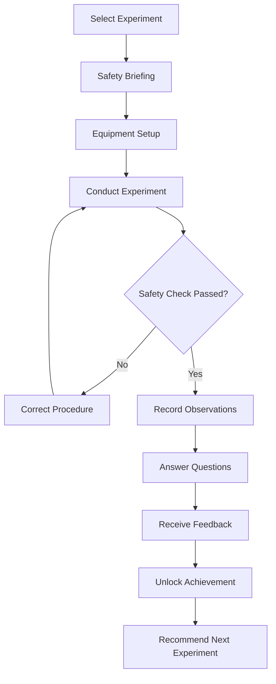
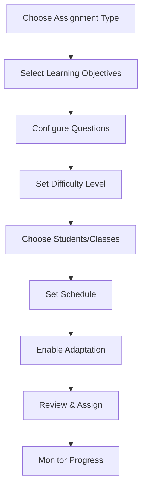
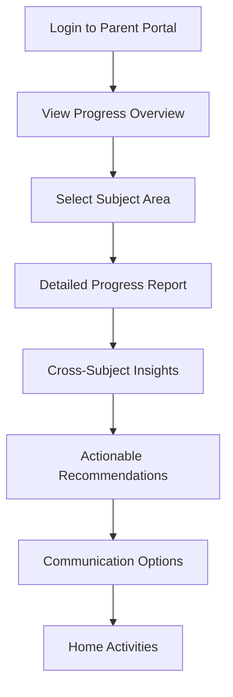

# User Flows

## Student Science Experiment Flow

**User Goal:** Complete a virtual chemistry experiment safely while learning scientific concepts

**Entry Points:**

- Science Hub → Virtual Laboratory → Chemistry
- AI Learning Path recommendation
- Teacher assignment

**Success Criteria:** Student completes experiment with proper safety procedures, understands key concepts, and receives achievement badge

### Flow Diagram

### Edge Cases & Error Handling:

- **Equipment damage**: Virtual replacement with learning moment about proper handling
- **Chemical spill**: Automatic cleanup procedure with safety lesson
- **Network interruption**: Auto-save experiment state with resume capability
- **Incorrect procedure**: Step-by-step guidance with hints
- **Accessibility needs**: Screen reader descriptions of visual changes

### Notes:

- All safety procedures align with Thai Ministry of Education standards
- Cultural context includes Thai scientific contributions where relevant
- Progress saved automatically for interrupted sessions

## Teacher Assignment Creation Flow

**User Goal:** Create and assign a science assessment with automatic grading and personalized recommendations

**Entry Points:**

- Teacher Dashboard → Assignments → Create New
- Class Management → Quick Assign
- Analytics → Create Intervention

**Success Criteria:** Assignment created, assigned to selected students, with automatic grading and progress tracking enabled

### Flow Diagram

### Edge Cases & Error Handling:

- **Invalid question format**: Real-time validation with correction suggestions
- **Schedule conflicts**: Automatic resolution options or manual override
- **Student availability**: Check for existing assignments and suggest alternatives
- **Technical issues**: Draft auto-save with recovery options

### Notes:

- Integration with curriculum standards for automatic objective mapping
- AI-powered question generation based on learning gaps
- Bulk assignment capabilities for efficiency

## Parent Progress Monitoring Flow

**User Goal:** Understand child's science learning progress and cross-subject benefits

**Entry Points:**

- Parent Portal → Progress Overview
- Mobile app notification → View Details
- Email report → Full Dashboard

**Success Criteria:** Parent gains clear understanding of child's progress, strengths, and areas for support

### Flow Diagram

### Edge Cases & Error Handling:

- **Data privacy**: Age-appropriate information sharing with consent controls
- **Multiple children**: Clear navigation between different student profiles
- **Language preferences**: Automatic detection and language switching
- **Technical literacy**: Simplified views with detailed explanations available

### Notes:

- Holistic view across all Advantage subjects
- Celebratory moments for achievements and milestones
- Privacy controls for different levels of detail sharing