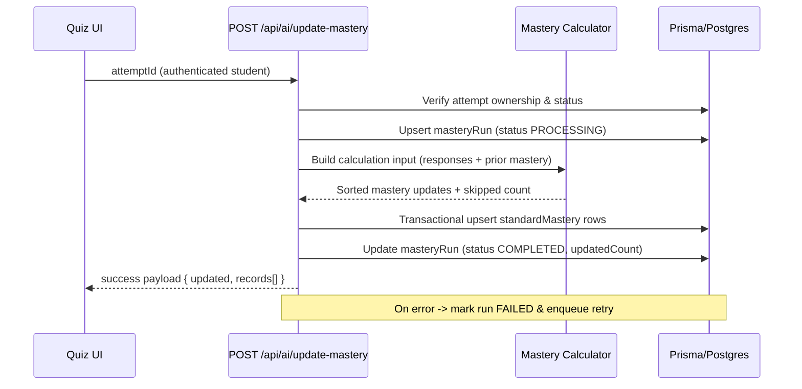

# Student Mastery Profile

## Overview

Deliver a personalized mastery profile for each student that surfaces strand-aligned strengths, gaps, and recent progress within one minute of quiz submission. The profile pulls from the `standardMastery` persistence model, powers AI recommendations, and must remain accessible, localized, and performant for students with large standard sets.

## Scope

- **In scope**: persistence schema (with precision, cascade rules), mastery-profile API, student profile UI contract, accessibility requirements, observability, and failure/empty state handling.
- **Out of scope**: mastery calculation logic (covered in the Mastery Pipeline service), teacher-specific analytics UI, or curriculum authoring tools.

## Dependencies

- Assessment System for Attempt and QuestionResponse data (`docs/specs/assessment-system/spec.md`).
- Progress Tracking analytics (`docs/specs/progress-tracking/spec.md`) for shared mastery thresholds and color tokens.
- AI Recommendations spec (this sprint) for interoperability between mastery surfaces and next-lesson guidance.

## Data Model

### `standardMastery`

| Field            | Type              | Notes                                                                 |
|------------------|-------------------|-----------------------------------------------------------------------|
| `id`             | `String @id`      | `cuid()` primary key                                                 |
| `studentId`      | `String`          | FK -> `user.id`, relation name `StudentMastery`, `onDelete: Cascade` |
| `standardId`     | `String`          | FK -> `Standard.id`, `onDelete: Cascade`                             |
| `masteryLevel`   | `Decimal(3,2)`    | Stored as `@db.Decimal(3,2)`; inclusive range [0.00, 1.00] with clamp helper |
| `evidenceCount`  | `Int`             | Default `0`; count of graded responses rolled into the row           |
| `lastAssessedAt` | `DateTime`        | ISO timestamp of most recent evidence                                |
| `createdAt`      | `DateTime`        | Default `now()`                                                       |
| `updatedAt`      | `DateTime`        | `@updatedAt`                                                         |

**Relations**

- `user` exposes `masteryRecords standardMastery[] @relation("StudentMastery")` with cascade delete to keep orphan rows out of analytics.
- `Standard` exposes `masteryRecords standardMastery[]` so curriculum reporting can join without custom SQL.
- Deleting a student or standard cascades to related mastery rows; regression tests must cover both cases.

**Indexes & Constraints**

- `@@unique([studentId, standardId])`
- `@@index([studentId, masteryLevel])` // teacher dashboards sort struggling students quickly
- `@@index([standardId])`
- Database-level `CHECK` is not available in Prisma yet, so the mastery write helper clamps to `[0,1]` and rejects invalid precision before persisting.

### `masteryRun`

| Field         | Type                   | Notes                                                                 |
|---------------|------------------------|-----------------------------------------------------------------------|
| `attemptId`   | `String @id`           | Primary key, references `Attempt.id`                                  |
| `studentId`   | `String`               | Redundant guard for auditing and authorization                        |
| `status`      | `MasteryRunStatus`     | Enum: `PENDING` \| `PROCESSING` \| `COMPLETED` \| `FAILED`             |
| `updatedCount`| `Int`                  | Number of `standardMastery` rows touched in last successful run       |
| `lastError`   | `String?`              | Most recent failure message for observability                         |
| `createdAt`   | `DateTime`             | Default `now()`                                                       |
| `updatedAt`   | `DateTime`             | `@updatedAt`                                                          |

**Indexes & Constraints**

- `@@index([studentId])`
- Enforce one row per attempt to guarantee idempotency.
- Serialised transaction updates the status field to avoid duplicate writes under contention.

### Backfill Strategy

- Dry-run backfill script replays historical attempts ordered by `submittedAt`.
- Batch size defaults to 200 attempts; exposes CLI flags for `--from` and `--to` timestamps.
- Progress logged every 1,000 updates; failures retried with exponential backoff.
- Backfill invokes the same service interface as live calls and records `masteryRun` rows for traceability.
- Script entry point: `scripts/backfill-mastery.ts` (`--dry-run` honoured to avoid writes during validation).

## Mastery Calculation Service

### Inputs

- `Attempt` with `completedAt` timestamp and `questionResponses[]`.
- Each `QuestionResponse` includes `isCorrect`, `answeredAt`, and related `QuizQuestion`.
- `QuizQuestion` provides `points` (defaults to 1) and `standards[]`.
- Existing `standardMastery` rows for the student (fetched for standards present in the attempt).

### Algorithm

1. Ignore responses whose questions have no mapped standards; increment `mastery_updates_skipped_total`.
2. For each response, derive `questionWeight = question.points ?? 1`.
3. Split `questionWeight` evenly across associated standards unless explicit weighting metadata is added later.
4. For each standard accumulate:
   - `totalWeight += perStandardWeight`
   - `correctWeight += perStandardWeight * (isCorrect ? 1 : 0)`
   - `evidenceCount += 1`
   - `lastAssessedAt = max(existingLastAssessedAt, response.answeredAt)`
5. Compute `newScore = correctWeight / totalWeight` (defaults to 0 when no weight).
6. Apply recency decay: `nextMastery = clamp(previousMastery * 0.35 + newScore * 0.65, 0, 1)`.
7. Sort updates by `standardId` for deterministic output.
8. Return structured payload with `{ standardId, masteryLevel, evidenceCount, lastAssessedAt }[]` and counters for telemetry.

### Idempotency & Transactions

- Prior to calculation, the service upserts a `masteryRun` row (status `PROCESSING`) within a serializable transaction.
- If an existing run is `COMPLETED`, the service short-circuits and returns current `standardMastery` rows without mutating data.
- Status transitions: `PENDING` (initial), `PROCESSING` (in-flight), `COMPLETED` (success), `FAILED` (error path with `lastError` populated).
- `masteryRun.updatedCount` stores the number of rows affected in the last successful execution.

### Failure & Retry

- Synchronous execution targets <10s latency; beyond that the service enqueues a background retry and returns `{ success: false, reason: 'QUEUED' }`.
- Parallel invocations that collide on the unique `masteryRun` key return `202 / QUEUED` immediately so the caller can retry after the active job finishes.
- Retries follow exponential backoff (initial 30s) and cap at 5 attempts before surfacing an alert.
- Failures record `masteryRun.status = 'FAILED'` and persist stack traces in structured logs.
- UI consumers keep quiz completion flows unblocked; they poll for readiness via the mastery profile endpoint.

### Telemetry

- Metrics:
  - `mastery_updates_total` (counter, tags: `student_id`, `attempt_id`)
  - `mastery_updates_failed_total`
  - `mastery_updates_skipped_total`
  - `mastery_updates_latency_ms` (histogram)
- Logs:
  - Structured event `mastery.update` containing `{ studentId, attemptId, updatedCount, durationMs, fallbackUsed }`.
  - Error event `mastery.update.error` with `reason`, `stack`, and `queued` boolean.

### Sequence Diagram



## API Contracts

### `POST /api/ai/update-mastery`

| Aspect          | Detail                                                                                           |
|-----------------|--------------------------------------------------------------------------------------------------|
| Auth            | Student session required; teachers/admins allowed when impersonation flag is active.             |
| Request Body    | `{ "attemptId": "att_123" }`                                                                     |
| Rate Limit      | 3 requests per minute per student; exceeding returns 429 with `retry-after` header.              |
| Success (200)   | `{ "success": true, "updated": 3, "records": StandardMastery[], "durationMs": 420 }`             |
| Feature flag off| 202 `{ "success": false, "reason": "DISABLED" }` with `retry-after: 60`.                         |
| Already queued  | 202 `{ "success": false, "reason": "QUEUED", "retryAfterSeconds": 30 }`                          |
| Already done    | 200 `{ "success": true, "updated": 0, "records": [...] }`                                        |
| Errors          | 401 unauthenticated, 403 forbidden (ownership mismatch), 404 unknown attempt, 409 attempt pending grading. |
| Logging         | Every response emits structured log via `lib/observability/logger.ts`.                           |

### `GET /api/students/[studentId]/mastery-profile`

| Aspect          | Detail                                                                                           |
|-----------------|--------------------------------------------------------------------------------------------------|
| Auth            | Requires session; student can only access self. Teachers/Admins allowed when impersonation flag. |
| Query Params    | `strand`, `grade`, `limit` (default 100), `cursor`, `includeRecommendations` (boolean).          |
| Response        | `{ status: 'READY' | 'CALCULATING', generatedAt, student: { id, name, grade }, strands: Strand[] }` |

`Strand` payload:

```json
{
  "code": "Sc1",
  "title": "Scientific Inquiry",
  "masteryAverage": 0.78,
  "standards": [
    {
      "standardId": "std_123",
      "code": "Sc1.1-G3",
      "titleEn": "Plan and conduct investigations",
      "titleTh": "วางแผนและดำเนินการทดลอง",
      "masteryLevel": 0.62,
      "masteryLabel": "Developing",
      "evidenceCount": 5,
      "lastAssessedAt": "2025-10-28T08:00:00Z",
      "aiAnnotation": {
        "recommended": true,
        "traceId": "rec_abc"
      }
    }
  ]
}
```

### Pagination

- Cursor is the last `standardMastery.id` returned; API returns `nextCursor` when additional records exist.
- Server enforces `limit <= 200`.

### Status Reporting

- When mastery pipeline has not yet processed the latest attempt, API returns `status: 'CALCULATING'` with `retryAfterSeconds`.
- UI consumes this to show polling indicator (default 10-second interval, max retries 6).

## UX Contract

- **Layout**: hero section with profile summary, strand accordions sorted by weakness (lowest average first).
- **Color thresholds** (aligned with progress tracking):
  - `mastery < 0.60` => red (`--chart-critical`)
  - `0.60 <= mastery < 0.80` => amber (`--chart-caution`)
  - `mastery >= 0.80` => green (`--chart-strong`)
- **Text labels** accompany colors (e.g., "Needs Support", "On Track") to satisfy WCAG.
- **Virtualization**: lists >75 standards must use `@tanstack/react-virtual` with overscan 8.
- **Empty state**: friendly illustration, CTA to curriculum.
- **Calculating state**: info banner referencing quiz in progress; auto-refresh until READY.

## Accessibility & Localization

- Progress bars expose `aria-valuenow`, `aria-valuetext` (e.g., "Mastery 72% - solid grasp") and maintain contrast ratio >= 4.5:1.
- All copy maintained in `en` / `th` locale files; fallback to English when Thai unavailable.
- Keyboard focus order matches visual order; no horizontal scroll traps.

## Non-Functional Requirements

| Category     | Requirement                                                                                   |
|--------------|-----------------------------------------------------------------------------------------------|
| Performance  | API p95 latency < 400 ms for 150 standards; bundle per page < 150 KB gzip via code splitting.|
| Freshness    | Mastery data updates visible within 60 seconds of attempt completion.                         |
| Availability | API SLO 99.5%; degrade with friendly error message + fallback link.                           |
| Security     | Prevent studentId tampering; enforce impersonation flag for teacher access.                  |

## Observability

- Emit metrics: `mastery_profile_requests_total`, `mastery_profile_latency_ms`, `mastery_profile_status_calculating_total`.
- Mastery pipeline emits `mastery_updates_total`, `mastery_updates_failed_total`, `mastery_updates_skipped_total`, and `mastery_updates_latency_ms`.
- Log trace IDs that connect mastery API calls to AI recommendations when `includeRecommendations=true`.
- Dashboard tracks: number of standards per student, mastery pipeline latency, retry counts, API errors, average latency.
- TODO (observability backlog): add Grafana panel for `standardMastery` row growth + write latency once pipeline (#120) lands.

## Failure Modes

- **Pipeline lag**: API returns CALCULATING; UI polls with backoff.
- **Missing mastery data**: treat as empty state; log warning for investigation.
- **Authorization mismatch**: respond 403 with audit log entry.
- **Repeated calls during processing**: respond 202 with queue hint; ensure `masteryRun` reflects pending state.
- **Downstream persistence failure**: mark `masteryRun` as FAILED, enqueue retry, surface alert.

## Open Questions

1. Should we expose confidence intervals once we have mastery variance data?
2. Do we need offline export (PDF) for students/parents? (Currently out of scope.)
3. Should students be able to filter by recommended vs mastered standards directly?

## Implementation Checklist

- [ ] Merge schema + migration (#119).
- [ ] Implement mastery pipeline (#120) with idempotent writes and telemetry.
- [ ] Build mastery-profile API + UI (#121).
- [ ] Instrument metrics/logging.
- [ ] Update Epic #118 with links to this spec.
