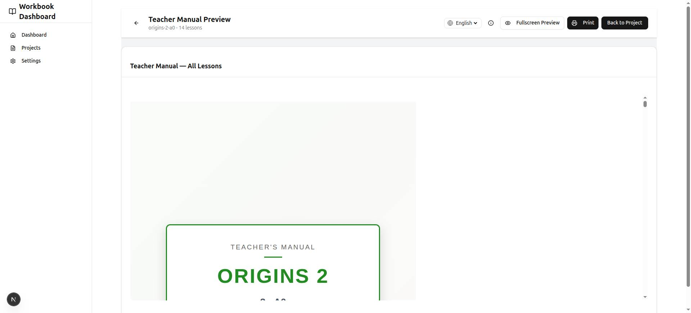

# Teacher Manual Generation

The workbook publishing home generates a printable **Teacher Manual** for a selection of lesson drafts. It is a separate, teacher-facing companion document that converts the workbook's 13 lesson steps into a structured 4-period classroom plan, with pedagogical guidance and troubleshooting.

Rendered output preview: 

## What the Manual Contains

The manual is compiled from three parts:

### 1. Front Matter

- **Title page** — series name, level, CEFR level, and a badge identifying the document as a teacher manual.
- **Preface** — an overview of the 4-period model and the blended learning approach (workbook + app + teacher anchors).
- **Lesson plan structure** — a walkthrough of all four periods and their steps.
- **Pedagogical guidelines** — pair work, discussion techniques (think-pair-share, evidence-first, cold call), app audio usage, and blended learning management.
- **Flashcard games guide** — Memory, Go Fish, Snap, and Quiz Show, with a link to further game ideas.
- **Spelling routine guide** — the trace → write → cover-and-write cycle.
- **Goal setting introduction** — how to run the "My English Learning Goals" page.

### 2. Per-Lesson 4-Period Plans

Each lesson gets a full plan page with:

- **Lesson header** — lesson number, title, genre, article type, CEFR level, and duration.
- **Objectives and vocabulary overview** — the lesson's target vocabulary with definitions.
- **Four period plans** (see [The 4-Period Model](#the-4-period-model)), where every step renders:
  - A **"Student View" step insert** — a realistic miniature of the workbook page the students see (vocabulary table, article excerpt, comprehension questions, writing prompt, etc.).
  - **Teaching notes** — teacher actions, teacher language (model sentences), student actions, and watch-fors.
  - Per-period **bell-ringers**, **spelling activities**, and **online components**.

### 3. End Matter

- **Self-assessment guide** — how to administer the student reflection page (before/during/after).
- **Certificate ceremony** — presentation tips and sample scripts.
- **Troubleshooting** — five common classroom issues (pacing, app problems, writing difficulty, low engagement, AI feedback) with solutions.

## The 4-Period Model

The workbook's 13 lesson steps are grouped into four 45–60 minute teaching periods.

| Period | Steps | Title | Bell-Ringer | Spelling | Online Components |
| :--- | :--- | :--- | :--- | :--- | :--- |
| **1** | 1–4 | **Launch & Vocabulary** | Flashcard cut-out & organization (5 min) | — | App article reading (QR/audio) |
| **2** | 5–7 | **Deep Reading & Comprehension** | Flashcard vocabulary game (5 min) | Trace | Extensive reading assignments |
| **3** | 8–10 | **Response & Practice** | Flashcard vocabulary game (5 min) | Write | App vocabulary/sentence review |
| **4** | 11–13 | **Writing & Reflection** | Flashcard vocabulary game (5 min) | Cover-and-write | AI writing feedback + Progress tracker |

### Steps by Period

- **Period 1 — Launch & Vocabulary:** 1 Before You Read · 2 Key Vocabulary · 3 Read the Article · 4 Collect Vocabulary
- **Period 2 — Deep Reading & Comprehension:** 5 Deep Reading Notes · 6 Collect Sentences · 7 Comprehension Check
- **Period 3 — Response & Practice:** 8 Guided Response · 9 Vocabulary Practice · 10 Sentence Practice
- **Period 4 — Writing & Reflection:** 11 Guided Writing · 12 Language Questions · 13 Lesson Reflection

The flashcard games rotate across periods 2–4 (Memory, Go Fish, Snap, Quiz Show), and the spelling routine progresses trace → write → cover-and-write so students practice each word three times across the unit.

## How to Use

1. On the workbook publishing home (the drafts list), tick the checkbox next to each draft you want in the manual, then click the **"Teacher Manual"** button (which shows the selected count).
2. The modal compiles the selected drafts into a single paginated document and offers a language selector (**English** / **ไทย**); switching languages recompiles the manual.
3. Click **Print** (or Ctrl+P / Cmd+P) and save as PDF.

Drafts are compiled in lesson-number order (numeric-aware; drafts without a parseable lesson number sort last, then by title). The manual's series metadata — series name, level, CEFR level, and type — comes from the first ordered draft's settings, falling back to **Reading Advantage** / *A1* / *primary* when unset.

### Printing

- **"Background graphics" MUST be enabled** in More Settings — without it, colors, styled headers, and bordered step inserts are dropped.
- Set margins to **Default** or **None**.
- Pagination is handled by Paged.js; the print dialog runs inside the preview modal's iframe.

## Implementation

- **Server action:** `apps/workbooks/app/teacher-manual-actions.ts` — `compileTeacherManualAction` verifies the session (WORKBOOK_ADMIN role), reads every requested draft inside the session tenant, orders the drafts by lesson number then title, derives series metadata from the first ordered draft's settings, and calls the domain compiler. Any requested draft that is missing fails the whole request closed. It returns `{ ok: true, html, lessonCount, lang }` on success, or `{ ok: false, code, message }` for validation, authorization, and compile failures; any language other than `en`/`th` falls back to English.
- **Compiler:** `workbooks.compileTeacherManual` in `@reading-advantage/domain` — `packages/domain/src/workbooks/teacher-manual/`. `compiler.ts` orchestrates `front-matter.ts`, `lesson-plan.ts` / `period-plan.ts` (step inserts from `step-insert.ts`, teaching notes from `teaching-notes.ts`), `end-matter.ts`, and `document-wrapper.ts` (full Paged.js print styles). `lesson-adapter.ts` maps normalized draft content into teacher-manual lessons — the compiler consumes normalized content, not filesystem lessons.
- **Preview UI:** `apps/workbooks/app/projects/teacher-manual-section.tsx` (checkbox island over the drafts list) and `teacher-manual-modal.tsx` (compile modal with a sandboxed iframe, language toggle, and Print button).
- **Localization:** all strings live in `packages/domain/src/workbooks/teacher-manual/i18n/en.ts` and `i18n/th.ts`.
